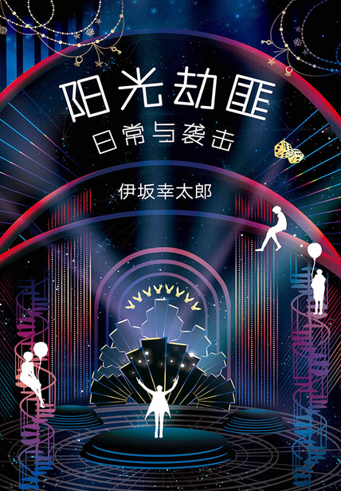
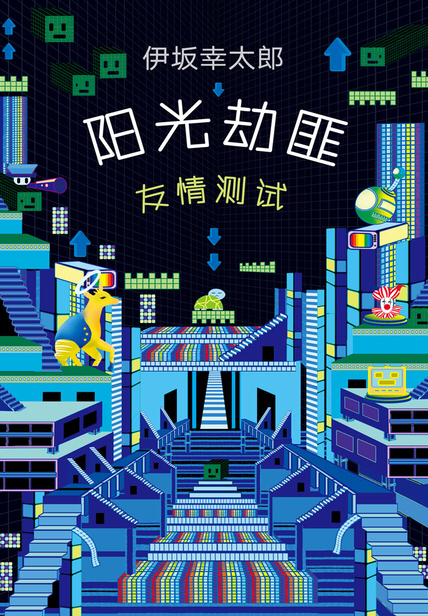

### 阳光劫匪倒转地球

三部曲之一。  
1996年，伊坂幸太郎的处女作《碍眼的坏蛋们》获得第13届三得利推理大奖佳作奖，大幅修改后成为《阳光劫匪倒转地球》，于2003年出版。  

四个可爱的劫匪朋友，一个能瞬间洞穿对方的谎言，一个能精确掌握时间，一个善于讲话操纵人心，一个身手敏捷到可以在你不注意时偷走你身上任何一件东西。  
有一天他们计划并实施了一次几乎完美的银行抢劫，没有开枪，没有激烈冲突，甚至没有给人质们留下心理阴影，顺利带走了四千万日元。然而还没来得及分赃，在返程途中又被另一群劫匪给抢劫了。  
作者功力深厚，打磨用心，每一个路人，每一句话，每一行文字，最终都有其用处。  

### 阳光劫匪日常与袭击

三部曲之二，2006年出版。  
这一次继续轻松欢乐温暖治愈，日常吵吵闹闹地聊着天，那些表面上毫不相干的生活小插曲却奇妙地将他们卷入一场绑架风波。  

> 毫发无伤就达到目的是不可能的。想做蛋包饭，就只能把鸡蛋壳打破。如果要意译，应该就是勇往直前敢于尝试吧。

### 阳光劫匪友情测试

三部曲之三，2015年出版。  
这一次，他们打算最后干一票就金盆洗手，但麻烦不断，似乎有人暗中作对。一番调查后他们发现，所有线索都指向了一个他们曾经帮助过的人。这是一次危急的友情测试。  

### 伊坂幸太郎 VS 东野圭吾

他们作品的阅读体验差异极大。  
东野圭吾的作品给人无力感，大部分故事的发展早已成定局，逐层递进的只是剥开真相的推理过程和背后的动机。而且主角大多数是警察，侦探。虽然主角很努力，但对结局的影响很小。  
伊坂幸太郎的阳光劫匪四人则不同，他们算不上是好人，也绝不是恶人。他们有各自的主业工作，还有不定期的副业项目（抢劫银行），以及充当热心路人，用好奇心和恶作剧为他人排忧解难。  
他们的故事让人觉得困难是可以克服的，结局是可以改变的，而且这个过程可以很欢乐，很随性，甚至很浪漫。  
非常喜欢伊坂幸太郎的这段话：  

> 我喜欢认真的人，与此同时最害怕那些把自己的欲望放在第一位、给别人添了麻烦也毫不在乎的人。哪怕他们再遵纪守法，不顾他人感受并且不以为然这一点仍让我觉得可怕，不想和他们做朋友。我总在想，这个世界全靠认真的人才得以运转。  
小说中的银行劫匪们肯定违反了法律，所以无论如何不能称其为好人，但他们一直在认真思考尽可能不给别人添麻烦。我也想过如果他们认真思考到那种程度，明明做别的事也可以，但最后还是决定让他们暂且先认真完成好自己的事吧。  
而且，他们从不耀武扬威。  
大概是我既不喜欢指使别人，也不喜欢被人指使吧。  
