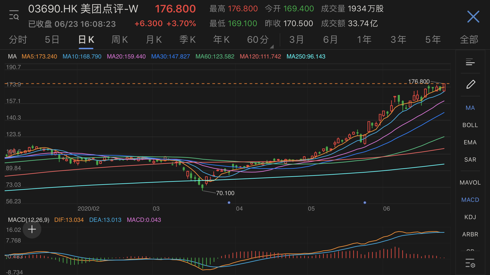
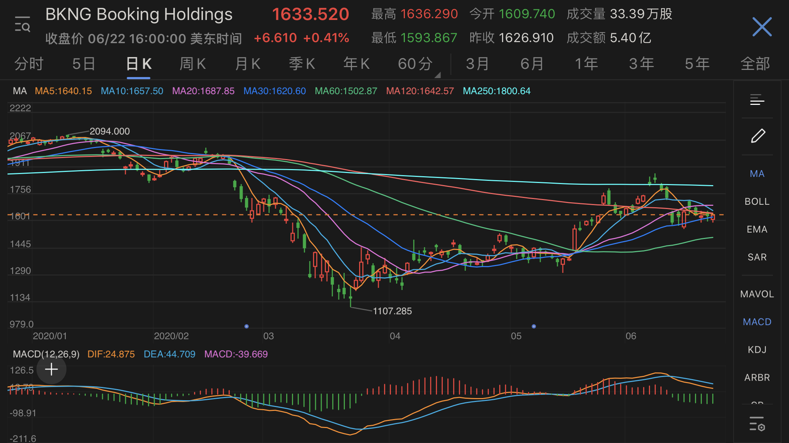
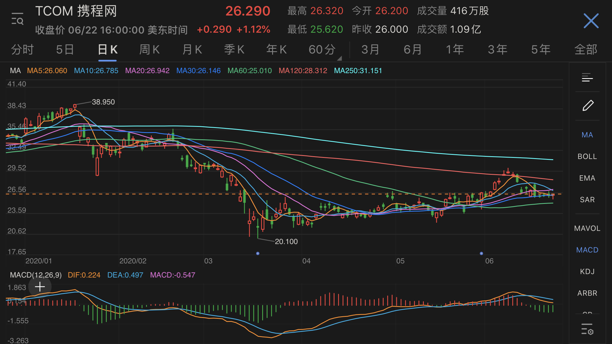
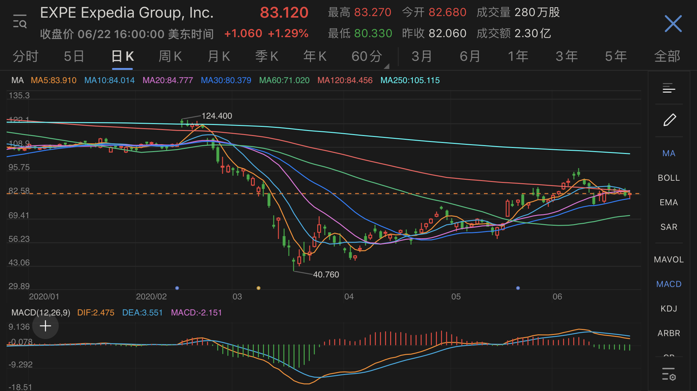
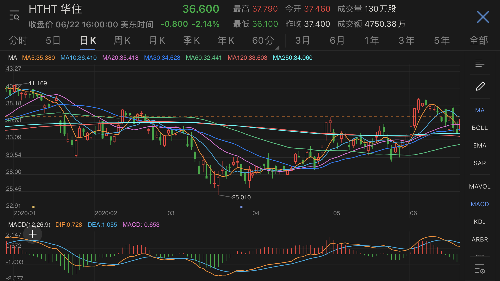
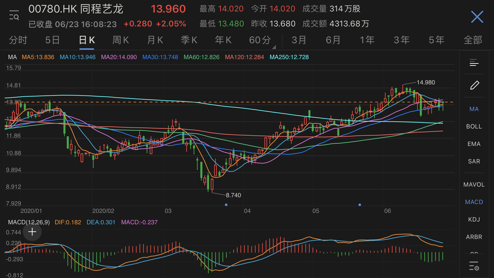
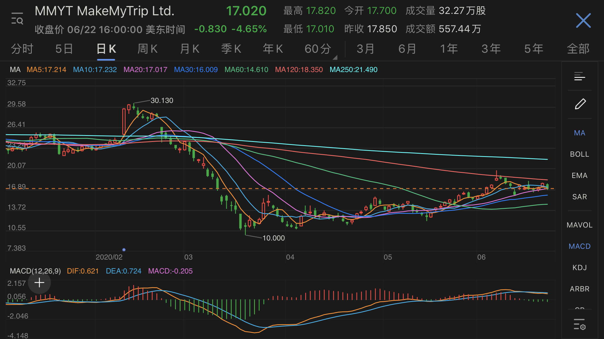

2020H1

| 公司 | 当前市值(亿美元) | 最低价格 | 最低日期 | 最高价格  | 最高日期 | 06.23价格 | 最大价差   | 最低至今价差 |
|:---|---:|---:|:----|---:|:---|---:|---:|---:|
| HK.3690.美团点评 | 1335.32 | 70.100 | 2020-03-19 | 176.800 | 2020-06-23 | 176.800 | 152.21% | 152.21% |
| US.BKNG.Booking | 668.61 | 1107.285 | 2020-03-23 | 2094.000 | 2020-01-10 | 1633.520 | -47.12% | 47.52% |
| US.TCOM.携程网 | 155.92 | 20.100 | 2020-03-18 | 38.950 | 2020-01-17 | 26.290 | -48.40% | 30.80% |
| US.EXPE.Expedia | 117.18 | 40.760 | 2020-03-18 | 124.400 | 2020-02-14 | 83.120 | -67.23% | 103.93% |
| US.HTHT.华住 | 107.42 | 25.010 | 2020-03-19 | 41.169 | 2020-01-02 | 36.600 | -39.25% | 46.34% |
| HK.00780.同程艺龙 | 38.51 | 8.740 | 2020-03-19 | 14.980 | 2020-06-08 | 13.960 | 71.40% | 59.73% |
| US.MMYT.MakeMyTrip | 17.53 | 10.000 | 2020-03-19 | 30.130 | 2020-02-12 | 17.020 | -66.81% | 70.20% |

{:.table-scrollable}

因为从事OTA行业，去年下半年开始建立一个OTA板块的自选股池子，挑选了几个相对比较熟悉的标的，进行观察。  
在线旅游行业的发展，跟本国经济活动整体发展，有较强相关性。  
主营业务限定在某一国内部的OTA公司，自然跟该国GDP走势强相关。  
跨国业务，多样性丰富的OTA公司，受全球形势影响较大，一定程度上应该跟美股大盘的变化有相关性。因为后者反映了全球经济变化的趋势。  
美团点评不能算是一家100%的OTA公司，但是其酒旅业务是重点之一，所以也放入。  
2020年疫情影响，OTA行业影响最大，损失严重。上图是统计2020-01-01至今，这个池子的变化，按今天市值大小排序。  
时间上，股价走势跟实际疫情影响程度和公司当下实际收益不同，所以反映的是市场对未来一段时间的信心变化。Q1大部分公司严重下跌。  
5-6月美股大盘异常高涨，有很多专家说现在的泡沫接近或大于2008金融危机的程度，我也有同感。特朗普本身就是一个大变量。  
所以从Q1价格最低点至今，都有非常亮眼的涨势。  
整体趋势非常相似，除了美团点评例外。明天继续复盘具体个股操作。  

