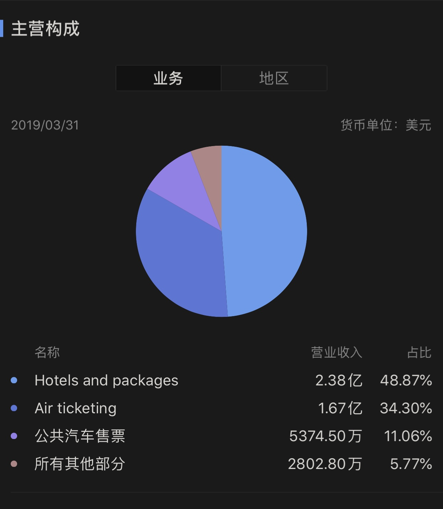
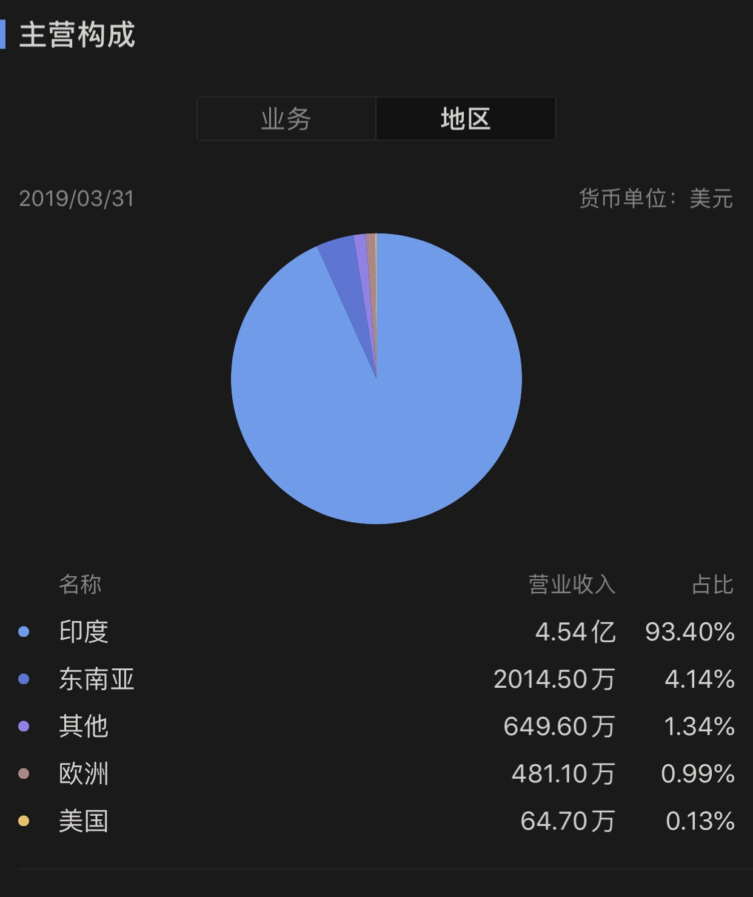
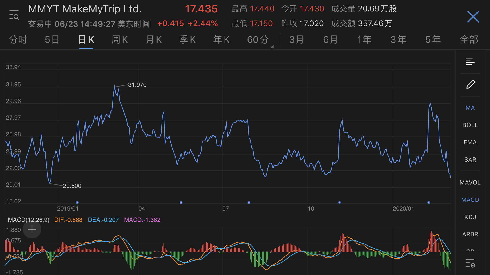
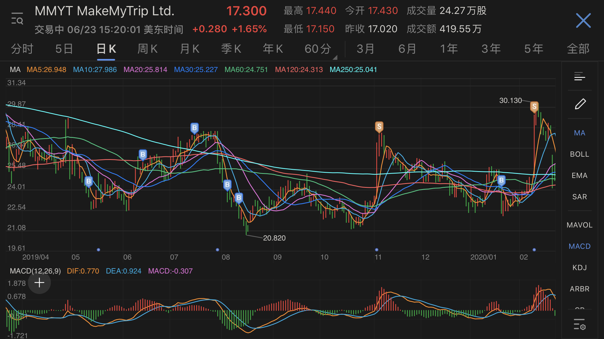

### Why

2019年4月26日，携程宣布同 Naspers 达成股权置换协议，获得 MMYT 49% 和 4% 的投票权。  
MMYT是印度的“携程”，2000年4月28日成立，2010年上市，本土在线旅游市场老大，同时也面临不断加剧的竞争。当时其机票业务市占率 60%，酒店业务市占率超过 60%。  
2019年4月30日，MMYT收购了本国另一家互联网差旅管理公司 Quest2Travel.com 的多数股权。  
整体业务覆盖机票，酒店，其他住宿，度假，火车票，公共汽车票，租车，旅行辅助品（例如第三方旅行保险，签证处理），商旅。  

看上去是不是有一丝熟悉的感觉？

印度（在线）旅游市场增长潜力很大，酒店预订业务的线上渗透率仅 10%～20%，但间夜数增长不断加速。出境游市场处于起步阶段。  
感觉相当于中国十五年前的阶段，但更有利的催化剂是**手机**，尤其是Android 低端机，移动互联网的快速普及必将大大加速线上生活的比重，参考印度手机市场出货量和增速即可印证。  
OTA行业内部面临不断增大的竞争，OYO，Paytm，Expedia，Booking涌入。任何行业的竞争加剧会直接影响两方面：营销成本增加，利润率下降。  
外部最大风险就是宏观经济的不确定性。（现在知道了还有 COVID-2019 这种黑天鹅。）  

看上去是不是有非常熟悉的感觉？

再看2019年及之前的历史财报数据，一直处于亏损，但营收增速不错，亏损比例收敛明显，利润率呈一条不断上扬的曲线，似乎盈利指日可待。  

左看右看，MMYT应该是一个很好的投资标的。  

### How

过去十年的炒股学费换来的几条原则：

+ 不要做超短线操作，抱着一夜暴富的梦想进入股市。
+ 不要做超长线操作，99%的人所谓的长线持有就是为当下的亏损套牢找借口，炒股炒成股东，不愿割肉离场。
+ 不要追求在最低价买入。
+ 不要追求在最高点卖出。
+ 永远分批操作，永远不要一次性打光弹药，控制好仓位。

MMYT的一些特征：

+ 小盘股，换手率很低，通常每天不到0.4%，成交量一般在20万股以内，成交金额300万美元左右。美股市场以一级投资者（机构）为主，散户较少。这点跟A股相反。所以这支股票的散户参与者应该很少。
+ 以一级投资者为主的股票，例如各种大基金机构，会以量化交易方式为主，人为情绪因素影响很少，即策略公式驱动计算机执行。
+ 最终反映出的结果就是美股大盘涨，它就涨，大盘跌，它就跌。

2019年全年日K线图，按照马后炮式分析，强行拼凑一个公式。  
以季度财报公布日为分界线，形成一个有迹可循的周期。  

+ 财报公布日是一个相对高点。
+ 之后迅速震荡下跌，再慢慢爬升或阴跌。
+ 在下一次财报公布日之前，无论向上向下，都有明显适合买入的时机。
+ 然后迎来下一个相对高点的财报公布日。

图中X轴时间坐标线的蓝点就是财报公布日，分别是：

+ 2019-01-24
+ 2019-05-16
+ 2019-07-30
+ 2019-11-04
+ 2020-02-11

其中2019-04-26的尖刺就是携程入股引起的当天8%上涨，随后4天影响消散。  
变化即合理，股权变化引起市场波动上涨，说明投资机构认可这项交易。而这种股权投资并不会对MMYT短期营收和利润带来直接影响，只会以年为单位产生长远发展上的影响。  

设计一个简单操作策略：

+ 2019年中，当时的年平均线是25美元。携程入股前后的价格是24美元，所以设定目标平均线为25美元。
+ 假设每个月操作1次，半年6次，中途可能临时操作2次，保留弹药2成。即总投入资金固定情况下，分成10份，每次操作最多不能超过2份。
+ 每月固定日期操作，不要天天盯着，影响情绪和判断。
+ 当天价格 <= 25，就买入1份。
+ 当天价格 <= 20，就买入2份。
+ 当天价格 >= 30，就卖出1份。
+ 当天价格 >= 35，就卖出2份。以此类推。
+ 当天价格 25 - 30 之间呢？看心情。
+ 以季度为周期观察和调整。

### Just Do It

实际操作情况如下图，蓝色B是买入点，黄色S是卖出点。  

+ 5月常规买入1份。
+ 6月常规买入1份。
+ 7月常规买入1份，这次明显买高了，当天价格27，因为符合自己定的策略，并且当天心情很好。哈哈！  
但是这里明显违反了财报周期中的一条关键指标，即财报公布日附近应该卖出。  
+ 2019-07-30财报日之后，一路下跌到最低点20.820。  
8月常规操作买入一次，一周后决定启用一次临时操作份额。
+ 9月上涨，因此没有操作。
+ 10月应该常规操作，但是当时资金转账阻塞问题，没能完成，空缺一次。  
这里的教训就是，弹药需要提前备好，粮草先行！
+ 11月4日财报日，第二天卖出部分仓位，这次操作时间很完美。

转眼6个月过去了，需要认真反思复盘。按财报周期规律，11-04至02-11之间会有很多合适买入点，不急。  
策略1.0版本有2个明显错误。

+ 目标价20，25，30，35这种划分设定不合理。因为具体价格数字跟公司发展和市场行情相关，营收利润的变化，大盘涨跌的变化，怎么可能固定为这么愚蠢的数字。
+ 每月固定日期操作，似乎不妥。这本身就是一个保守定投+少量随性的懒人策略，再细分成2周一次，甚至1周一次，更多耗费精力，毕竟还是要以工作为主。那么是否应该在每个月固定时间范围内灵活变动呢？这样似乎变得更加随性了。

想着想着就迎来了2020，边思考边行动吧。1月22日恢复买入，2月12日的前一天卖出。嗯，第二次踩准了节奏。  
明天继续复盘2020H1操作。
