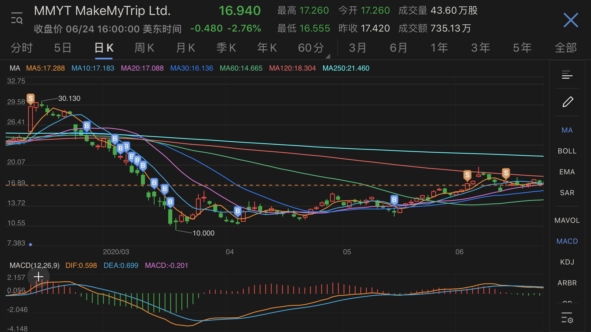

先上真实操作记录，再谈思路。

2020年1月25日，正月初一，春节长假。一直到2月17日戴口罩进公司上班，这三周正值 COVID-2019 疫情最严峻阶段。  
2月11日按策略公式大幅减仓后，在家隔离期间，顺便思考 COVID-2019，OTA，MakeMyTrip 三者的关系。

### COVID-2019

参考《上帝的坏笑——大病毒时代来临》，《病毒来袭》，人类和细菌病毒共生，谁也灭不掉谁，人类对抗瘟疫的历史悠久。在政府和有组织的集体管控下，疫情很快会过去。经历过2003 SARS的我，这段时间并没觉得事态严重。瘟疫对人类这个群体而言，不会有致命打击，除非是小行星撞地球，核爆这种高能剧烈的事件。疫情只会对个体造成致命影响，故事通常是：“从前有一个人，他不戴口罩不洗手，然后他死了。”  
所以很多国家采用“群体免疫”方式对抗，其实非常可以理解。  
最初疫情仅限中国境内，国际上逐渐严格针对中国的出入境管理。如果仅仅如此，那么就只影响中国航空工业和OTA行业。  
之后中国疫情减缓，国际上反而加重。全球航空业和OTA遭受严重打击。关于巴菲特和航空股的段子，网上多得是，这里不再赘述。  

### OTA

3月，美股迎来4次熔断，9日，12日，16日，18日。前天整理的《2020H1 OTA大盘回顾》，OTA股价最低日期都发生在第4次，7支股票，其中3月18日2支，3月19日4支，3月23日1支。  
疫情打击OTA股价，这是显而易见的。疫情总有结束的一天，OTA势必复兴，这也是显而易见的。难猜中的只是时间和程度。如果疫情很快结束，那么这4次熔断就是难得的入场良机。如果疫情时间延长，那么现在依然是入场良机，未来半年也是，直到明年，持仓时间和获利时间拉长。  
所以不用犹豫，该出手就出手。  

### MakeMyTrip

印度是个神奇的国度，相比其他股票，存在两个风险点。

+ 信息传播闭塞。只有少量财报公告和二手新闻，很难全面了解。
+ 印度疫情控制。国内这方面信息很少，开挂民族的真相到底是什么，不知道。

最差结果可能是，疫情时间超长，影响人群超多。印度有十亿人，即使随其自然群体免疫，十八个月也够了。  
期间只有这些新闻：

+ 2月12日，财报公布日，公司联合创始人 DeepKalra 从CEO变成执行主席。创始团队成员 Rajesh Magow 接任CEO一职。  
+ 3月24日，宣布严控成本，创始人零薪，管理层半薪。  
+ 4月14日，获得7.35亿卢比注资，约等于1100万美元。  
+ 6月1日，宣布裁员10%，全员3450人，裁员350人。  
+ 6月26日，下一次财报公布日。这个日期一拖再拖，延后了几次。

### What I have done

+ 2月26日，常规操作，买入10%仓位，当天价格24.30美元。
+ 3月，将弹药从10份细分到20份，提高操作频率，降低每次操作金额。
4，5，6，9，11，12，13，18，19，这些日期连续买入。
+ 4月，恢复常规操作，买入10%。
+ 5月，恢复常规操作，买入10%。此时平均持仓成本价14美元。
+ 6月，应该公布财报了，对应操作就是卖出。  
原定6月11日公布，延期至6月18日，又延期至6月26日。  
考虑到公司财报未知和印度疫情进展未知，分批两次清仓，17美元和17.65美元。近期最高价是 6月5日 19.89美元。

买入均价14，卖出均价17.325，盈利23.75%，再加上空仓部分的现金，整体在20%左右。

明天就要公布财报了，下半年会发生什么呢？
