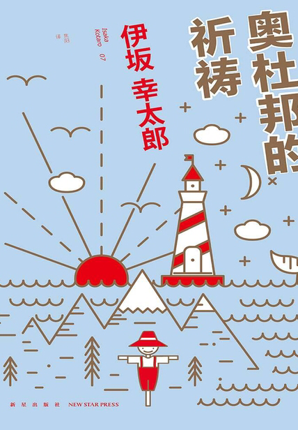

2000年，伊坂幸太郎正式出道的第一部作品。  

### 简介

有一座岛，一座不为外人所知的秘密孤岛，名叫荻岛。  
岛上有一群奇奇怪怪的人，以及一个会说话、知晓未来的稻草人。  
一则预言在岛上流传了上百年：这座岛缺少一样东西，外来之人会将它带来。  
“外人”终于来了，主人公伊藤，一个因为长期使用电脑导致视力受损而辞职的程序猿，有一个技术水平和工作责任心远胜于他的漂亮前女友程序媛静香。  
他裸辞两个月后，无脑抢劫便利店，被警察抓获，慌乱中逃脱，被唯一能够进出荻岛的船商轰大叔所救，带上岛。  
岛民们满心期待，等来的却是暴力与杀戮……而神一般的稻草人也离奇地倒下了。  
谁能来救这座岛？它真的需要救赎吗？  

### 剧透

岛上有一群奇奇怪怪的人，唯一会出入小岛的长得像头“笨熊”的轰先生，只说反话的画家、年轻貌美但胖得无法走动的兔子小姐，喜欢趴在地上听心跳声的小女孩若叶，规则与道德的化身，凭直觉公正处决有罪岛民的杀手樱，严格按流程慢半拍工作的警察和邮差。以及最奇怪的会说话知晓过去未来但从不提前透露的稻草人优午。  
在伊藤眼里，这一切都是新奇的。岛民们则寄希望于他能实现预言。同时稻草人优午提供了很多模糊的隐喻。之所以模糊，它解释为“混沌理论”或“蝴蝶效应”。所以它只能知晓100%的过去和一周内的未来。  
之后不久的某夜，稻草人被人残忍肢解，紧接着又发生命案。追查真凶的过程，同时也是揭晓预言谜底的过程。  
能够预知未来的稻草人，是否预测出了自己的死亡？  
如果已知，那么为什么它没有阻止悲剧的发生？  
如果未知，那么流传上百年的预言是否谣传？  
这座岛的未来又是什么？  

奥杜邦是19世纪美国著名的鸟类画家，祈祷意指旅鸽，近代绝灭鸟类中最为著名的代表。  
欧洲人来到北美大陆之前，北美有多达50亿只旅鸽。  
17世纪，旅鸽的噩梦开始，因为肉味鲜美，成为美洲开拓者的食物。  
1900年，最后一只野生旅鸽被猎杀。  
1914年，最后一只人工饲养的旅鸽死去，旅鸽从此在地球上销声匿迹了。  
美国威斯康辛州赖茨维尔州立公园（Wyalusing State Park）立有一块旅鸽纪念碑，上书︰“该物种因人类的贪婪和自私而绝灭。”  

> 人生就是电梯啊。就算自己是静止的，还是会不断前行。从乘坐的那一刻开始，要去的地方就已经决定好了，只是一个劲儿地向那里前进。但是没有人意识到这一点。大家都相信只有自己不在电梯上。

> 因为这是时代的潮流，无论是好是坏，世界上存在一种无人能与之抗衡的洪流。这股洪流虽似雪崩或洪水一样庞大，流速却如春日里渐渐变暖的水温般缓慢。旅鸽的灭绝如此，绝大多数战争也是这样的。在大家都没注意到的时候，一切就都被卷入洪流之中了。

> 优午曾说过，即使这座岛正不断朝着坏的方向发展，不可救药，他也不会为此自责，他说：“我只会祈祷”。  
优午这么说的时候，我感受到奥杜邦的画也是一种“祈祷”。画中蕴含着他对旅鸽的爱。他曾经说过，大群旅鸽飞过的景象壮丽得难以言喻，他肯定在祈祷这壮丽的景色能永远留在这个世界上。

私以为，结尾的谜底有点浅，这件需要外来之人带来，岛上所缺少的东西，其实岛民应该能够自产。有人的地方就一定会有它。  
