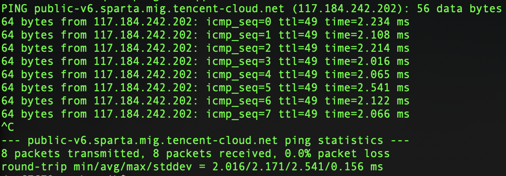

PING （Packet Internet Groper），用于测试目标主机是否可达及了解其有关状态。主要是向特定的目的主机发送 ICMP（Internet Control Message Protocol 因特网报文控制协议）Echo 请求报文。  
常规使用如图，每秒发送一次请求。

JDK 1.5 起，提供了用于检测主机地址是否可达的API：  
`java.net.InetAddress.isReachable()`

入口：

```java
package java.net;

public class InetAddress {

    /**
     * Test whether that address is reachable. Best effort is made by the
     * implementation to try to reach the host, but firewalls and server
     * configuration may block requests resulting in a unreachable status
     * while some specific ports may be accessible.
     * A typical implementation will use ICMP ECHO REQUESTs if the
     * privilege can be obtained, otherwise it will try to establish
     * a TCP connection on port 7 (Echo) of the destination host.
     * <p>
     * The timeout value, in milliseconds, indicates the maximum amount of time
     * the try should take. If the operation times out before getting an
     * answer, the host is deemed unreachable. A negative value will result
     * in an IllegalArgumentException being thrown.
     *
     * @param   timeout the time, in milliseconds, before the call aborts
     * @return a {@code boolean} indicating if the address is reachable.
     * @throws IOException if a network error occurs
     * @throws  IllegalArgumentException if {@code timeout} is negative.
     * @since 1.5
     */
    public boolean isReachable(int timeout) throws IOException {
        return isReachable(null, 0 , timeout);
    }

    public boolean isReachable(...) throws IOException {
        if (ttl < 0)
            throw new IllegalArgumentException("ttl can't be negative");
        if (timeout < 0)
            throw new IllegalArgumentException("timeout can't be negative");

        return impl.isReachable(this, timeout, netif, ttl);
    }
}
```

阻塞式方法，先使用 ICMP ECHO REQUESTs，若失败则使用 TCP ECHO REQUESTs，尝试与远端主机建立端口7的TCP连接。  
实现位于：  
`java.net.Inet4AddressImpl.java`  
`java.net.Inet6AddressImpl.java`  

方法内部逻辑基本一致，再调用 `JNI` 底层：  
`private native boolean isReachable0()`  

`JNI` 内部没深究，大概率是C语言实现，调用各具体平台API。  
运行时需要root权限。

--------
Android 1.0 基于 JDK 1.5，但很多部分与JDK不同，以该方法为例简单分析看看。  
有很多途径可以查看源码，AOSP官网，Android SDK Source。AndroidXRef.com 是一个专门用于在线阅读安卓源码的网站，提供了从1.6到9.0的所有版本。最早期的 1.0 1.5 缺失，不过这两个版本没有太大追溯意义。最新的 10 11版本尚未收录。  

--------

### [ Donut - 1.6, Marshmallow - 6.0.1_r10 ]

代码位于 `/libcore/luni/src/main/java/java/net/` ，承包了 `isReachable()` 的全部实现，仅此一处，没有其他子类继承改写。

唯一的区别是，`Class InetAddress` 最初归属于 dalvik 工程的 libcore 部分。  
Gingerbread - 2.3.6 开始，libcore 脱离 dalvik，变成一个独立工程。  
ICS - 4.0.3 开始，`libcore` 工程的 `IoBridge` 模块承担起，基于底层 `POSIX` 系统调用实现 `java.io/java.net/java.nio` 的角色。  
一直到 Marshmallow - 6.0.1_r10，都是如此。

```java
public boolean isReachable(...) throws IOException {
    if (0 > ttl || 0 > timeout) {
        throw new IllegalArgumentException(Msg.getString("K0051")); //$NON-NLS-1$
    }
    boolean reachable = false;
    if (null == netif) {
        // network interface is null, binds to no address
        // BEGIN android-changed
        // reachable = NETIMPL.isReachableByICMP(this, null, ttl, timeout);
        // if (!reachable) {
            reachable = isReachableByTCP(this, null, timeout);
        // }
        // END android-changed
    } else {
        // Not Bind to any address
        if (null == netif.addresses) {
           return false;
        }
        // binds to all address on this NetworkInterface, tries ICMP ping
        // first
        // BEGIN android-changed
        // reachable = isReachableByICMPUseMultiThread(netif, ttl, timeout);
        // if (!reachable) {
            // tries TCP echo if ICMP ping fails
            reachable = isReachableByMultiThread(netif, ttl, timeout);
        // }
        // END adnroid-changed
    }
    return reachable;
}
```

`NetworkInterface` 为 `null` 时，调用 `isReachableByTCP()`，否则调用 `isReachableByMultiThread()` 。  
这里注释掉了2个方法，应该是当时尚未稳定实现：

+ `isReachableByICMP()`
+ `isReachableByICMPUseMultiThread()`

`isReachableByTCP()` 顾名思义，直接尝试与远端主机建立端口7的TCP连接，成功或被拒绝就表明该主机存在，超时就等于主机不存在。  

`isReachableByMultiThread()` 同理，开启多线程调用 `isReachableByTCP()` ，当 `NetworkInterface` 的任何一个主机地址检测成功，就等于成功，否则等待全部线程超时，返回失败。

```java
private boolean isReachableByTCP(...) throws IOException {
    FileDescriptor fd = new FileDescriptor();
    // define traffic only for parameter
    int traffic = 0;
    boolean reached = false;
    NETIMPL.createSocket(fd, NetUtil.preferIPv4Stack());
    try {
        if (null != source) {
            NETIMPL.bind(fd, 0, source);
        }
        NETIMPL.connectStreamWithTimeoutSocket(fd, 7, timeout, traffic, dest);
        reached = true;
    } catch (IOException e) {
        if (ERRMSG_CONNECTION_REFUSED.equals(e.getMessage())) {
            // Connection refused means the IP is reachable
            reached = true;
        }
    }

    NETIMPL.socketClose(fd);

    return reached;
}
```

--------

### [ Nougat - 7.0.0_r1, 7.1.2_r36 ]

2016年8月，Android 7.0 版本，终于实现了 2008年9月 Android 1.0 版本的代码注释中所声称的，JDK标准方式的 `isReachable()` 。  

又是一个八年的故事。  

`Class InetAddress` 新增一个 `static final member` 。  
`isReachable()` 的具体实现转移至 `impl`，即 `Class Inet6AddressImpl` 内部。

```java
/* The implementation is always dual stack IPv6/IPv4 on android */
static final InetAddressImpl impl = new Inet6AddressImpl();
```

```java
public boolean isReachable(...) throws IOException {
    if (ttl < 0)
        throw new IllegalArgumentException("ttl can't be negative");
    if (timeout < 0)
        throw new IllegalArgumentException("timeout can't be negative");

    return impl.isReachable(this, timeout, netif, ttl);
}
```

`Class Inet6AddressImpl` 的实现改写，变成与JDK保持一致。

```java
public boolean isReachable(...) throws IOException {
    try {
        return isReachable0(...);
    } catch (IOException ioe) {
        return false;
    }
}

private native boolean isReachable0(...) throws IOException;
}
```

得益于 `AndroidXRef` 网站的便利，`JNI` 部分也非常容易找到，参考：  
> http://androidxref.com/7.0.0_r1/xref/libcore/ojluni/src/main/native/Inet6AddressImpl.c

这部分代码注释可读性非常好，不再赘述。

```c
JNIEXPORT jboolean JNICALL
Inet6AddressImpl_isReachable0(){
    /*
     * If IPv6 is not enable, then we can't reach an IPv6 address, can we?
     */
    if (!ipv6_available()) {
      return JNI_FALSE;
    }
    /*
     * If it's an IPv4 address, ICMP won't work with IPv4 mapped address,
     * therefore, let's delegate to the Inet4Address method.
     */
    sz = (*env)->GetArrayLength(env, addrArray);
    if (sz == 4) {
      return Inet4AddressImpl_isReachable0(...);
    }
    /*
     * If we can create a RAW socket, then when can use the ICMP ECHO_REQUEST
     * otherwise we'll try a tcp socket to the Echo port (7).
     * Note that this is empiric, and not connecting could mean it's blocked
     * or the echo servioe has been disabled.
     */

    fd = JVM_Socket(AF_INET6, SOCK_RAW, IPPROTO_ICMPV6);

    if (fd != -1) { /* Good to go, let's do a ping */
        tagSocket(env, fd);
        return ping6(env, fd, &him6, timeout, netif, ttl);
    }
    /* No good, let's fall back on TCP */
    fd = JVM_Socket(AF_INET6, SOCK_STREAM, 0);

    connect_rv = JVM_Connect(fd, (struct sockaddr *)&him6, len);
    /**
     * connection established or refused immediately, either way it means
     * we were able to reach the host!
     */
    if (connect_rv == 0 || errno == ECONNREFUSED) {
        return JNI_TRUE;
    }
}
```

其中新增了一个具体实现ICMP协议的方法 `ping6`：

```c
static jboolean
ping6(JNIEnv *env,
    jint fd,
    struct sockaddr_in6* him,
    jint timeout,
    struct sockaddr_in6* netif,
    jint ttl);
```

--------

### [ Oreo - 8.0.0_r4, Q - 10.x ]

Android 8.0 开始，`Class Inet6AddressImpl` 又有了少许变化。9.0 10.0 均相同。  

```java
// Android-note: Android-specific behavior and Linux-based implementation
// http://b/36933260 Implement root-less ICMP for isReachable()
public boolean isReachable(...) throw IOException {
    // Android-changed: rewritten on the top of IoBridge and Libcore.os.
    // Try ICMP first
    if (icmpEcho(...)) {
        return true;
    }
    // No good, let's fall back to TCP
    return tcpEcho(...);
}
```

`icmpEcho()` 每秒发送一次ping请求，直到超时。该方法属性是 `@hide protected` ，仅供系统内部调用，对第三方应用开发者不可见。  
`tcpEcho()` 继续尝试建立与远程主机端口7的连接。  
`ping6` 消失了。  

至此，说明 `libcore` 及其子模块 `IoBridge` 真正成熟稳定了。ICMP ping 的分析到此为止。

--------

Android 11 就算了吧，不看了。
