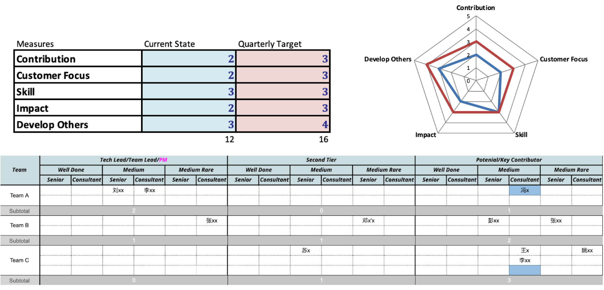

又到七月，忙成狗。  
每年7月和12月年底，都是团队管理行政类事务高峰期。之前的两篇半年投资复盘，也能看出这2个时间点都没有任何操作记录。  
除了事情多，更重要的是，事关团队全员的职业发展和薪酬福利，总是要慎重再慎重。  
其中一项工作就是盘点团队人才梯队现状，规划未来方向，制订路线图。  
ThoughtWorks洞见系列的这篇文章很好，其中提供了几个用于人才梯队盘点的工具系统，摘录如下。

> 《团队在高速扩张中的能力构建与质量保证》  
https://insights.thoughtworks.cn/capacity-building-and-quality-assurance/

### 人才梯队构建

为了防止项目新人过多所带来的文化稀释，知识稀释。人才梯队建设是非常有必要的。主要包括下面三个方面:

+ 可视化人才梯队看板。PM/TL、SecondTire、KeyContributor、Others、Risk
+ 每季度基于Facts的Review，进行梯队调整。
+ 梳理人员提升Actions、帮助团队成员提升。

人才看板，把团队里的人分为了五个阶段：

+ PM/TL：项目负责人/技术负责人。
+ SecondTire: 很有潜力成为项目负责人/技术负责人的第二梯队。
+ KeyContributor：项目主要贡献者。
+ Others：一般人员。
+ Risk：有风险人员。

同时每个阶段里再分为：

+ Well done 完全准备好了，找机会随时进入下一个阶段。
+ Medium 中等，还需要锻炼。
+ Medium Rate 刚刚进入这个阶段，还需要不少锻炼。

我们分为主要的五个维度进行打分和度量，以评估团队成员现在所处哪个阶段。

+ Contribution
+ Customer focus
+ Skill
+ Impact
+ Develop Others

由于我们项目的工作性质，工作内容。我们定义了这五个维度，当然你可以根据你的项目，你的工作，按照你的需求，来定义适合你项目所需要和关注的维度（可参考 **StrengthsFinder 2.0** 来设计你自己需要关注的维度）。

每个季度，我们会根据每位成员在项目里所做的工作，发生的事实，按照这五个维度进行打分，区分团队成员所在的阶段和分维度打分只是一个方法，最重要的目标是帮助团队成员提升，让他/她们发展自己，遇到更好的自己。所以对于review回顾最重要的是提出改善意见，希望团队成员不断的在人才看板上向前移动，最后成为项目的主要负责人/技术负责人，可以自己去开启并负责一个新项目。
