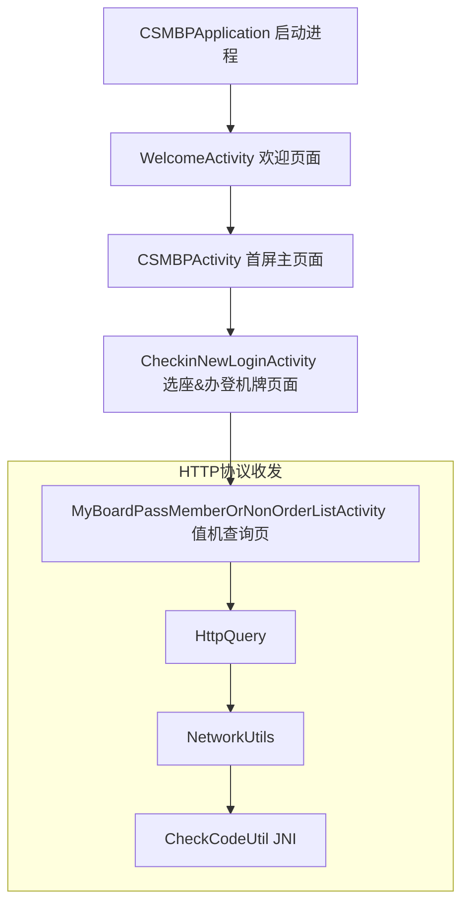

> 今天没写新东西，继续搬运。知乎上面没有存货了，剩下的都是很简短或者过时的内容。翻出三年前的这篇技术文档和代码，发现还能用，勉强充数吧。

中国航空公司的技术体系在互联网行业算是比较差了，再加上Android这种开源操作系统，几乎没有秘密可言。曾经想把所有航司App和官网都破解一遍，一直没行动。一是没必要，大前端逆向工程就几种固定的套路，翻来覆去折腾。二是系统天天变，今天破解了，明天又更新。三是没收益，不想违法，也不想从中盈利。  
以下是2017年夏天对南方航空App的一次逆向分析记录。

--------

### 0. 常规套路

+ APK 包体结构分析
+ Manifest.xml 结构分析
+ 安全加固脱壳
+ Java 字节码反编译
+ 网络协议抓包分析
+ NDK SO 文件反汇编分析
+ NDK SO 文件加解密算法分析
+ NDK SO 文件动态签名校验绕过

### 1. APK 包体结构分析

APK 解压后的 DEX 文件：

DEX | SIZE
---|---
classes.dex | 14 KB
classes2.dex | 6340 KB
classes3.dex | 4021 KB

assets 目录结构：

FILE | SIZE
---|---
classes.dgc | 1358 KB
classes0.jar | 6182 KB

标准的梆梆加固技术方案，用的还是付费企业版。

脱壳后：

DEX | SIZE | 用途
---|--- |---
classes.dex | 6517 KB | 主要业务逻辑和UI
classes2.dex | 6342 KB | 其他业务逻辑和UI
classes3.dex | 4017 KB | 第三方SDK和开源库

### 2. 脱壳

过程省略，安卓第三方安全加固厂商就那么几家，常规固定套路。有耐心就自己搞，嫌麻烦就上淘宝找店铺，几十块到几百块，二十分钟搞定。

+ 梆梆加固免费版，一般使用 XPosed + ZJDroid 就能顺利脱壳。
+ 梆梆加固企业版，针对常见破解工具，做了动态对抗，稍微棘手一些。
+ 小米手机 MIUI bootloader，recovery 安全性越来越复杂，刷机难度提升，不宜用于 Xposed 注入。
+ GenyMotion 模拟器不错，性能好，运行快，非常方便注入 xposed。但是仅支持x86架构，需要额外安装 ARM Translation。
+ 国产安卓模拟器越来越好用，内置 ROOT，Xposed，应用多开，脚本控制。是非常不错的选择。

### 3. Manifest.xml 结构分析

Activity UI 入口必须有明文静态声明的，躲不了。摘录一段值机相关逻辑代码片段（快速跳过）：

```xml
<manifest xmlns:android="http://schemas.android.com/apk/res/android" package="com.csair.mbp" platformBuildVersionCode="25" platformBuildVersionName="7.1.1">
    <application android:name="com.csair.mbp.CSMBPApplication" android:networkSecurityConfig="@xml/b" android:persistent="true">
        <activity android:name="com.csair.mbp.WelcomeActivity">
            <intent-filter>
                <action android:name="android.intent.action.MAIN"/>
                <category android:name="android.intent.category.LAUNCHER"/>
            </intent-filter>
        </activity>
        <activity android:name="com.csair.mbp.checkin.activity.CheckinLoginActivity"/>
        <activity android:name="com.csair.mbp.checkin.activity.CheckinListActivity"/>
        <activity android:name="com.csair.mbp.checkin.activity.CheckinDetailActivity"/>
        <activity android:name="com.csair.mbp.checkin.activity.CheckinApiActivity"/>
        <activity android:name="com.csair.mbp.checkin.activity.CheckinChooseSeatActivity"/>
        <activity android:name="com.csair.mbp.checkin.activity.CheckinCancleSeatActivity"/>
        <activity android:name="com.csair.mbp.checkin.activity.CheckinChooseAirlineActivity"/>
        <activity android:name="com.csair.mbp.checkin.activity.CheckinDialogListActivity"/>
        <activity android:name="com.csair.mbp.checkin.activity.CheckinSuccessActivity"/>
        <activity android:name="com.csair.mbp.checkin.activity.CheckInTypeActivity"/>
        <activity android:name="com.csair.mbp.checkin.activity.CheckinLoginAllActivity"/>
        <activity android:name="com.csair.mbp.checkin.input.activity.CheckinNewLoginActivity"/>
        <activity android:name="com.csair.mbp.checkin.input.activity.CheckinNewLoginAllActivity"/>
        <activity android:name="com.csair.mbp.checkin.input.activity.MyBoardPassMemberOrNonOrderListActivity"/>
        <activity android:name="com.csair.mbp.checkin.input.activity.MyBoardPassMemberOrNonOrderRVActivity"/>
        <activity android:name="com.csair.mbp.checkin.input.activity.BoardingPassBundleOpenActivity"/>
        <activity android:name="com.csair.mbp.checkin.input.activity.CheckInAddAddressActivity"/>
        <activity android:name="com.csair.mbp.checkin.input.activity.CheckInAddUSAddressActivity"/>
        <activity android:name="com.csair.mbp.checkin.input.activity.SendEmailActivity"/>
        <activity android:name="com.csair.mbp.checkin.input.activity.BoardingPassCardActivity"/>
        <activity android:name="com.csair.mbp.checkin.input.activity.BoardingPassQrCardActivity"/>
        <activity android:name="com.csair.mbp.checkin.input.activity.PaymentForSeatActivity"/>
        <activity android:name="com.csair.mbp.checkin.input.activity.CheckinSelectPassengerActivity"/>
        <activity android:name="com.csair.mbp.checkin.input.activity.SelectSeatActivity"/>
        <activity android:name="com.csair.mbp.checkin.input.activity.SelectSeatActivityNew"/>
    </application>
</manifest>
```

#### 4. NDK SO 文件结构

解压缩 /lib/armeabi/*.so

SO文件 | 望文生义猜测用途
---|---
libAndroidBankCard.so | 南航银行卡逻辑
libAndroidIDCard.so | 南航用户ID逻辑
libencrypt_release.so | 南航网络协议加解密逻辑
libapp_BaiduPanoramaAppLib.so | 百度全景图
libBaiduMapSDK_base_v4_1_1.so | 百度地图
libBaiduMapSDK_cloud_v4_1_1.so | 百度地图
libBaiduMapSDK_map_v4_1_1.so | 百度地图
libBaiduMapSDK_radar_v4_1_1.so | 百度地图
libBaiduMapSDK_search_v4_1_1.so | 百度地图
libBaiduMapSDK_util_v4_1_1.so | 百度地图
liblocSDK7.so | 百度地图
libbsdiff.so | 增量更新
libDexHelper-x86.so | 梆梆加固
libDexHelper.so | 梆梆加固
libentryexpro.so | 银联支付
libjcore110.so | 极光推送
libmsc.so | 科大讯飞语音
libMtaNativeCrash_v2.so | 腾讯移动分析统计
libnbsdc2.1.0.so | 听云应用性能监控
libtencentloc.so | 腾讯地图
libuptsmaddon.so | 银联支付
libweibosdkcore.so | 微博

### 5. Java 字节码反编译

+ jeb最强大，license最贵，在免费试用期内玩。
+ dex2jar + jd-gui, jadx 各有千秋，混合搭配使用，字节码就能 99% 还原成可读性极佳的 Java 代码。
+ 网易云加密提供的"安卓右键工具"不错，右键下拉菜单集成 apktool, dex2jar, jd-gui。

### 6. Java 代码分析启动流程



### 7

CheckinNewLoginActivity.java  
枯燥的部分，跳过。

```java
package com.csair.mpb.checkin.input.activity;

@Deprecated
@NBSInstrumented
public class CheckinNewLoginActivity extends AppCompatActivity implements TextWatcher, TraceFieldInterface {

    //UI Button Click 事件
    private void a(View view) {
        if (c()) {
            //MTA埋点统计
            b.a((int) j.f.New_MTA_061001001, "001", "CheckLogin");

            //获取UI控件字符串
            String trim = ((AQuery) this.a.id(2131758702)).getText().toString().trim();
            String replaceAll = ((AQuery) this.a.id(2131758704)).getText().toString().trim().replaceAll(" ", "");
            String trim2 = ((AQuery) this.a.id(2131758713)).getText().toString().trim();

            //SharedPreferences.edit().putString("login_phone", trim2);
            ai.a().a("login_phone", trim2);

            /*
            @com.csair.mbp.base.d.a.a(a =
            "com.csair.mbp.checkin.input.activity.MyBoardPassMemberOrNonOrderListActivity"
            )
            public interface ep {
                a a(
                @com.csair.mbp.base.d.a.k(a = "retrieveby") String str,
                @com.csair.mbp.base.d.a.k(a = "accountNo") String str2,
                @com.csair.mbp.base.d.a.k(a = "supplementInfo") String str3,
                @com.csair.mbp.base.d.a.k(a = "mobile") String str4
                );
            }
            */
            ((ep) d.b(ep.class, this)).a("IDFN", trim, replaceAll, trim2).b();

        }
    }

    //UI Button Click 事件
    private void b(View view) {
        if (d() && c() && e()) {
            String replaceAll;
            //MTA埋点统计
            b.a((int) j.f.New_MTA_061001001, "001", "ID/TicketNo");

            //获取UI控件字符串
            String trim = ((AQuery) this.a.id(2131758708)).getText().toString().trim();
            String trim2 = ((AQuery) this.a.id(2131758711)).getText().toString().trim();
            if (v.c()) {
                replaceAll = trim2.replaceAll(" ", "");
            } else {
                replaceAll = trim2;
            }
            String trim3 = ((AQuery) this.a.id(2131758713)).getText().toString().trim();

            //SharedPreferences.edit().putString("login_phone", trim2);
            ai.a().a("login_phone", trim3);
            if (this.b == null) {
                this.b = new ArrayList();
                this.b.add(replaceAll.toUpperCase());
                //SharedPreferences.edit().putString()
                this.d.a(this.b);
            } else if (!this.b.contains(replaceAll.toUpperCase())) {
                if (this.b.size() < 3) {
                    this.b.add(replaceAll.toUpperCase());
                } else {
                    this.b.remove(0);
                    this.b.add(replaceAll.toUpperCase());
                }
                //SharedPreferences.edit().putString()
                this.d.a(this.b);
            }
            if (this.c == null) {
                this.c = new ArrayList();
                this.c.add(trim);
                this.d.b(this.c);
            } else if (!this.c.contains(trim)) {
                if (this.c.size() < 3) {
                    this.c.add(trim);
                } else {
                    this.c.remove(0);
                    this.c.add(trim);
                }
                //SharedPreferences.edit().putString()
                this.d.b(this.c);
            }
            /*
            @com.csair.mbp.base.d.a.a(a =
            "com.csair.mbp.checkin.input.activity.MyBoardPassMemberOrNonOrderListActivity"
            )
            public interface ep {
                a a(
                @com.csair.mbp.base.d.a.k(a = "retrieveby") String str,
                @com.csair.mbp.base.d.a.k(a = "accountNo") String str2,
                @com.csair.mbp.base.d.a.k(a = "supplementInfo") String str3,
                @com.csair.mbp.base.d.a.k(a = "mobile") String str4
                );
            }
            */
            ((ep) d.b(ep.class, this)).a("TNNM", trim, replaceAll, trim3).b();
        }
    }
}
```

### 8

MyBoardPassMember...Activity.java  
继续跳过。

```java
package com.csair.mbp.checkin.input.activity;

@NBSInstrumented
public class MyBoardPassMemberOrNonOrderListActivity extends AppCompatActivity implements TraceFieldInterface {

   private void b(String str, String str2, String str3, String str4) {
        /*
        this.f is class BaseJsonQuery
        */
        if (!(this.f == null || this.f.isCancelled())) {
            this.f.cancel(true);
        }

        /*
        e is class HttpQuery
        public abstract class e extends AsyncTask<String, Integer, Object> implements TraceFieldInterface{}
        a is class BaseJsonQuery
        public class a extends e {}
        g is interface IJsonQueryDealer
        public interface g {}
        this.f = new BaseJsonQuery(Context).a( g );
        */
        this.f = new a(this).a(new e(str, str2, str3, str4));

        this.f.b(false).a(com.csair.mbp.base.i.a((int) f.URL_C064, new Object[0]), dw.a(this), dx.a(this), dy.a(this));
    }
}
```

### 9

HttpQuery.java  
继续跳过。

```java
package com.csair.mbp.c;

public abstract class e extends AsyncTask<String, Integer, Object> implements TraceFieldInterface {

    public void a(String str, f fVar, e eVar, c cVar) {
        this.k = fVar;
        this.l = eVar;
        this.m = cVar;

        /*
        加载CheckCodeUtil SO动态库，并初始化。
        */
        CheckCodeUtil.a(BaseApplication.a());

        //兼容Android 2.3系统版本，启动异步线程执行http请求。
        if (VERSION.SDK_INT < 11) {
            String[] strArr = new String[]{str};
            if (this instanceof AsyncTask) {
                NBSAsyncTaskInstrumentation.execute(this, strArr);
                return;
            } else {
                execute(strArr);
                return;
            }
        }

        //使用线程池，启动异步线程执行http请求。
        Executor newCachedThreadPool = Executors.newCachedThreadPool();
        String[] strArr2 = new String[]{str};
        if (this instanceof AsyncTask) {
            NBSAsyncTaskInstrumentation.executeOnExecutor(this, newCachedThreadPool, strArr2);
        } else {
            executeOnExecutor(newCachedThreadPool, strArr2);
        }
    }
}
```

### 10

NetworkUtils.java  
继续跳过。

```java
package com.csair.mbp.c;

@NBSInstrumented
/* compiled from: NetworkUtils */
public final class i {

    /* compiled from: NetworkUtils */
    private static class a extends Exception {
        a(String str) {
            super(str);
        }
    }

    public static String a(Context context, String str) throws Exception {
        JSONObject init = NBSJSONObjectInstrumentation.init(str);
        String optString = init.optString(dc.X);
        if (TextUtils.isEmpty(optString)) {
            return null;
        }
        String a = k.a("NETWORK_DESCRIPTION", "F");
        String substring = optString.substring(0, 1);
        if (a.equalsIgnoreCase(substring)) {
            String optString2 = init.optString(dc.Y);
            if (TextUtils.isEmpty(optString2)) {
                return null;
            }
            /*
            CheckCodeUtil 解密 optString
            */
            optString = CheckCodeUtil.a(context).a(optString);
            if (TextUtils.isEmpty(optString2)) {
                return null;
            }
            int parseInt = Integer.parseInt(optString.substring(0, 1));
            if (!optString2.startsWith(optString.substring(1, parseInt + 1))) {
                return null;
            }
            byte[] a2 = o.a(com.csair.mbp.base.f.a.a(optString2.getBytes(), optString.substring(parseInt + 1).getBytes()));
            return a2 != null ? new String(a2, "utf-8") : null;
        } else {
            k.a("NETWORK_DESCRIPTION", substring.toUpperCase());
            return null;
        }
    }

    /*
    CheckCodeUtil 加密 str
    o.b() is GZipUtil.GZip()
    */
    private static byte[] c(String str, int i) throws Exception {
        return o.b(CheckCodeUtil.a(BaseApplication.a()).a(k.a("NETWORK_DESCRIPTION", "") + str, i).getBytes("utf-8"));
    }
```

### 11

CheckCodeUtil.java  
继续跳过。

```java
package com.MobileTicket;

import android.content.Context;
import android.content.SharedPreferences;

public class CheckCodeUtil {
    private static CheckCodeUtil instance = null;
    private static SharedPreferences sharedPreferences = null;

    public static CheckCodeUtil getInstance(Context context) {
        if (instance == null) {
            instance = new CheckCodeUtil();
        }
        if (sharedPreferences == null && context != null) {
            sharedPreferences = context.getSharedPreferences("checkCodeUtilServiceInfo", 0);
        }
        return instance;
    }

    public String deCheckCode(String str) {
        byte[] decheckcode = decheckcode(str);
        return decheckcode != null ? new String(decheckcode) : null;
    }

    public String checkCode(String str, int i) {
        long j = 0;
        long currentTimeMillis = System.currentTimeMillis();
        if (sharedPreferences != null) {
            j = sharedPreferences.getLong("timeDifference", 0);
        }
        byte[] checkcode = checkcode(str, i, (j + currentTimeMillis) + "");
        return checkcode != null ? new String(checkcode) : null;
    }

    public native byte[] checkcode(String str, int i, String str2);

    public native byte[] decheckcode(String str);

    static {
        System.loadLibrary("encrypt_release_crack");
    }
}
```

### 12. Wireshark 抓包分析HTTP协议

值机查询

**request:**

```
0000   1f 8b 08 00 00 00 00 00 00 00 05 c1 4b 12 82 20  ............K..
0010   00 00 d0 03 b9 10 2a 19 5d b8 c8 cc 10 bf 24 a6  ......*.].....$.
0020   b6 63 06 c9 a6 6c d4 d0 c4 d3 f7 5e b0 be ed a9  .c...l.....^....
0030   3f b7 0a 68 39 69 1e e5 41 b7 eb bf fb 4f 0b 9d  ?..h9i..A....O..
0040   a2 33 3c 40 a8 65 20 53 c4 f0 28 58 34 e0 a5 88  .3<@.e S..(X4...
0050   69 7d 82 64 6a 9d f1 26 ac 4c 2e 9a a8 94 b0 9c  i}.dj..&.L......
0060   aa a7 c0 35 13 8f 6a 64 57 d4 bc 50 38 8c e1 61  ...5..jdW..P8..a
0070   9b 2f 54 cb b2 f2 bd 39 e6 20 dd 92 9a 17 a8 37  ./T....9. .....7
0080   e7 3b 6f 58 f6 f3 4b a1 42 e0 6d 6a c5 4d 07 f1  .;oX..K.B.mj.M..
0090   0a 13 c9 6c df c8 b8 43 5d f7 0f dd 76 b8 6f 99  ...l...C]...v.o.
00a0   00 00 00                                         ...
```

标准GZIP格式：  

```
header 10 bytes: 1f 8b 08 magic number + version number + timestamp  
footer 8 bytes: CRC-32 checksum  + uncompressed data length
```

解压缩：

```
Fxl8rmEet0yfryaKPFh2ms3ne19Sh+B0JQ5+6/dL1AdTKpHvSLQXC1Jre9qVd5OfvyJtNJTPQtidHXTdgWqTR6Yk6IpqI4zuGQyfUWDBuLa0NzMXaS6m/uZaYTOwDUdtI0BztxHYh1Hx1MfT8D+Oa9Q==  
```

标准Base64格式：  
> Base64编码由大写字母，小写字母，数字，'+'，'/'组成，尾部通常有1,2个'='。  

配合Java代码逻辑解读，这里使用AES加解密，解密后数据如下，仍然是二进制密文，思路卡壳，不过已知与 libencrypt_release.so 有关。

```
536BC2820A4F1D78063CC3A748C29DC28C6CC2AA74C289C2B77214062A4BC28B72C38C4D145BC2AEC3B2C2B2C3984D25C3BF58C39AC398C292C392C3A54011C3A0C293C3A8C28BC38238C3A0C392C2B0C385C2BC0DC2BB00C2B9C38535C3A44019C285C3842DC28B4DC3BE1EC3A7C28D4CC29F6CC3B913C3A5C2B2C3B664C28C14C38CC3A6C3AB242AC3903A4AC3880A79C386153DC3ADC39A6E3759C3B3C2A32913C381C29C4E6CC2A25AC389594705C283C2A15D00C3925E0F60C297C283
```

### 13. NDK SO 文件反汇编分析

目标：`libencrypt_release.so`

Linux ELF 格式的 SO文件，有很多现成分析工具。过程省略。  
找到该文件的2个关键 JNI 方法： checkcode, decheckcode。  

+ checkcode，传入String，返回密文String。
+ decheckcode, 传入密文String，返回32位String。再由Java层AES解密。  

### 14. NDK SO文件签名校验绕过

直接调用该SO文件的2个JNI方法会静默报错。即运行正常，但解密内容错误，无法使用。  
简单分析可知，其运行时通过 JNI 反射调用 Java 层的 `Android Package Signature`，检查合法性。非法即返回错误值。
  
祭出大杀器 IDA Pro，找到一个最大嫌疑犯，字符串"162cebab80ee4e308341350f2eeadd1d"，长度32。  
继续验证，它就是南航APK包签名的MD5值。  
接下来就简单了，使用任意二进制编辑器，替换新密钥MD5值，跳过验证逻辑。  
(南航犯了小错误，这里不该明文保存完整hardcode，至少混淆拆分隐藏一下吧。)  

### 15. End

虽然完整的加解密算法没有逆向出来，但是 HTTP 协议及其 NDK 加解密方法已经清晰，那么剩下的就是体力活了。
