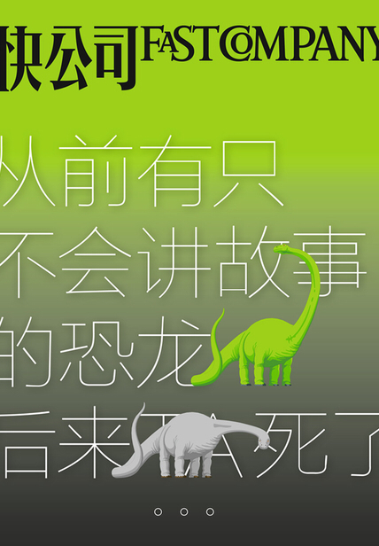

### 《快公司 Fast Company》

> 快公司（Fast Company）是国际领先的多元媒体品牌，1995年11月由艾伦·韦伯（前哈佛商业评论总编辑）创建，长期出品有关管理、设计和技术的最新思想，探讨主流行业的前瞻趋势，聚焦于商业创新领域，为变革商业和创造财富的人士提供指南，对美国新经济的发展做出了卓越的贡献。
>
> 简单点说，25年前有位名叫 Alan Webber 的老头功成名就，却觉得那个让他成功的工作和头衔很无聊，于是拉着另外一位叫 William Taylor 的人，创办了这本杂志。

### 简介

> 觉得这本书的名字很奇怪？其实这是一本与讲故事有关的书，方方面面，巨细无遗。为什么我们要学会讲故事？什么样的故事是好故事？如何讲好一个故事？讲好了故事会有怎样的获益？欢迎打开本书，一心一意谈创新的快公司（Fast Company），将和您一起探讨如何更好地讲故事。恐龙，是怎么死的？科学家说，是因为环境温度的变化，引发了食物短缺等危机。但环境的变化影响的是每一种生物，为何独独灭绝了体型最大的？  
有的公司在发展中推出更有吸引力的产品、招徕更牛逼的人才，他们用更好的环境刺激创新，无需过多渲染，直接看他们的一言一行就像在读一个故事。而另外一些公司，却在规模的变化中染病，组织臃肿，对竞争反应迟钝——变大成了一场事故。

### 讲故事

心理学表明，我们的态度、恐惧、希望以及价值观都强烈受到故事的影响动摇。事实上，比起佐以辩论和证据以达说服目的的论文来说，故事小说似乎能更加有力地改变人类的信仰。  
讲故事让家庭开心，让员工快乐，让事业成功。

+ “一帆风顺”或是“永无翻身之日”不会对孩子有多大的影响，而最有感染力的一类，毫无疑问就是那些充满悲欢离合、有起有伏的故事。
+ 过去总是认为塑造品牌形象就是以真实可信的故事打动消费者（换句话说，故事是专门讲给消费者听的），却没有想过这些故事同样能够让我们的员工受益。帮助员工建立强烈的使命感和企业历史感与说服用户同样重要。
+ 如果你的个人品牌更强、更有价值的话，你的团队品牌也相应地变得更强。如果没人能看到你独特的价值，那他们也就失去了你的经验、专业知识和让你发挥能力的机会。

在现在的时代，人们应该表现得像公司，而公司应该表现得像人们。例如奥巴马和特朗普。跟他人分享自己在成功路上的思考，有利于自己更为成功。

+ 可视化使数据变得有故事。
+ 好故事的骨架甚至可以使用emoji这种最精炼的工具提取。
+ 博客/Twitter/图片/视频……
+ 当有些人在议论140字限制正在毁掉饱满的故事时，另外有些人提出，新媒体并不是在毁灭小说，而是让创作故事拥有更大的创新空间。

最后，让更多的人愿意和你一起讲故事，永远是一件稳赚不赔的事。
