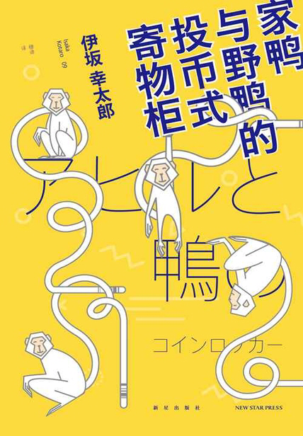

伊坂幸太郎  
2003年11月25日出版。  
获 2004年 第25回吉川英治文学新人奖。  
豆瓣评分最高 8.4。  
英文名：The foreign duck, the native duck and God in a coin locker.  
家鸭是在中国被改良过的品种，即外国的鸭子。  
野鸭是日本本土的鸭子。  
投币式寄物柜，按英文名更容易理解，即“把神锁在柜子里”。  

### 人物

+ 丽子，宠物店店长。
+ 琴美，宠物店员工。
+ 多吉，不丹人，琴美男朋友，来日本留学。
+ 河崎，琴美前男友，女人缘佳。曾去过不丹，看多吉不太会说日文而开始教导他。
+ 椎名，书中的主人公“我”，从老家到仙台求学的大一新生。住在河崎隔壁。

### 简介

大一新生椎名哼着鲍勃·迪伦的歌搬入独居公寓，和帅气邻居河崎初次见面就被邀请深夜一起去抢劫书店！为了一本《广辞苑》去抢书店？有没有搞错？！椎名深知此事荒唐，却又莫名其妙地被这份荒唐所吸引，恍惚地参与其中。河崎口中的荒唐事还不只这一件，单纯的椎名有些应接不暇，他想知道很多事的真相。椎名去跟踪、追问，寻找相关人士打探，最终他发现，所有的答案早就呈现在眼前。正如鲍勃·迪伦早就唱过的，Blowing in The Wind。

### 剧透

伊坂幸太郎一定是太爱科恩兄弟，鲍勃·迪伦，披头士乐队了。鲍勃·迪伦的《Blowing in The Wind》（答案在风中飘扬，又译随风而逝）在整本书中弥漫。  
读他的小说一定要先看目录。习惯性多人物视角，交叉时间线叙事。本书以“两年前”和“现在”两条时间线，两种视角轮番切换，临近结尾揭示真假河崎的身份替换，最终诠释了书名“家鸭，野鸭，寄物柜”的含义。不温不火的讲着重口和悲剧的故事。  
这种切换形式似乎很常见。东野圭吾 1993 《分身》，鞠子之章和双叶之章，双主角轮番切换。1997 《恶意》，野野口修和加贺恭一郎，一人一章。

### 同名改编电影

2007年，豆瓣评分 8.0，推荐。

