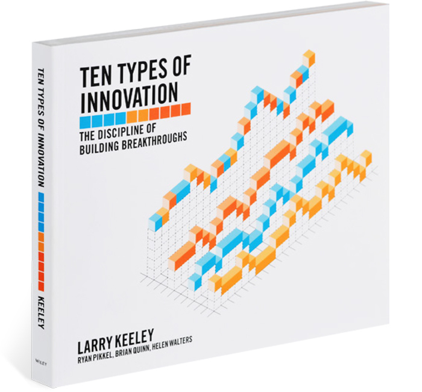

> 上半年的工作回顾即将处理完毕，绩效考核，晋升述职，人的事，钱的事。接下来就该思考讨论规划下半年的方向。  
当团队扩大，岗位职责多样化，涉猎的领域越宽。快速学习各领域知识，并制订未来创新方向变成一件很烧脑的事情。  
最近看了《Doblin's 10 Types of Innovation》，很受启发，放几个链接，以备日后查阅。  
这篇大概可以归类到“专家VS管理”这个课题的“专家角色价值”部分吧。  

### Doblin

[https://doblin.com/ten-types](https://doblin.com/ten-types)  
Doblin 是一家创新咨询公司，他们提出了一种创新框架“创新十型”。  
官网有非常详细介绍。  

+ PROFIT MODEL  
How you make money
+ NETWORK  
How you connect with others to create value
+ STRUCTURE  
How you organize and align your talent and assets
+ PROCESS  
How you use signature or superior methods to do your work
+ PRODUCT PERFORMANCE  
How you develop distinguishing features and functionality
+ PRODUCT SYSTEM  
How you create complementary products and services
+ SERVICE  
How you support and amplify the value of your offerings
+ CHANNEL  
How you deliver your offerings to customers and users
+ BRAND  
How you represent your offerings and business
+ CUSTOMER ENGAGEMENT  
How you foster compelling interactions

### YouTube

[Doblin's 10 Types of Innovation](https://www.youtube.com/watch?v=Q3sfmDkrAI0)

[10 Types of Innovation](https://www.youtube.com/watch?v=GvROlNjLbrA)  
Larry Keeley  
SingularityU South Africa Summit

[Corporate Innovation](https://www.youtube.com/watch?v=JD1ofouDGGE)  
Larry Keeley  
SingularityU Australia Summit 2018

### Book

