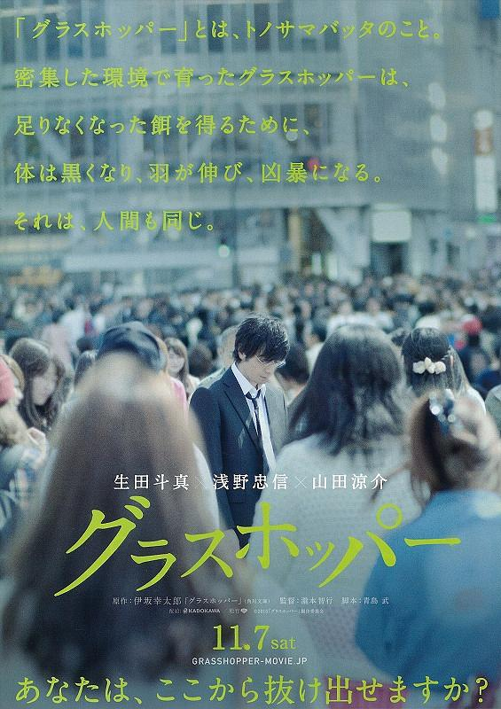
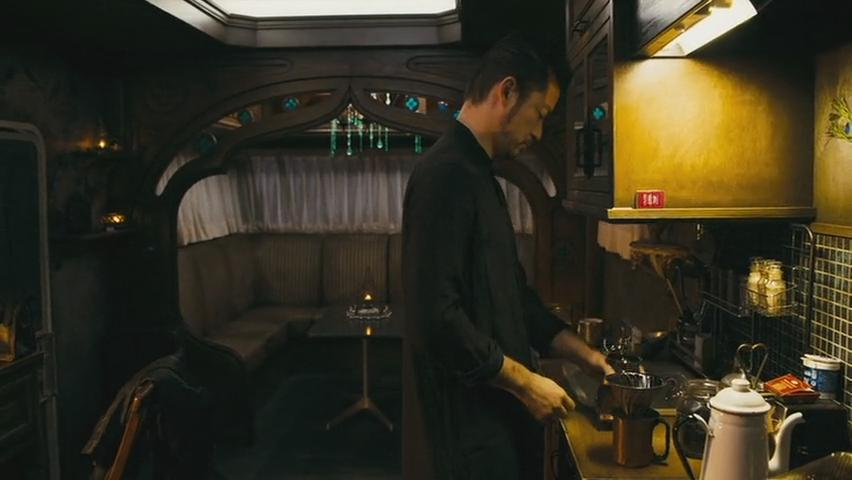
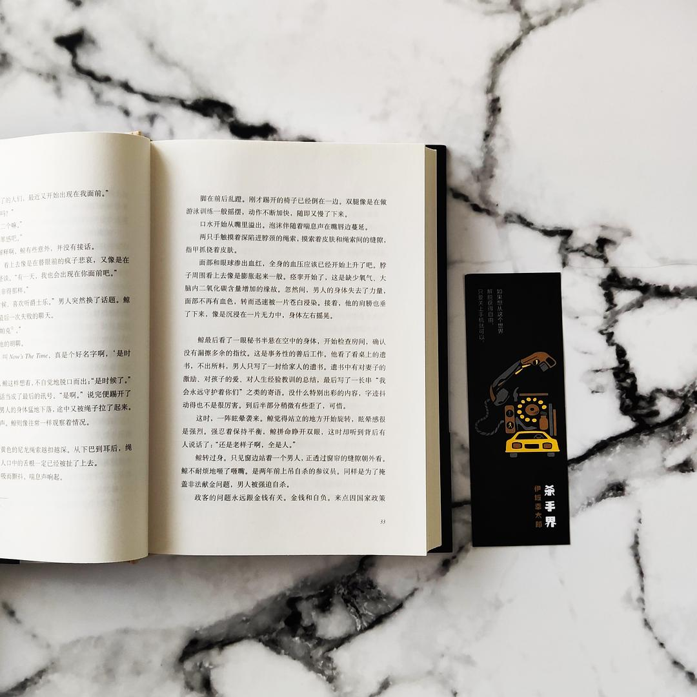
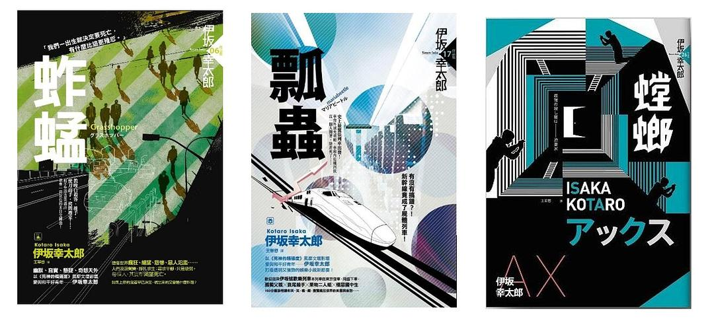
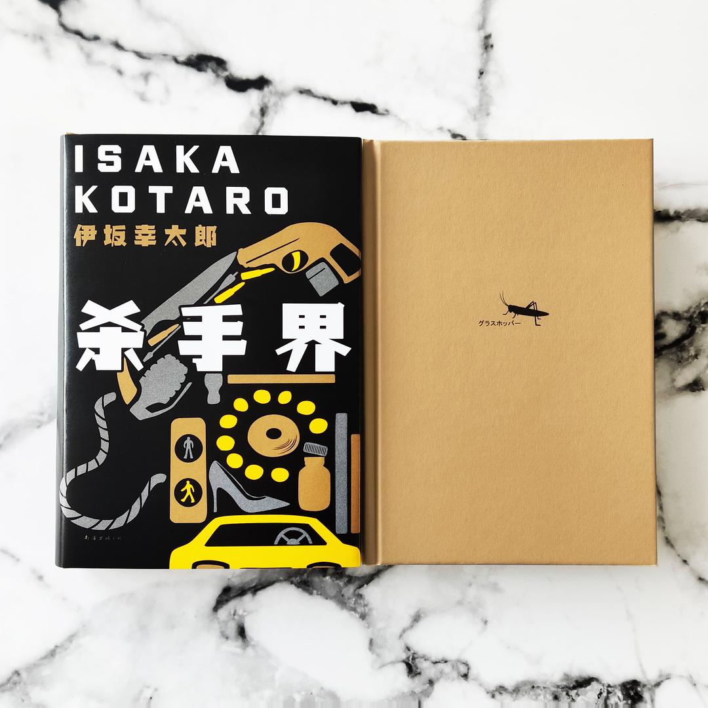
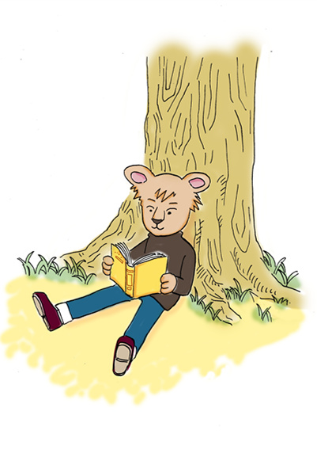

> 最近有人威胁我说，再发垃圾书评就取关！  
于是我认真思考了一下这个问题。  
这个公众号简介是：一间存放故事的仓库。  
但是这一天到晚的，哪儿来那么多“无码真故事”啊～  
之前花了很多时间看完东野圭吾86本小说。  
最近主要在看伊坂幸太郎，每读完一本就忍不住想写点什么。  
但是又不想写太多剧透（主要还是水平差 + 懒）。  
最后就变成了骚扰大家的垃圾推送。  
用威胁者的话说就是：“你这些破文字，跟百度搜索有什么区别！”
>
> 但是我现在就是喜欢看伊坂幸太郎啊！  
转载一篇超级高质量的书评，不算垃圾推送吧？  
本文已联系作者，获得转载授权。
>
> [转载自豆瓣书评](https://book.douban.com/review/12175371/)  
[作者豆瓣主页](https://www.douban.com/people/3012510/)  
© 本文版权归作者 短矢 所有，任何形式转载请联系作者。  

接到编辑新版《杀手界》的任务是在八月份，没想到等这书出来竟然已经到了次年——其实书早早已经编辑印刷完成，只是因为决定跟新版《疾风号》一起上市，所以硬生生在库房扣了一段时间，好在终于赶在年前上市了。

十几年前初读伊坂作品的时候，肯定没想过自己有一天会成为他作品的编辑，更没想过自己会负责的第一本书是《杀手界》。这绝不是说《杀手界》在伊坂作品里没有存在感，而是觉得这本书在伊坂所有的作品里太过特别。

**特别在哪？简言之，在其阴郁。**

伊坂的作品常以“温暖人心”“治愈”等标签为人所知，可《杀手界》全然不是如此，**除开为数不多的几处插科打诨，这部作品几乎可以说自始至终都笼罩在一股阴郁的氛围里。**

比如，小说主线所讲述的“教师铃木为亡妻复仇”这一故事本身就很是沉重；书中另外两个有POV的角色，鲸和蝉，在人物性格和经历方面同样堪称令人窒息；而小说中那个贯穿始终、反复强调、令人印象深刻的“昆虫隐喻”，恐怕也绝对称不上是积极乐观。

那么，这部不怎么“伊坂”的作品值得一读吗？我的看法是：**值得——但请不要抱着对伊坂的“成见”去读。**如果能这样，那么，你不但可以意识到作者的苦心经营，甚至还能更加深刻地理解其他所有伊坂的作品。

伊坂经常会称自己的作品时“悲伤中带着乐观”，然而，在我个人看来，他真正的写作风格倒不如说是“**温情背后的底色悲凉**”。实际上，从出道作《奥杜邦的祈祷》，到巅峰作《金色梦乡》，再到近作《恐妻家》，伊坂的这种底色悲凉一直都若有若无地隐藏在他的作品之中，即使有意按捺，也都难以抛开。

另一点可以用来佐证的大概是伊坂**对其他作家的引用**。伊坂颇爱掉书袋，而他掉的书袋经常都是陀思妥耶夫斯基、三岛由纪夫、伍尔夫等作家——这如果不是暗示他的思想立场，至少也多多少少透露了他的美学趣味。

伊坂很聪明的一点在于，他非常清楚自己在创作什么样的作品，他对于类型文学的定位认识也很是清晰。**“类型文学”不是“纯文学”，它的消遣性质决定了它必须遵循一定的写法，因此，作者在表达的同时也必须有意地克制一部分的自我。**正是从这个角度，我们或许可以理解理解伊坂作品中内在的那种矛盾，其来源正是伊坂自觉、有意，却不完美的克制。

而《杀手界》一作，某种程度上而言或许可以说是他**最不克制，最能显示出他“底色悲凉”的一部小说**了，不单单是剧情、人物如此，书中那些大量出现的对于人类社会之残酷，人生之荒诞的批评也是这样。就连在小说结尾，伊坂也借助一个第159页那个隐秘的伏笔，堪称罕见地写作了一个BAD ENDING（大概是怕读者没读懂，这一结尾在续作《疾风号》中还被强调了一次）。

然而，也正因为这本书足够阴郁，其中的感情真挚才更显动人，也才能真正显示出铃木那句“**看着吧，我会像活着一样活着**”所蕴含的力量——一种罗曼·罗兰式的英雄主义。

有趣的是，比对伊坂早年和近年的创作，其悲凉的底色似乎明显存在着一个弱化的过程，这是因为伊坂的克制日趋成熟与完美，还是因为他确确实实日益感受到了“人间值得”？答案或许只能靠伊坂本人来揭晓。

再提一提编辑过程中几处可能引起争议的改动。

首先是**书名**。本作原名为“グラスホッパー”，对应的是英文中“grasshopper”一词，台版因此选择了直译为《蚱蜢》。我们当然很清楚很多书迷对这个译名很有感情，也认为其更具深度，但之所以最后没有使用这个译法，一方面自然是出于对市场的考虑，另一方面也是我们认为伊坂所谓的“昆虫三部曲”并不是那么成立。

为什么这么说呢？固然，在《杀手界》这部作品中，昆虫的隐喻很是关键，书中常常提到昆虫社会与人类社会的相似之处，很多讨论也堪称深刻。但是，**到了续作《疾风号》（台译《瓢虫》）和《恐妻家》（台译《螳螂》）中，伊坂的昆虫隐喻实际上并未再能较好地延续下去**：《疾风号》中的“瓢虫”除了作为主人公七尾的代号之外，几乎没有什么实际意义，至于《恐妻家》，“螳螂”这个译法本身同样就已经是日文书名“AX”的意译了，作品内容与“螳螂”之间的联系更是非常勉强。就此而言，放弃昆虫三部曲的译法其实并不会造成特别大的损失，而真正重要的是还是想想怎么样才能让伊坂老师“出圈”，被更多的读者看到。

与之相关的另一个改动是“グラスホッパー”（蚱蜢/蝗虫）、“バッタ”（蝗虫）与“トノサマバッタ”（殿下蝗虫/东亚飞蝗）这几个词的翻译。在台版和之前的大陆译本里，内文都多处出现了“蚱蜢”一词，但本次经核对原文发现，这些被翻译为“蚱蜢”的地方，其原文多为“バッタ”——一下子是“グラスホッパー”，一下子是“バッタ”，伊坂到底想说的是蚱蜢还是蝗虫？

这里的问题在于，对于日本人而言，蚱蜢与蝗虫似乎无需做进一步区分。翻遍各类词典，很多词条都将蚱蜢与蝗虫归为一种动物。但对于大多数国人而言，这两个词的所指明显存在差异：蚱蜢在人们印象里多指绿色蚱蜢，它们群居性不太强，通常被视为一种相对无害的昆虫；而蝗虫对大多数而言则是与“蝗灾”联系在一起的，它们有着很强的群居性，以成群结队蚕食粮食闻名，毫无疑问地联系着一种负面的情感。

考虑到这一差异，特别是考虑书中使用这一词汇的语境，以及关于这一隐喻的具体内容，我们决定**订正原来的“蚱蜢”这一译法，以“蝗虫”代之**，而另一个出现的日文词“トノサマバッタ”，这里则被统一为了“飞蝗”以示区别。**这么说来，假如这本书的书名真的一定要直译，恐怕也不适合翻译为《蚱蜢》，而应该译为《蝗虫》。**

不像豆瓣评论或者微博会员，书籍一经出版印刷，“付梓”的文字便成了“不刊之论”，即使有心修正，也不可能一本本去改回来。代珂老师的译笔素以流畅准确闻名，但任何译稿都不免有提升的空间，改版一本书是难得的机会，我们再次对译稿进行了优化，希望能让各位读者有流畅的阅读体验。

确认沿用《杀手界》的书名后，我们也对文案做出了不少更改，希望更多地呈现出伊坂笔下这个有趣的“杀手江湖”。此外，与这一系列的另外的两部作品《疾风号》《恐妻家》一样，《杀手界》的封面同样采取的是“拿很多物件拼成一样东西”的创意，而这本书之所以会选择用书中的“致命元素”拼装成一部电话，也是希望呼应“业界”这一有趣的主题。

写作、翻译与编辑都是无法“止于至善”的工作，更不可能赢得每一位读者的好评，尽管我们做了很多精心的修订与设计，书中一定也还有错误和遗憾。好在只要有人继续读伊坂，我们就总有机会“重版出来”。

