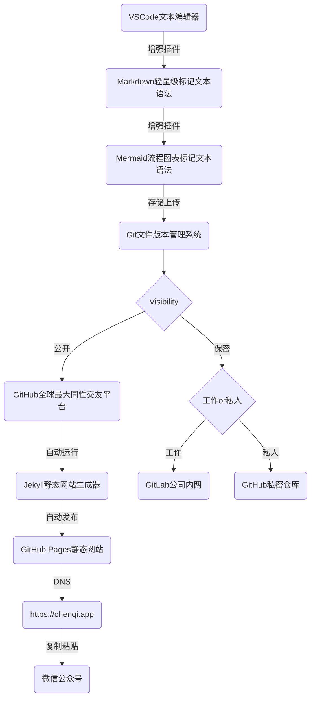
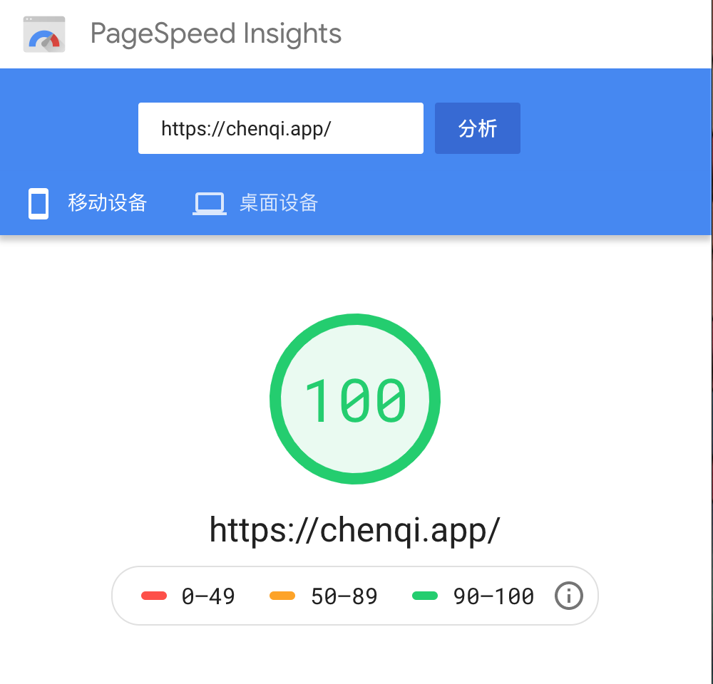
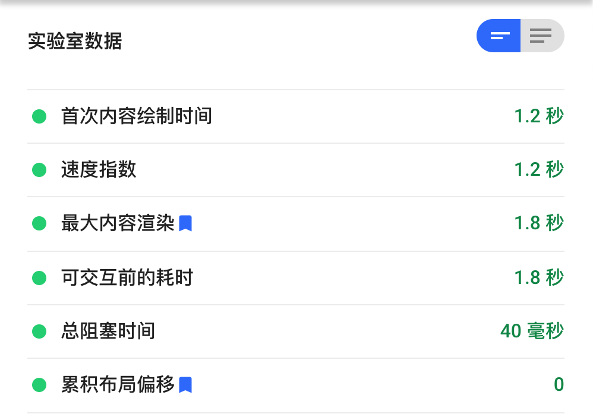
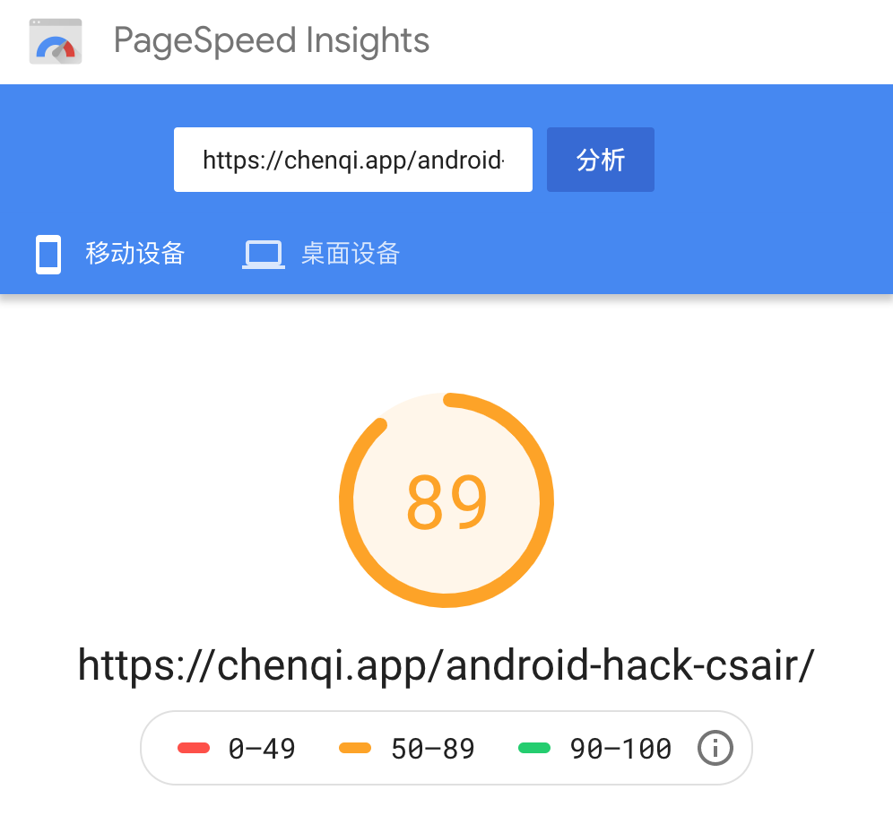
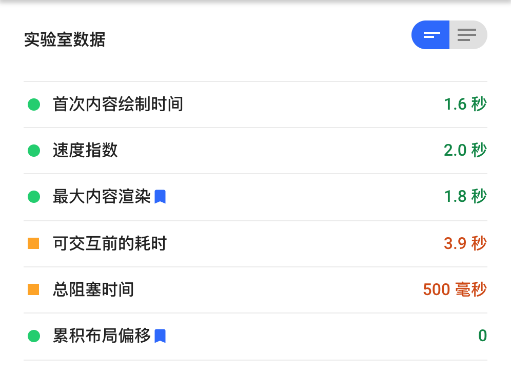
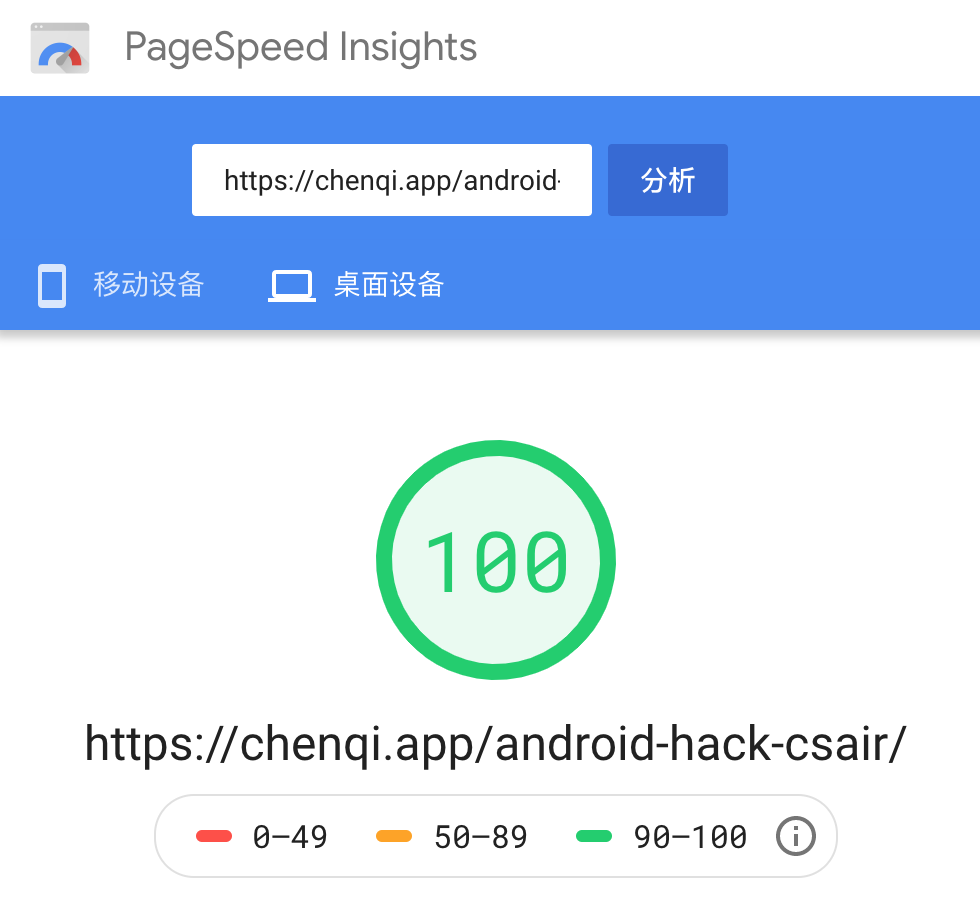
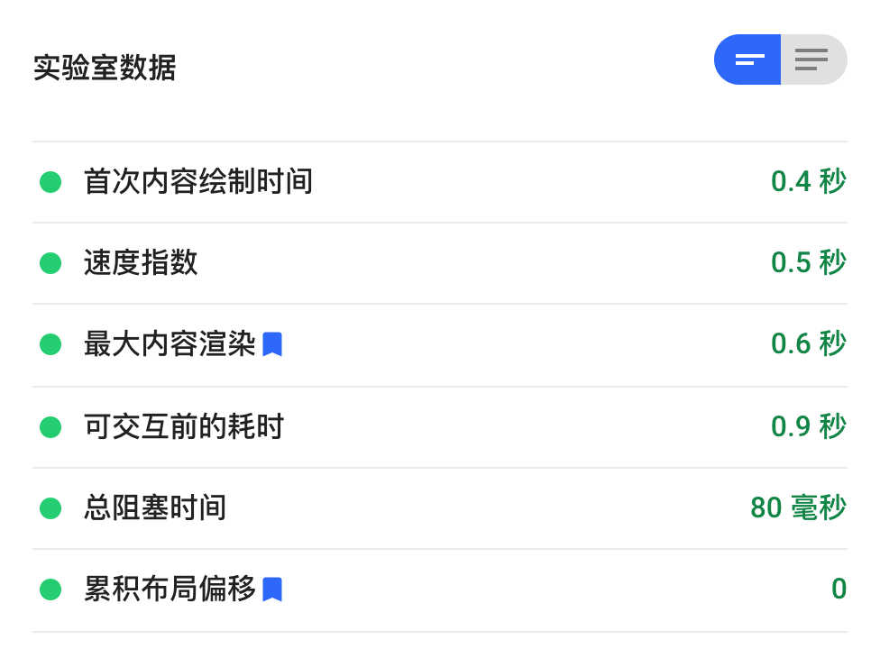

7月10日写[《 Android：csair 逆向工程》](../android-hack-csair/)时，发现一个 `Mermaid FlowChart` 排版问题，由于时间关系，发布时改用图片替换。趁着周末做个 BugFix。

### 程序员写字工具流程



嗯，上面这张流程图的制作过程就是图中 `Mermaid` 部分。语法很简单，原文如下：

```
graph TB
    vsc(VSCode文本编辑器)
    md(Markdown轻量级标记文本语法)
    mm(Mermaid流程图表标记文本语法)
    git(Git文件版本管理系统)
    gh(GitHub全球最大同性交友平台)
    ghp(GitHub Pages静态网站)
    jk(Jekyll静态网站生成器)
    cqa(https://chenqi.app)
    mp(微信公众号)

    gl(GitLab公司内网)
    ghv(GitHub私密仓库)

    vsc -->|增强插件|md
    md -->|增强插件|mm
    mm -->|存储上传|git
    git -->v{Visibility}
    v -->|公开|gh
    v -->|保密|wp{工作or私人}

    gh -->|自动运行|jk
    jk -->|自动发布|ghp
    ghp -->|DNS|cqa
    cqa -->|复制粘贴|mp

    wp -->|工作|gl
    wp -->|私人|ghv
```

### GitHub

`Markdown` 流行后，很快得到了大部分文本编辑器和平台的支持，例如：印象笔记，有道云笔记，简书，掘金，GitHub，GitLab。`Mermaid` 作为增强功能，紧随其后。  
但是，GitHub 始终不支持。  
2015年8月，`GitHub markup` 项目中有人创建 issue： [Add rendering of Mermaid diagrams](https://github.com/github/markup/issues/533)，至今无响应。  
2019年5月，`GitHub Support Community` 有人申请 [Feature Request: Support Mermaid (markdown) graph diagrams in .md files](https://github.community/t/feature-request-support-mermaid-markdown-graph-diagrams-in-md-files/1922) ，官方敷衍了事，至今依然没有任何进展。

反观 `GitLab` 社区，2015年11月，有人创建相同的 issue，2017年12月发布的 10.3 版本就成功集成进去。  
[Introduce Mermaid diagram support in markdown editor/preview](https://gitlab.com/gitlab-org/gitlab-foss/-/issues/3711)

### Jekyll

缺乏平台原生支持，那就从转译工具生成器入手。

`Jekyll` 是一个简单易用的静态博客网站生成器，适用于个人，项目或组织站点。它由 `GitHub` 联合创始人 `Tom Preston-Werner` 用 `Ruby` 语言编写，遵循 `MIT` 开源许可证。

`Jekyll Mermaid Plugin` 有很多种可用，但是无一被 `GitHub Pages` 内置。其默认启用并严格限制的依赖项和版本信息，详见：  
[https://pages.github.com/versions/](https://pages.github.com/versions/)

如果要使用任何额外的插件，只能放弃 `GitHub Pages` 标准构建流程和服务，改成本地构建再上传，或者自建新 CI 流程和服务。

对于我这么懒的人，绝对不可行。

### 页面样式模版

根据 `Mermaid` 官网文档，直接修改 `Jekyll Theme HTML` 样式模版是最简单的方法。  
从 `Theme` 仓库 Fork `_layouts/default.html` 到个人仓库。

添加代码：

```html
<script src="//cdnjs.cloudflare.com/ajax/libs/mermaid/8.6.0/mermaid.min.js"></script>

<script>
var config = {
startOnLoad: true,
theme: "forest",
};
mermaid.initialize(config);
window.mermaid.init(undefined, document.querySelectorAll('.language-mermaid'));
</script>
```

完成！

分别使用电脑和手机浏览器打开网站，页面加载出现明显卡顿，很显然问题出在这个JavaScript文件的远程加载和渲染环节。  
使用 `Google PageSpeed Insights (LightHouse)` 测试，只有可怜的40分。

### 页面性能优化

同步改异步，又一次重温互联网前端技术二十年悲惨历史。过程按下不表，只说结果。

首先添加自定义 `Jekyll Page Variables` ，用于区分哪些页面需要启用 `Mermaid` 。  
很显然，并不是每篇文章都有图表，在需要启用的文章头部添加声明：

```
---
mermaid: true
---
```

> ### ProTip™: Use Custom Front Matter
>
> Any custom front matter that you specify will be available under `page`. For example, if you specify `custom_css: true` in a page’s front matter, that value will be available as `page.custom_css`.
>
> If you specify front matter in a `layout`, access that via layout. For example, if you specify `class: full_page` in a layout’s front matter, that value will be available as `layout.class` in the layout and its parents.

然后修改样式模版，异步加载渲染。

```javascript


<script>
function initMermaid() {
    var config = {
    startOnLoad: true,
    theme: "forest",
    };
    mermaid.initialize(config);
    window.mermaid.init(undefined, document.querySelectorAll('.language-mermaid'));
}
</script>

<script src="//cdnjs.cloudflare.com/ajax/libs/mermaid/8.6.0/mermaid.min.js" async onload="initMermaid()"></script>


```

再次分别使用电脑和手机浏览器打开网站，页面加载明显顺畅了，继续测试性能评分。

没有使用 `Mermaid` 的网页恢复到100分。  
[《 Android：csair 逆向工程》](../android-hack-csair/) 这个网页含有一个 `Mermaid` 流程图和大量代码块，所以维持在80-90分已经非常理想。移动设备浏览器阻塞耗时仍有少量无法避免，桌面设备浏览器体验几近完美。

BTW：  
重温互联网前端技术二十年悲惨历史之沧海一粟  
《Deep dive into the murky waters of script loading》  
[https://www.html5rocks.com/zh/tutorials/speed/script-loading/](https://www.html5rocks.com/zh/tutorials/speed/script-loading/)












