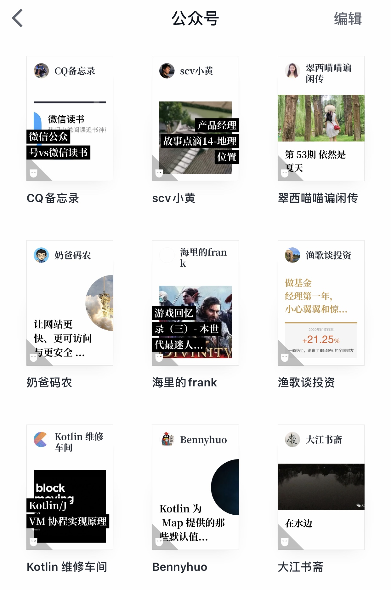

> 好怕你们看完这篇都取关我啊！  
可是这篇就是要证明微信公众号值得被取关。

今天做了个统计，我一共关注了183个微信公众号。

+ 53个服务号，主要是各种商家，例如招商银行，平安银行，麦当劳，肯德基之类。
+ 130个订阅号，都是几经筛选剩余的高质量内容号。

这130个订阅号的作者在公众号管理平台上都看不到我的关注。因为每一个公众号都变成了微信读书 App 里的一本书。

### 公众号的体验缺陷

微信始终存在一个（算不上缺陷的）缺陷，无论是聊天记录，还是公众号文章，一旦海量就会卡顿。  
这是没办法的事情，承载 App 的手机计算性能和存储性能无法跟服务器集群相比。  
所以我习惯了阅后即焚，减少 App 磁盘索引耗时。  

之前遇到过几次令人崩溃的场景：  
正在删除某条信息时，突然有新信息或者公众号文章推送到达，消息列表排序瞬间改变，选中项错乱，导致误删。  
这时如果被误删的内容太多，App 就会进入假死状态，卡顿很久后再恢复正常。  
这时如果强杀进程，可能损坏手机本地文件，被迫卸载重装。  

### Read it Later or Never

信息大爆炸，每天太多推送，优质内容只好收藏，指望 Read it Later，结果慢慢变成 Read it Never。  
体验过几种信息分级过滤归档的方法，均不理想。

+ 囤在微信里原地不动
+ 微信收藏
+ 转发至微信文件传输助手
+ 转发至有道云笔记收藏

某一天发现公众号文章可以“在微信读书中阅读”，而且用户体验良好，于是一次性全部搬迁。近期微信读书团队密集更新版本，用户体验越来越好。

### 微信读书 一号一书

+ 每一个公众号，等于微信读书的书架上的一本书，一本永远连载，没有完结的书。
+ 公众号新文章推送时，消息提醒（开启系统推送时），或者书架书籍右上角红点提示。
+ 书架支持分组（分文件夹）摆放。
+ 公开/私密阅读设置。
+ 收藏，笔记，评论留言，点赞。社交属性完备，但是目前跟微信不互通。
+ 从右往左侧滑，按时间新旧排序，显示历史文章。同一个界面内切换，跳出感大大降低。
+ 阅读记录保存，自动记忆上一次阅读位置，这个功能很赞。
+ 相同类型文章联想推荐（该功能目前还比较鸡肋）。
+ 阅读公众号也能累积微信读书时长，兑换福利。
+ 机器语音朗诵文章内容，读书变听书，适合开车族。
+ 全局文本检索功能非常强大！

> 其实我想说的是，那些在公众号管理平台看见我取关的朋友，请原谅我。  
我没取关，只是都迁移到这里了。

### 偷懒晒图

