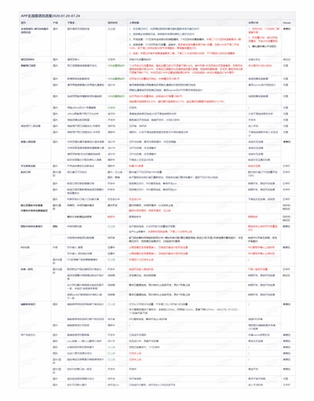

都说“以用户体验为导向”，“移动端优先（ Mobile First ）”，“人人都是产品经理”，但是日常工作中总会收到用户体验糟糕的邮件。

发邮件的目的是什么？当然是希望收件人看到并阅读。但是很多邮件似乎并不希望收件人阅读，而是想让收件人眼睛瞎掉。

### 信息带宽瓶颈

据观察，越高级别管理者，邮箱每日未读邮件数量越多。  
我自己的每日新增邮件总数大约300～500，通过设置分类过滤规则，默认收件箱的新增未读数量通常可以控制在20～50左右。  
我的直接上级的默认收件箱未读邮件大约400。我的上级的上级的默认收件箱未读邮件大约4000。  
这还是在设置了很多分类过滤规则之后的优化结果。可想而知每天有多少封邮件淹没在邮箱里，来不及被阅读，最终送入垃圾箱删除掉。

### 移动办公体验

每天会议很多，越来越多的工作和邮件在手机端处理。最讨厌的就是收到从 PC 端编辑发送的内容繁多布局复杂的邮件。  
这类邮件的阅读体验极其糟糕，只能勉强扫一眼标题和摘要。如果内容重要，会保留到返回座位在电脑上阅读，不重要的就直接忽略删除。  
等到返回座位用电脑时，又会涌入100封未读新邮件，继续淹没。

常见案例：

+ 系统数据图形分析报表。
+ 从 Excel 拷贝的项目集工作进展报告。
+ 临时被动加入的已经盖了几十层楼的跨团队反复扯皮邮件。
+ 大段复制粘贴代码或日志的线上问题排查邮件。
+ 各种自动化测试系统的运行结果报告。

### 图片内嵌文字

有一种邮件，明明一百字能说清楚的事情，非要做成多张高清大图，嵌入文字内容。各种各样的字体字号齐上阵，百花园般万紫千红的色彩，GIF 表情包动效转起来。  
这样的邮件，5MB 大小算是有良心，至少说明有图片压缩意识。10MB 大小的也不罕见。如果邮箱服务器不做限制，估计内嵌完整视频的 100MB 邮件会满天飞。  
“啊～人人都是设计师～”

### 不会用邮件组

还有一种人，可能不知道这个世界上有一种东西叫“邮件组”。一封邮件通常手动添加几十上百个收件人。这样的邮件经常每周一发，每次收件人列表比正文内容还长。  
如果邮件标题规范，尚可启用分类过滤规则，自动转至特定文件夹。否则就只能默默忍受，或者直接将发件人加入某一特定规则下，此人发送的邮件一律进入小黑屋。

### 解决方案

脑子是个好东西，可惜很多人没有。  
最简单的办法，写完邮件先发给自己，手机测试能否在3秒内下载完成并打开，正文布局和内容阅读体验是否良好。  

### Bad Case

典型案例数不胜数，随便选一封，iPhone 手机系统邮箱，原始截图，缩放比例40%，自带模糊脱敏效果。

