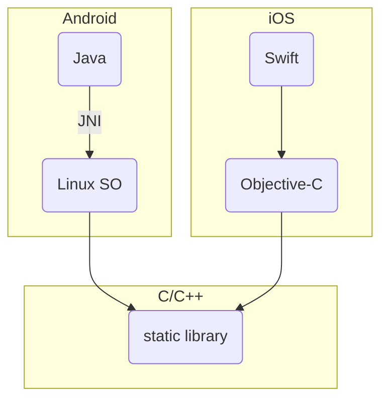
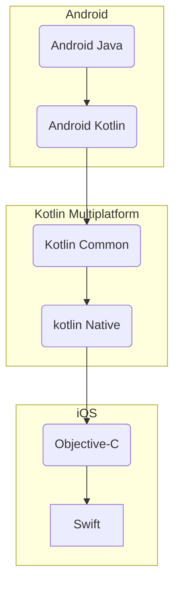
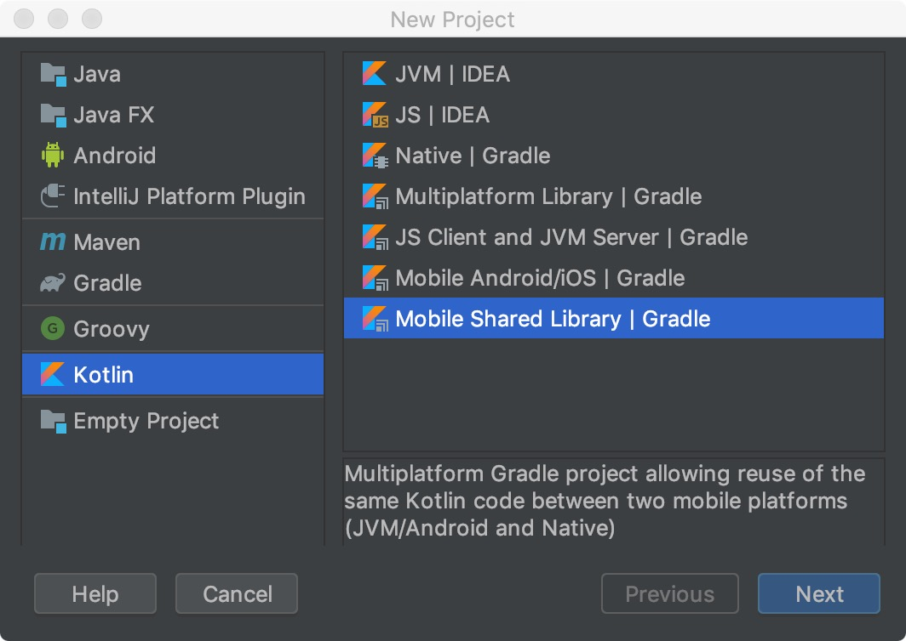

> 断更两周，最近正在写几个 Kotlin 跨平台项目，应该会输 (wa) 出 (keng) 一个系列，所以先归档一篇旧文水货，算是楔子。  
原载于《携程技术》公众号，2019-06-12，[《携程机票 App Kotlin Multiplatform 初探》](https://mp.weixin.qq.com/s/hFoCEmhKAyeuckQJBhPcGA)。

2019年初，迷上了Kotlin语言，顺带对其跨平台特性非常感兴趣。断断续续写了几个算不上 Demo 的玩票小工程，平时没事翻一翻官网内容更新和 GitHub Issues 讨论，1.3大版本的每一个小版本更新，都会仔细阅读 Change Log，期待 Kotlin Native beta 早日转正。

2019年5月，一时冲动答应了公司公共框架团队同事的邀约，短时间拼凑出一篇水货，硬着头皮上台吹牛。然后威逼利诱自己的Android iOS App 团队人员朝这个方向走。

2019年8月至今，转眼一年过去，踩了很多坑，至今没填完。App 团队人员走了一半，React Native 和 Flutter 的热潮背后，映出 Native 开发人员的寂寥。也幸好遇到了小乔，Kotlin 路途做伴，开山搭桥的头阵先锋。

终于，Kotlin 1.4 Release 版即将到来，Kotlin Native 也迎来重大更新。我也该继续写点代码了。

--------

### Kotlin Multiplatform for Mobile

2017.09 - 2019.05，经过一年半的努力，携程机票 App 团队完成 **90%** 从 Native 到 CRN(Ctrip React Native) 的技术栈转型。（技术人员转型比例也大致相同）。  
2019年初，我们开始思考下一步规划。  
除了继续做深 React Native 技术栈，更快更好的迭代交付机票业务需求，优化用户体验，我们还需要从具体业务逻辑实现层次抽离出来，从一个完整的应用程序架构设计和实现的角度，寻找跨平台技术的未来方向。  
React Native 和 Flutter 这类大前端技术方案已经可以很好的支撑用户界面和组件，业务逻辑需求功能的实现，但是“单线程”动态脚本语言在以下领域仍显不足。  

+ 灵活调用强大的平台/厂商 API (AI, AR, mult-core GPU, ...)
+ 高性能计算
+ 多线程处理
+ 后台任务
+ 低功耗

我们希望能够找到一种可靠的跨平台，原生，或能够与原生 API 进行灵活自由双向互操作的技术方案。经过一段时间的针对 Kotlin 及相关开源社区的调研，观察，Kotlin Multiplatform 技术在这方面展现出了良好的发展潜力。  

### Native Multiplatform

传统主流跨平台原生方案是 C/C++，目前依然是最被广泛使用的。React Native 和 Flutter 底层实现也是如此。



Kotlin Multiplatform 跨平台迁移如下图。



### Kotlin Native

了解 Kotlin Multiplatform 需要先从 Kotlin Native 入手。相比 Kotlin/JVM， Kotlin Native 使用 Kotlin 语言编译器， 配合 LLVM backend，将 Kotlin 代码编译为平台原生二进制文件，不依赖虚拟机或运行时环境。当前 LLVM 版本 6.0.1 。官方正在将编译方案从 LLVM backend 迁移到 Clang frontend。  
目前已支持的平台：

+ iOS 9.0+ (arm32, arm64, x86_64 模拟器)
+ macOS (x86_64)
+ Android (arm32, arm64) ，编译生成 Linux SO 文件
+ Windows (mingw x86_64, x86)
+ Linux (x86_64, arm32, MIPS, MIPS little endian, Raspberry Pi)
+ WebAssembly (wasm32)

### Kotlin Native vs C 双向互操作

#### cinterop

Kotlin Native 官方附带工具，用于快速生成 Kotlin 与平台 C 库互相调用操作所需的内容。  
首先创建一个`.def`文件，描述需要包含在语言绑定的内容。  
然后使用 `cinterop` 分析 C 头文件，映射生成 Kotlin 语言的类型，函数和常量，完成绑定。  
最后通过 LLVM 编译器链接生成最终的可执行文件 `*.kexe` 或库文件 `*.klib`。  
`kexe` 是平台相关的可执行程序文件格式。  
`klib` 是平台相关的库文件格式，类似 JAR ZIP 格式，细节详见[官网文档](https://kotlinlang.org/docs/reference/native/libraries.html#the-library-format)

#### 平台库

大多数情况下，我们并不需要使用 `cinterop` 手动生成所有所需的 C 库绑定。Kotlin Native SDK 已经提供了大部分平台的原生库绑定。例如：  

+ Linux POSIX
+ Windows Win32
+ macOS/iOS Apple Framework, POSIX
+ 以及各平台的常用热门库，`OpenGL, zlib` 等

Kotlin Native 在本机开发时默认会将其下载到 `~/.konan/` 文件夹，例如 `~/.konan/kotlin-native-macos-1.2.1/`, 平台库文件位于`~/.konan/kotlin-native-macos-1.2.1/klib/platform/`，已包含以下内容，可见大部分平台SDK都已预处理完成。  

Android Native Arm32

```txt
.
├── android
├── android_arm32.tree.txt
├── builtin
├── egl
├── gles
├── gles2
├── gles3
├── glesCommon
├── linux
├── media
├── omxal
├── posix
├── sles
└── zlib

13 directories, 1 file
```

iOS Arm64

```txt
.
├── ARKit
├── AVFoundation
├── AVKit
├── Accelerate
├── Accounts
├── AdSupport
├── AddressBook
├── AddressBookUI
├── AssetsLibrary
├── AudioToolbox
├── AuthenticationServices
├── BusinessChat
├── CFNetwork
├── CallKit
├── CarPlay
├── ClassKit
├── CloudKit
├── CommonCrypto
├── Contacts
├── ContactsUI
├── CoreAudio
├── CoreAudioKit
├── CoreBluetooth
├── CoreData
├── CoreFoundation
├── CoreGraphics
├── CoreImage
├── CoreLocation
├── CoreMIDI
├── CoreML
├── CoreMedia
├── CoreMotion
├── CoreNFC
├── CoreServices
├── CoreSpotlight
├── CoreTelephony
├── CoreText
├── CoreVideo
├── DeviceCheck
├── EAGL
├── EventKit
├── EventKitUI
├── ExternalAccessory
├── FileProvider
├── FileProviderUI
├── Foundation
├── GLKit
├── GSS
├── GameController
├── GameKit
├── GameplayKit
├── HealthKit
├── HealthKitUI
├── HomeKit
├── IOSurface
├── IdentityLookup
├── IdentityLookupUI
├── ImageIO
├── Intents
├── IntentsUI
├── LocalAuthentication
├── MapKit
├── MediaAccessibility
├── MediaPlayer
├── MediaToolbox
├── MessageUI
├── Messages
├── Metal
├── MetalKit
├── MetalPerformanceShaders
├── MobileCoreServices
├── ModelIO
├── MultipeerConnectivity
├── NaturalLanguage
├── Network
├── NetworkExtension
├── NewsstandKit
├── NotificationCenter
├── OpenAL
├── OpenGLES
├── OpenGLES2
├── OpenGLES3
├── OpenGLESCommon
├── PDFKit
├── PassKit
├── Photos
├── PhotosUI
├── PushKit
├── QuartzCore
├── QuickLook
├── ReplayKit
├── SafariServices
├── SceneKit
├── Security
├── Social
├── Speech
├── SpriteKit
├── StoreKit
├── SystemConfiguration
├── Twitter
├── UIKit
├── UserNotifications
├── UserNotificationsUI
├── VideoSubscriberAccount
├── VideoToolbox
├── Vision
├── WatchConnectivity
├── WatchKit
├── WebKit
├── builtin
├── darwin
├── iAd
├── iconv
├── ios_arm64.tree.txt
├── objc
├── posix
└── zlib

116 directories, 1 file
```

### Kotlin Native vs Swift/Objective-C 双向互操作

基于 `cinteroop`，增加了面向对象的映射。细节详见[官网文档](https://kotlinlang.org/docs/reference/native/objc_interop.html#mappings)

<div class="scrollable-table-wrapper" markdown="block">

Kotlin | Swift | Objective-C
--|--|--
class | class | @interface
interface | protocol | @protocol
constructor/create | Initializer | Initializer
Property | Property | Property
Method | Method | Method
@Throws | throws | error:(NSError**)error
Extension | Extension | Category member
companion member <- | Class method or property | Class method or property
null | nil | nil
Singleton | Singleton() | [Singleton singleton]
Primitive type | Primitive type / NSNumber |
Unit return type | Void | void
String | String | NSString
String | NSMutableString | NSMutableString
List | Array | NSArray
MutableList | NSMutableArray | NSMutableArray
Set | Set | NSSet
MutableSet | NSMutableSet | NSMutableSet
Map | Dictionary | NSDictionary
MutableMap | NSMutableDictionary | NSMutableDictionary
Function type | Function type | Block pointer type

{:.table-scrollable}
</div>

### Kotlin Multiplatform

Kotlin 1.3 重新设计了多平台工程项目架构，以提高工程结构的灵活性和扩展性，更容易共享复用 Kotlin 代码。  
Kotlin Native 变成 Kotlin Multiplatfrom 的目标平台之一， 相关库和插件转为内部实现。  
例如提供给应用程序开发人员使用的 Gradle 插件，从 `org.jetbrains.kotlin.konan` 变更为 `org.jetbrains.kotlin.multiplatform`。  
`konan` 变成 `multiplatform` 内部引用的依赖库，创建 Kotlin Gradle Project 时后台自动下载并存储在本机 `~/.konan/` 文件夹。  
为了减少开发人员的误解，对外提供的 SDK 版本号都统一跟随 Kotlin 语言版本号。  
例如 Kotlin 语言最新版本是 1.3.31，各平台库 SDK 版本号也一致，而 `kotlin native macos 1.2.1` 仅用于 Kotlin 内部开发人员的版本标签，对使用者透明，我们无需关心。  
因此网上搜索到的大部分基于 `konan` 的文章教程和 GitHub 源码均已过时，需留意 Gradle Project 配置中是否基于 multiplatform plugin。包括官网部分文档。  

IntelliJ IDEA 提供了 Kotlin Mulitplatform 工程模版。实际上 IDEA + Android SDK 可以替代 Android Studio 绝大部分的开发工作。其针对 Native 平台有4种模版，大同小异，区别仅是 Gradle Module 结构略有不同。  



+ `Native` 模版是针对单一平台的最小化工程模版。
+ `Mobile Android/iOS` 模版沿用 Android 工程默认结构，将 Android 主工程，Kotlin Common 代码集放在`root/app/src`，根目录额外增加了一个 iOS 主工程文件夹。
+ `Multiplatform Library` 和 `Mobile Shared Library` 非常相似，可以简单的认为后者是前者的子集。  
前者包含 Kotlin/JS 和3个 Native（macOS，Windows，Linux）平台。  
后者仅包含 Android，iOS 2个平台。  
其中仅有一处细微差异。前者 jvmMain 模块依赖 stdlib-jdk8，后者 jvmMain 模块依赖 stdlib。即前者 JVM 运行环境是 Java 服务端，后者 JVM 运行环境是 Android 设备。
+ `Mobile Shared Library` 是最简结构，文件夹如下。

```txt
.
├── build.gradle
├── gradle
│   └── wrapper
│       └── gradle-wrapper.properties
├── gradle.properties
├── settings.gradle
└── src
    ├── commonMain
    │   ├── kotlin
    │   │   └── sample
    │   │       └── Sample.kt
    │   └── resources
    ├── commonTest
    │   ├── kotlin
    │   │   └── sample
    │   │       └── SampleTests.kt
    │   └── resources
    ├── iosMain
    │   ├── kotlin
    │   │   └── sample
    │   │       └── SampleIos.kt
    │   └── resources
    ├── iosTest
    │   ├── kotlin
    │   │   └── sample
    │   │       └── SampleTestsNative.kt
    │   └── resources
    ├── jvmMain
    │   ├── kotlin
    │   │   └── sample
    │   │       └── SampleJvm.kt
    │   └── resources
    └── jvmTest
        ├── kotlin
        │   └── sample
        │       └── SampleTestsJVM.kt
        └── resources

27 directories, 10 files
```

--------
接下来我们需要首先解决一些平台相关的上手问题，结合一些简单且实际存在的小场景，探索 Kotlin Multiplatform 的实践现状。

### 场景1：Logger

打印输出日志是任何平台和技术栈的开发人员每天面对的简单且必需的功能。我们首先看看各平台的基础方案。大致都是定义好日志级别，提供出全局单例或静态方法API。

#### Java Logger

Since Java 1.4

```Kotlin
import java.util.logging.Logger

private val logger = Logger.getLogger("Module")

fun javaLog() {
    logger.fine("Fine Msg")
    logger.config("Config Msg")
    logger.info("Info Msg")
    logger.warning("Warning Msg")
    logger.severe("Error Msg")
}
```

#### Android Log

Since API Level 1

```kotlin
import android.util.Log

private val tag = "Module"

fun androidLog() {
    Log.v(tag, "Verbose Msg")
    Log.d(tag, "Debug Msg")
    Log.i(tag, "Info Msg")
    Log.w(tag, "Warning Msg")
    Log.e(tag, "Error Msg")
}
```

实际在Android日常开发中，我个人更倾向于使用 `Java Logger`，它可以通过注册 `ConsoleHandler, FileHandler, SockeHandler, StreamHandler`，配合 `SimpleFormatter, XMLFormatter`，将日志转存到手机本地文件或后端服务器，供后续分析，以及每一行日志代码可以少写一个`Tag`参数。

#### iOS os_log

忽略 `C print` 和 `Objective-C NSLog`，仅看 iOS 10 提供的 unified logging system。

```objc
void iOSLog()
{
    os_log(OS_LOG_DEFAULT, "Msg");
    os_log_fault(OS_LOG_DEFAULT, "Fault Msg");
    os_log_error(OS_LOG_DEFAULT, "Error Msg");
    os_log_info(OS_LOG_DEFAULT, "Info Msg");
    os_log_debug(OS_LOG_DEFAULT, "Debug Msg");
    os_log_with_type(OS_LOG_DEFAULT, OS_LOG_TYPE_DEFAULT, "Msg with type");
}
```

#### Kotlin Log - Common Expect

参考 android.util.Log，复制一份 Kotlin Common 模块的声明。  
跨平台公共模块的实现，除了使用常规的 `Interface/Implementation` 方案，Kotlin 提供了 `expect/actual` 声明语法。  
这里使用 `expect` 关键字声明一个单例Log对象的预期。其类成员方法等同于Java的纯虚方法。

```Kotlin
/**
 * Keep consistent with android.utl.log constant level.
 * */
enum class Level(val value: Int) {
    VERBOSE(2),
    DEBUG(3),
    INFO(4),
    WARN(5),
    ERROR(6),
    ASSERT(7)
}

expect object Log {
    fun isLoggable(tag: String, level: Level): Boolean
    fun v(tag: String, msg: String)
    fun d(tag: String, msg: String)
    fun i(tag: String, msg: String)
    fun w(tag: String, msg: String)
    fun e(tag: String, msg: String)
    fun wtf(tag: String, msg: String)
}
```

#### Kotlin Log - Android Actual

Android平台的实现直接绑定 `android.util.Log`。

```kotlin
// Kotlin Android Implementation
actual object Log {
    actual fun isLoggable(tag: String, level: Level): Boolean = android.util.Log.isLoggable(tag, level.value)
    actual fun v(tag: String, msg: String) { android.util.Log.v(tag, msg) }
    actual fun d(tag: String, msg: String) { android.util.Log.d(tag, msg) }
    actual fun i(tag: String, msg: String) { android.util.Log.i(tag, msg) }
    actual fun w(tag: String, msg: String) { android.util.Log.w(tag, msg) }
    actual fun e(tag: String, msg: String) { android.util.Log.e(tag, msg) }
    actual fun wtf(tag: String, msg: String) { android.util.Log.wtf(tag, msg) }
}
```

#### Kotlin Log - iOS Actual

由于`cinterop`工具仅处理C库的实例和函数的绑定，不能实现 macro 宏定义的绑定。而`os_log()`提供的常用API实际是 macro 宏定义，所以我们需要找到其内部实际调用的函数 `_os_log_internal()`。这对新手可能是一个小坑，在未详细了解平台API的情况下，在 Kotlin 平台库中费时费力查找绑定方法无果。  

```objc
// <os/log.h> declaration
#define os_log(log, format, ...) \
        os_log_with_type(log, OS_LOG_TYPE_DEFAULT, format, ##__VA_ARGS__)

#define os_log_with_type(log, type, format, ...) __extension__({ \
    _Pragma("clang diagnostic push") \
    _Pragma("clang diagnostic error \"-Wformat\"") \
    _Static_assert(__builtin_constant_p(format), "format argument must be a string constant"); \
    _os_log_internal(&__dso_handle, log, type, format, ##__VA_ARGS__); \
    _Pragma("clang diagnostic pop") \
})
```

`_os_log_internal()` 的第一个参数 `__dso_handle` 定义如下。这里有趣了，我们需要调用它的内存地址指针，`kotlinx.cinterop.ptr` 就是为此而生。  

```objc
// <os/trace_base.h> declaration
extern struct mach_header __dso_handle;
```

下面这段实现是纯 Kotlin 语言代码，是上文中 Kotlin Common 的 `Log` 单例对象 `expect` 声明对应的 `actual`实现。调用 Kotlin Native iOS 平台库已提供好的 os_log API 绑定。  

```kotlin
// Kotlin iOS Implementation
import kotlinx.cinterop.ptr
import platform.darwin.*

actual object Log {
    actual fun isLoggable(tag: String, level: Level): Boolean =
        os_log_type_enabled(OS_LOG_DEFAULT, level.toPlatform())
    actual fun v(tag: String, msg: String) =
        _os_log_internal(__dso_handle.ptr, OS_LOG_DEFAULT, OS_LOG_TYPE_DEFAULT, "$tag | $msg")
    actual fun d(tag: String, msg: String) =
        _os_log_internal(__dso_handle.ptr, OS_LOG_DEFAULT, OS_LOG_TYPE_DEBUG, "$tag | $msg")
    actual fun i(tag: String, msg: String) =
        _os_log_internal(__dso_handle.ptr, OS_LOG_DEFAULT, OS_LOG_TYPE_INFO, "$tag | $msg")
    actual fun w(tag: String, msg: String) =
        _os_log_internal(__dso_handle.ptr, OS_LOG_DEFAULT, OS_LOG_TYPE_INFO, "$tag | $msg")
    actual fun e(tag: String, msg: String) =
        _os_log_internal(__dso_handle.ptr, OS_LOG_DEFAULT, OS_LOG_TYPE_ERROR, "$tag | $msg")
    actual fun wtf(tag: String, msg: String) =
        _os_log_internal(__dso_handle.ptr, OS_LOG_DEFAULT, OS_LOG_TYPE_FAULT, "$tag | $msg")
}
```

#### Kotlin Log - AndroidNativeArm Actual

大部分业务场景中，我们使用 Kotlin/JVM 实现 Android 平台功能，Kotlin Native for AndroidNativeArm32/64 可用但仍不好用。我们简单看看其实现。  
与 iOS Native 类似，只需在 build.gradle 文件中添加相应 Target。这里使用了 Gradle Kotlin DSL 新版本。使用 Kotlin 编写 Gradle 配置文件的体验比 Groovy 更佳，IDE支持语法高亮，自动补全，代码跳转，编译提示等便捷功能。  

```kotlin
androidNativeArm32() {
    binaries {
        sharedLib()// or staticLib() or executable()
    }
}
```

Android NDK Log API

```c
/**
 * Writes the constant string `text` to the log, with priority `prio` and tag
 * `tag`.
 */
int __android_log_write(int prio, const char* tag, const char* text);

/**
 * Writes a formatted string to the log, with priority `prio` and tag `tag`.
 * The details of formatting are the same as for
 * [printf(3)](http://man7.org/linux/man-pages/man3/printf.3.html).
 */
int __android_log_print(int prio, const char* tag, const char* fmt, ...)
#if defined(__GNUC__)
    __attribute__((__format__(printf, 3, 4)))
#endif
    ;
```

继续纯 Kotlin 语言实现。  

```kotlin
// Kotlin AndroidNativeArm Implementation
import platform.android.*

@kotlin.ExperimentalUnsignedTypes
actual object Log {
    actual fun isLoggable(tag: String, level: Level): Boolean  = level >= Level.INFO

    actual fun v(tag: String, msg: String) {
        __android_log_write(ANDROID_LOG_VERBOSE.toInt(), tag, msg)
    }
    actual fun d(tag: String, msg: String) {
        __android_log_write(ANDROID_LOG_DEBUG.toInt(), tag,  msg)
    }
    actual fun i(tag: String, msg: String) {
        __android_log_write(ANDROID_LOG_INFO.toInt(), tag, msg)
    }
    actual fun w(tag: String, msg: String) {
        __android_log_write(ANDROID_LOG_WARN.toInt(), tag, msg)
    }
    actual fun e(tag: String, msg: String) {
        __android_log_write(ANDROID_LOG_ERROR.toInt(), tag, msg)
    }
    actual fun wtf(tag: String, msg: String) {
        __android_log_write(ANDROID_LOG_FATAL.toInt(), tag, msg)
    }
}
```

[Demo源码工程](https://github.com/9468305/log-kotlin)

实际生产环境使用，推荐 [Jake Wharton's Timber](https://github.com/JakeWharton/timber)。

--------

### 场景2: IO File

本地文件读写相比打印输出日志略复杂但也很常用。Android/JVM 和 Java 服务端的 IO File 技术方案一致但场景选型不同。  

+ Java IO (Blocking IO)  
Default IO Streaming.  
+ Java NIO (Non-Blocking IO)  
Since 1.4.
+ Java NIO2 (Asynchronous I/O, AIO)  
Since 7, Enhancements in 8.

移动端常用 Blocking IO，一方面是因为该方案适合嵌入式平台，另一方面是因为 Android 系统版本对 JDK 高版本的支持更新进展缓慢。长期以来我们需要兼容 JDK 6，最低系统版本升级至 Android 4.4(API Level 19) 以上才能够兼容 JDK 7，Android 8.0(API Level 26) 才升级至 JDK 8，并且仅支持部分功能 API。  
Android NIO 实际广泛应用于网络组件的实现，例如 Google Guava，Square OKHttp 。  
iOS File 就是 C Posix 使用方式，这里不再赘述。  
下面这段代码使用纯 Kotlin 语言调用 iOS POSIX File API。`memScoped{}` 表示该作用域内的申请的内存空间，当离开作用域后，会被自动释放。这是 Kotlin Native 不依赖 JVM GC 内存管理方式，即 ARC 自动引用计数。  

```kotlin
fun sample() {
    val file = fopen(__filename = "filename", __mode = "r")
    if (file != null) {
        try {
            memScoped { // ARC - Automatic Reference Counting
                val bufferLength = 1024
                val buffer = allocArray<ByteVar>(bufferLength)
                while (true) {
                    val line = fgets(buffer, bufferLength, file)?.toKString()
                    if (line == null || line.isEmpty())
                        break
                    println(line)
                }
            }
        } finally {
            fclose(file)
        }
    }
}
```

那么如何使用 Kotlin Multiplatform 实现 java.io.file 与 C POSIX File 统一 API ？我们看看官方现状。  
`Package kotlin.io for native` 仅有3个方法。

```kotlin
// Prints the given message to the standard output stream.
fun print()
// Prints the given message and the line separator to the standard output stream.
fun println()
// Reads a line of input from the standard input stream.
fun readLine(): String?
```

`Package kotlinx.io` 基于 NIO 方案实现，目前仍处于实验阶段，官方建议配合 kotlinx.coroutines, kotlinx.atomicfu 一起使用，尚未支持 Native 平台。  
所以目前我们只能自己实现双平台的统一封装。这部分实现并不难，可参考 OpenJDK 和 AOSP 源码。 Java File 底层实现原理也是通过 JNI 调用 C POSIX。Android 源码部分改写了 OpenJDK 的实现。具体细节详见 Android SDK FileInputStream/FileOutputSteam 源码。  
另外 Okio 2 正在进行迁移至 Kotlin 和支持多平台，square 团队的最终目标是将 Retrofit, OkHttp 运行在多平台。详见：  
[okio/issues/370](https://github.com/square/okio/issues/370)

--------

### 场景3: SQLite

嵌入式平台主流关系型数据存储方案。  

#### `Android SQLiteOpenHelper`

+ Android SDK 默认提供的 SQLite 方案。
+ SQLite low-level API
+ Raw SQL queries
+ 使用较繁琐

#### Android Jetpack Room

+ Jetpack 新组件。
+ SQLite 之上的 ORM 抽象层。

#### iOS SQLite library

+ 相比 Android，iOS 更接近原始 SQLite C 库。

#### SQLDelight

[https://github.com/square/sqldelight](https://github.com/square/sqldelight)

目前最成熟稳定的 Kotlin MultiPlatform SQLite 解决方案。作者 Alec Strong, Jake Wharton（又见大神）。不论是 Android Java 开发，还是 Kotlin 跨平台开发，我都建议大家了解一下它。  
它的思路非常有趣，与 Room 为代表的各种 ORM 方案截然相反。它是从 SQL 查询语句生成代码，而不是从代码生成 SQL 查询。这里不展开介绍，直接放上 Jake Wharton 关于 《SQLDelight vs Room》 的评论原文。  

> In my opinion, Room exists at the wrong level of abstraction.
>
> The reason Retrofit and Gson/Moshi/etc. are successful is because there's nothing from which to generate the interfaces and model objects so you write both by hand duplicating an implicit contract. If you switch to protocol buffers, you stop writing models by hand–the tool can generate those. If you switch to gRPC or Swagger, you stop writing Retrofit interfaces by hand–a tool can generate those. When you have an explicit source of schema you no longer need to duplicate that schema by hand in code.
>
> SQL table definitions and queries are a schema. They can define the types and names of both the model objects and the interface through which you interact with queries. Thus, it doesn't really make sense to force the user to duplicate that schema by writing the model objects and interface by hand. You wouldn't do it with protobuf and gRPC. Why are you doing it with your database?
>
> Room is an okay choice. It's far better than all the ORMs people have been using for years. Alec and I have given talks where the conclusion was that we don't care which you choose, just don't choose an ORM [https://youtu.be/4eUuD7LsqMs](https://youtu.be/4eUuD7LsqMs).
>
> That being said, it's hard not to see SQLDelight as a step up from Room. It validates more. It has better tooling. It generates Kotlin. And it's multiplatform. Yes, I'm biased, but Alec can tell you how long we spent evaluating what the right level of abstraction is and what the right developer UX is. It's a pleasant experience writing only SQL and having SQLDelight generate the interfaces and model objects that you'd otherwise be forced to write by hand with Room. And when you do that, you also stop (ab)using star selects in your queries and selecting only the minimal amount of columns necessary rather than selecting entire tables so you can reuse entities.
>
> You write the SQL query and you write the method signature. Generating the method signature is a pure function from the SQL query. You have to keep both in sync manually instead of having the method generated automatically based on the SQL bind args and selected columns. SQLDelight generates the interface methods that Room makes you write given the same SQL command.
>
> Similarly, when you write a query that returns results, Room forces you to write a model object which conforms to the selected data. SQLDelight generates the model objects that Room makes you write given the same SQL query.
>
> In summary, you can take all the SQL you're already using with Room, delete all of the interfaces and model objects you had to write manually, and SQLDelight will generate them for you (along with some extra validation that they're correct).

### The Future

[Kotlin 解决方案组件的稳定性和进展](https://kotlinlang.org/docs/reference/evolution/components-stability.html)

Kotlin Native 处于 Additions in Incremental Releases (AIR) 阶段。  
Multiplatform Projects 处于 Moving fast (MF) 阶段。

前不久的Google IO 2019 大会上，Kotlin 语言在 Android 平台的地位进一步上升。Android Jetpack 系列组件优先支持 Kotlin 。Square 公司的 Okio 2，OkHttp 4.0 正在迁移 Kotlin并支持多平台。  
所以我相信 Kotlin Multiplatform 的未来充满想象力。  

### One more thing

[https://gradle.org/kotlin/](https://gradle.org/kotlin/)

Gradle 5.0 已发布 Kotlin DSL v1.0 稳定版，建议迁移 Gradle 工程至 KTS 。
