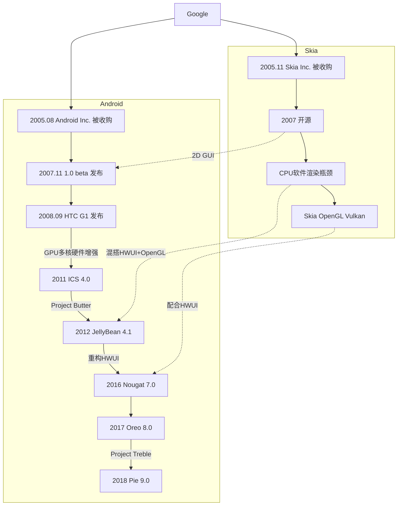

### Skia.org

> Skia 是一个开源的二维图形库，提供各种常用的 API，并可在多种软硬件平台上运行。谷歌 Chrome 浏览器、Chrome OS、安卓、Flutter、火狐浏览器、火狐操作系统以及其它许多产品都使用它作为图形引擎。
>
> Skia 由谷歌出资管理，任何人都可基于 BSD 免费软件许可证使用。Skia 开发团队致力于开发其核心部分， 并广泛采纳各方对于 Skia 的开源贡献。

### History

### Project Treble

[Android 工程师如何终结碎片化问题？](https://mp.weixin.qq.com/s/DLqHC-sG2brGZ6CzgmFMFw)

> Question：
>
> 以前在 Android O 中有个开发者选项，可以切换 GPU 渲染方式为“default”或“Skia”。现在这个选项没有了，我记得 Android P 默认运行的就是 Skia 吧？
>
> Burke：
>
> 以前 Android 的标准窗体不支持硬件渲染的。基本上是建立在 Skia 之上，而 Skia 是软件渲染。同时我们还做了个“GL 渲染器”，是基于 OpenGL 的。所以以前有两种方法。系统里有一种使用硬件加速器的方法，这得放弃 Skia 去使用 GL 渲染器。而其他部分可以使用 Skia。不过说来话长，其实一部分 GL 渲染器也在使用 Skia。听起来是有点怪。
>
> Malchev：
>
> 一些 Skia 在慢慢地迁移到 GL 上，但并不是所有的都迁移了。
>
> Burke：
>
> 我们在给 Skia 做一个 GL 后台。我们在清理架构。简单来说，整个架构的目标是让 Android 的 UI 框架直接与 Skia 对话，然后 Skia 负责与硬件加速的后台对话。而不是像现在这个奇怪的世界一样，一些窗体得自己去找 GL 渲染器。这就是我们要清理的东西。我只是想不起来这是 P 里的功能还是以后版本的功能了。我记得还没完全完成呢，但这是我们的目标。源代码里看得见，也不是什么大秘密。
>
> 更新：
>
> 在这次访谈结束后，Burke 澄清 Skia GL 后台实际上在 Android P 中已经完成了。

### Reference

+ [Chromium Graphics and Skia](https://www.chromium.org/developers/design-documents/graphics-and-skia)
+ [The Android graphics path in depth](https://elinux.org/images/2/2b/Android_graphics_path--chis_simmonds.pdf)
+ [2D Graphics in Android](http://www.kandroid.org/board/data/board/conference/file_in_body/1/2d-graphics-in-android.pdf)
+ [Microsoft Edge Insider / Which one is better? Skia API as the graphics API or OpenGL ES](https://techcommunity.microsoft.com/t5/discussions/which-one-is-better-skia-api-as-the-graphics-api-or-opengl-es/m-p/1260220)
+ [Implementing Vulkan-capable LibreOffice user interface using the Skia library](https://www.collaboraoffice.com/success-story/implementing-vulkan-capable-libreoffice-user-interface-using-the-skia-library/)
