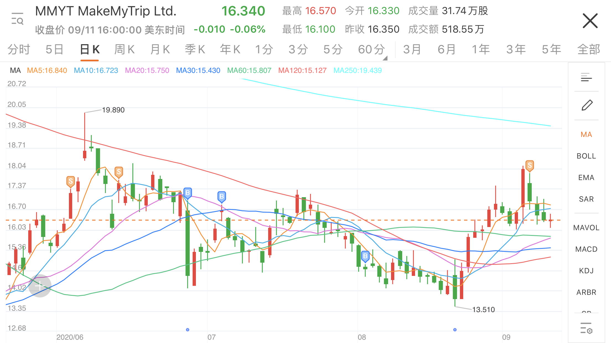

书接前文[《投资：2020H1 MMYT 复盘》](../mmyt-2020h1/)。

2020.08.21，MakeMyTrip公布2020财年第一季度业绩，时间范围 2020.04.01-2020.06.30。疫情影响非常严重。

### 收入

总收入640万美元，同比减少95.5%（去年同期总收入1.417亿美元）。

+ 机票收入减少91.6%
+ 酒店收入减少98.4%
+ 汽车票收入减少98.2%
+ 其他收入减少88.9%。
+ 机票航段数减少91.7%。
+ 酒店间夜数减少98.2%。

### 支出

人员成本2500万美元，同比减少19.8%（去年同期3120万美元）。  
市场营销成本支出90万美元，同比减少98.4%（去年同期5450万美元）。

+ 集团主席和CEO零薪
+ 高管半薪
+ 裁员350人
+ 大幅削减呼叫中心的外包团队
+ 削减其他各种行政运营费用

### 利润

总亏损3460万美元，去年同期亏损4290万美元。  
稀释后每股亏损0.32美元，去年同期每股亏损0.41美元。

### 现金流

资产负债表上的现金及现金等价物和定期存款余额为1.738亿美元。  
已获得约1亿美元的信贷担保，其中包括我们最大股东的一家附属公司提供的7000万美元贷款和印度一家商业银行的余额。

### 操盘记录

+ 06.05，达到近期历史高点19.890美元。
+ 6月中旬，止盈清仓。
+ 06.26 FY20Q4财报公布，大跌15.92%，趁机买入。
+ 07.06，常规买入。
+ 08.04，常规买入。
+ 08.21，FY21Q1财报公布，小跌3.10%，达到近期历史低点13.510美元。
+ 连续上涨，09.04，达到近期历史高点18.150美元。
+ 09.08，清仓。

### 不玩了

2020.09.07，印度超越巴西，成为全球感染新冠病例第二多的国家，如果无法遏制趋势，未来几个月，印度很有可能会超越排名第一的美国。  
截止北京时间13日8时26分，印度累计新冠确诊病例4659984例，累计死亡77472例。

火中取栗的事情，就算了吧。

### 链接

[https://investors.makemytrip.com/](https://investors.makemytrip.com/)

[Makemytrip Limited Announces Fiscal 2021 First Quarter and Full Year Results](https://investors.makemytrip.com/files/doc_financials/2021/q1/MMYT-Fiscal-2021-Q1-Earnings-Release-FINAL.pdf)

[MMYT公布2021财年第一季度业绩](https://news.futunn.com/translate/1436175321597963425/143934/0)

[MMYT合并财务报表2020.03.31和2019.03.31独立审计报告](https://news.futunn.com/translate/1467786221599523080/688222/0)

[MMYT独立财务报表2020.03.31和2019.03.31独立审计报告](https://news.futunn.com/translate/1467786221599523081/161264/0)

[MakeMyTrip Limited (NASDAQ: MMYT) Investor Presentation March 2020](https://s22.q4cdn.com/244830719/files/doc_presentations/2020/MMYT-IR-Presentation-March-2020.pdf)
