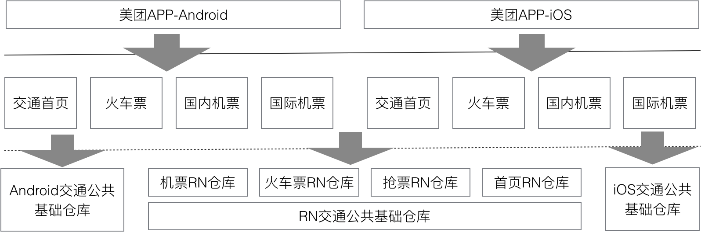

> 两周没写公众号文章，粉丝一个没掉，太感动了，你们都是好人。今天发一篇旧文，表示我还在。中秋国庆八天假期可以认真准备一些文章素材了。

携程有 CRN(Ctrip React Native)，美团有 MRN(Meituan React Native)。只看吹水软文自嗨或互嗨是不行的，剥开代码一探究竟。

Talk is cheap, show me your shitty code!

### 准备工作

<div class="scrollable-table-wrapper" markdown="block">

| 目标 | 美团App Android |
|:---|:---|
| 时间 | 2020.04.24 |
| 版本 | 10.7.204 |
| APK Size | 91.7MB |
| Unzip Size | 256.6MB |

{:.table-scrollable}
</div>

### 文件结构

<div class="scrollable-table-wrapper" markdown="block">

| 一级文件夹 | 大小 | 用途 |
|:---|:---|:---|
| assets | 19.2MB | assets资源文件（MRN Bundle 在这里）|
| lib | 41.2MB | Linux SO files |
| META-INF | 3.9MB | 签名/证书/索引 |
| r | 92.9MB | raw资源文件 |
| classes.dex | 92.6MB | Java字节码 |
| resources.arsc | 6.5MB | 资源文件索引表|
| AndroidManifest.xml | 341KB | Manifest |

{:.table-scrollable}
</div>

### assets 文件夹

剥离无关文件后，与混合技术栈相关的代码文件结构。[]内数字是文件大小（字节）。

```bash
.
├── [ 36864] PicassoModule-bundle.js #大众点评的一套类似RN的框架Picasso
├── [ 12166] PicassoModuleMapping_1
├── [ 66] PicassoProtocolMapping_1
├── [ 4610] PicassoViewMapping_1
├── [ 304] picasso-controller-bundle.js
├── [ 49332] picasso-main.js
├── [ 201193] picasso-matrix.js
├── [ 155182] picassojs-bundle.js
├── [ 17964] editable_category_default.json #这2个category文件是App所有业务模块的跳转路由表。
├── [ 12295] index_category_light.json
├── [ 128] hybridres #zepto框架文件
│   ├── [ 593] template.html
│   └── [ 26539] zepto.min.js
├── [ 96] mach #美团外卖业务的Hybrid包
│   └── [ 96] template
│   └── [ 384] prod
│   ├── [ 96] waimai-homepage-head-super-promotion
│   │   └── [ 25126] waimai-homepage-head-super-promotion@mach_waimai-usercenter-homepage-steepdiscount@0.0.29.zip
│   ├── [ 96] waimai-mach-dialog-orderdetail-activity-task
│   │   └── [ 15639] waimai-mach-dialog-orderdetail-activity-task@mach_waimai-dialog-orderdetail-activity-task@0.0.2.zip
│   ├── [ 96] waimai-mach-dialog-orderdetail-share-redpacket
│   │   └── [ 13600] waimai-mach-dialog-orderdetail-share-redpacket@mach_waimai-dialog-orderdetail-share-redpacket@0.0.2.zip
│   ├── [ 96] waimai-mach-marketing-homepage-discount-style-grid
│   │   └── [ 7533] waimai-mach-marketing-homepage-discount-style-grid@mach_waimai-marketing-homepage-discount-style-grid@0.0.24.zip
│   ├── [ 96] waimai-marketing-homepage-newuser-card
│   │   └── [ 3448] waimai-marketing-homepage-newuser-card@mach_waimai-marketing-homepage-newuser-card@0.0.6.zip
│   ├── [ 96] waimai-marketing-homepage-newuser-promotion
│   │   └── [ 22451] waimai-marketing-homepage-newuser-promotion@mach_waimai-marketing-homepage-newuser-promotion@0.0.8.zip
│   ├── [ 96] waimai-usercenter-order-insurance-style-1
│   │   └── [ 12503] waimai-usercenter-order-insurance-style-1@mach_waimai-usercenter-order-insurance-style-1@0.0.6.zip
│   ├── [ 96] wm-home-marketing-entry-coupon-style-0
│   │   └── [ 8282] wm-home-marketing-entry-coupon-style-0@mach_waimai-marketing-homepage_entry-coupon@0.0.2.zip
│   ├── [ 96] wm-submit-order-membership-style-1
│   │   └── [ 18393] wm-submit-order-membership-style-1@mach_waimai-marketing-sumbit-order-membership-style-1@0.0.7.zip
│   └── [ 96] wm-submit-order-membership-upgrade-style-1
│   └── [ 19270] wm-submit-order-membership-upgrade-style-1@mach_waimai-marketing-sumbit-order-upgradepackage-style-1@0.0.2.zip
├── [ 232] mrn_container_valid_bundle.json #内含2个mrn底包配置信息
├── [ 416] mrnbundle # mrn bundle目录，1个基础包，8个业务包。ZIP 5.2MB，Unzip 14.6MB
│   ├── [ 168] mrn_base.json # mrn 基础包的名字和版本号配置文件
│   ├── [ 1913] mrn_business.json # mrn 业务包的名字和版本号配置文件
│   ├── [ 946676] rn_hotel_hotelchannel-homepage_0.339.7.zip # 酒店
│   ├── [ 940093] rn_hotel_hotelchannel-orderfill_2.255.3.zip # 酒店
│   ├── [ 815036] rn_hotel_rn-hotel-poidetail_1.576.25.zip # 酒店
│   ├── [ 358557] rn_major_traffic-major_1000020200.0.28.zip # 大交通框架包？
│   ├── [ 181830] rn_mrn_base.zip # 基础包
│   ├── [ 252476] rn_travel_aroundtravel_0.18.16.zip # 交通（机票，火车票，汽车票）
│   ├── [ 989361] rn_travel_travelcore_6.0.40.zip # 交通（机票，火车票，汽车票）
│   ├── [ 509494] rn_travel_traveltriprn_2.3.0.zip # 交通（机票，火车票，汽车票）
│   └── [ 215898] rn_zhenguo_homepage_6.1.5.zip #榛果民宿首页
```

### MRN Bundle

<div class="scrollable-table-wrapper" markdown="block">

| Bundle | 业务 | Size |
|:---|:---|:---|
| rn_mrn_base | 基础 | 182KB |
| rn_hotel_hotelchannel-homepage | 酒店 | 947KB |
| rn_hotel_hotelchannel-orderfill | 酒店 | 940KB |
| rn_hotel_rn-hotel-poidetail | 酒店 | 815KB |
| rn_major_traffic-major | 交通（机票+火车票+汽车票） | 359KB | 2.1MB |
| rn_travel_aroundtravel | 交通（机票+火车票+汽车票） | 252KB |
| rn_travel_travelcore | 交通（机票+火车票+汽车票） | 989KB |
| rn_travel_traveltriprn | 交通（机票+火车票+汽车票） | 509KB |
| rn_zhenguo_homepage | 榛果民宿 | 216KB |

{:.table-scrollable}
</div>

### MRN工程结构图



### MRN JSON Config

mrn_base.json

```json
[
 {
 "archiveName": "rn_mrn_base.zip",
 "fileName": "rn_mrn_base_2.0.7",
 "bundleName": "rn_mrn_base",
 "bundleVersion": "2.0.7"
 }
]
```

mrn_business.json

```json
[
 {
 "archiveName": "rn_travel_aroundtravel_0.18.16.zip",
 "fileName": "rn_travel_aroundtravel_0.18.16",
 "bundleName": "rn_travel_aroundtravel",
 "bundleVersion": "0.18.16",
 "meta": []
 },
 {
 "archiveName": "rn_zhenguo_homepage_6.1.5.zip",
 "fileName": "rn_zhenguo_homepage_6.1.5",
 "bundleName": "rn_zhenguo_homepage",
 "bundleVersion": "6.1.5",
 "meta": []
 },
 {
 "archiveName": "rn_hotel_hotelchannel-orderfill_2.255.3.zip",
 "fileName": "rn_hotel_hotelchannel-orderfill_2.255.3",
 "bundleName": "rn_hotel_hotelchannel-orderfill",
 "bundleVersion": "2.255.3",
 "meta": []
 },
 {
 "archiveName": "rn_hotel_hotelchannel-homepage_0.339.7.zip",
 "fileName": "rn_hotel_hotelchannel-homepage_0.339.7",
 "bundleName": "rn_hotel_hotelchannel-homepage",
 "bundleVersion": "0.339.7",
 "meta": []
 },
 {
 "archiveName": "rn_major_traffic-major_1000020200.0.28.zip",
 "fileName": "rn_major_traffic-major_1000020200.0.28",
 "bundleName": "rn_major_traffic-major",
 "bundleVersion": "1000020200.0.28",
 "meta": []
 },
 {
 "archiveName": "rn_hotel_rn-hotel-poidetail_1.576.25.zip",
 "fileName": "rn_hotel_rn-hotel-poidetail_1.576.25",
 "bundleName": "rn_hotel_rn-hotel-poidetail",
 "bundleVersion": "1.576.25",
 "meta": []
 },
 {
 "archiveName": "rn_travel_travelcore_6.0.40.zip",
 "fileName": "rn_travel_travelcore_6.0.40",
 "bundleName": "rn_travel_travelcore",
 "bundleVersion": "6.0.40",
 "meta": []
 },
 {
 "archiveName": "rn_travel_traveltriprn_2.3.0.zip",
 "fileName": "rn_travel_traveltriprn_2.3.0",
 "bundleName": "rn_travel_traveltriprn",
 "bundleVersion": "2.3.0",
 "meta": []
 }
]
```

meta.json

RN Bundle解压缩后的配置信息

```json
{
 "name": "rn_mrn_base",
 "biz": "mrn",
 "bundleType": 0,
 "version": "2.0.7",
 "dependencies": [],
 "hashSum": {
 "index.js": "fa3d808d9d4e6d536ef74175e112f004"
 },
 "timestamp": "1577342987822",
 "RNVersion": "0.60.5",
 "cliVersion": "2.0.4"
}

{
 "name": "rn_hotel_hotelchannel-homepage",
 "biz": "hotel",
 "bundleType": 1,
 "version": "0.339.7",
 "dependencies": [],
 "hashSum": {
 "index.js": "075de9e65f11a179847c87e609b2aeab"
 },
 "timestamp": "1581843887277",
 "RNVersion": "0.60.5",
 "cliVersion": "2.0.5"
}

{
 "name": "rn_hotel_hotelchannel-orderfill",
 "biz": "hotel",
 "bundleType": 1,
 "version": "2.255.3",
 "dependencies": [],
 "hashSum": {
 "index.js": "6a6fab6464a4dd2d08c3d883d25e88a6"
 },
 "timestamp": "1581774249753",
 "RNVersion": "0.60.5",
 "cliVersion": "2.0.5"
}

{
 "name": "rn_hotel_rn-hotel-poidetail",
 "biz": "hotel",
 "bundleType": 1,
 "version": "1.576.25",
 "dependencies": [],
 "hashSum": {
 "index.js": "ccd4fa415ba3537bcfdf426f87697afc"
 },
 "timestamp": "1581939405423",
 "RNVersion": "0.60.5",
 "cliVersion": "2.0.5"
}

{
 "name": "rn_major_traffic-major",
 "biz": "major",
 "bundleType": 1,
 "version": "1000020200.0.28",
 "dependencies": [],
 "hashSum": {
 "index.js": "26d7b30cbc21c4b28884539a5ef57e50"
 },
 "timestamp": "1580730030789",
 "RNVersion": "0.60.5",
 "cliVersion": "2.0.6"
}

{
 "name": "rn_travel_travelcore",
 "biz": "travel",
 "bundleType": 1,
 "version": "6.0.40",
 "dependencies": [],
 "hashSum": {
 "4327.js": "28b2f5aed325051af7894a0780320620",
 "5e03.js": "23128de35361911cfa39d685d0f041a6",
 "77f8.js": "b10802bac932f2493c32ebac983ebd74",
 "8bbe.js": "e61d135d3d7e4dde5400c68f8d888486",
 "c2b7.js": "703208e5fbcc61cdbd5a0d61e9f3aa94",
 "eac4.js": "ccdbc171b38fe64d555a64d816c9287c",
 "f4c3.js": "196bfa6c930b244431133e5006ef2b56",
 "index.js": "55d08c0bf91b266309dbbb7283525084"
 },
 "timestamp": "1582193070786",
 "RNVersion": "0.60.5",
 "cliVersion": "2.1.0"
}

{
 "name": "rn_travel_aroundtravel",
 "biz": "travel",
 "bundleType": 1,
 "version": "0.18.16",
 "dependencies": [],
 "hashSum": {
 "index.js": "8d761dc2214ff93ec1f9779a961ca473"
 },
 "timestamp": "1579177802755",
 "RNVersion": "0.60.5",
 "cliVersion": "2.0.3-1"
}

{
 "name": "rn_travel_traveltriprn",
 "biz": "travel",
 "bundleType": 1,
 "version": "2.3.0",
 "dependencies": [],
 "hashSum": {
 "index.js": "fec6e8562e6622005eda92f12b20bdc6"
 },
 "timestamp": "1582257320690",
 "RNVersion": "0.60.5",
 "cliVersion": "2.0.6-2"
}

{
 "name": "rn_zhenguo_homepage",
 "biz": "zhenguo",
 "bundleType": 1,
 "version": "6.1.5",
 "dependencies": [],
 "hashSum": {
 "index.js": "5a125e51b403f29d22abae5d78bd6d4b"
 },
 "timestamp": "1582103123894",
 "RNVersion": "0.60.5",
 "cliVersion": "2.0.6",
 "manualStopLoading": true
}
```

### 服务端动态加载

启动App，在各业务模块中使用一段时间，触发动态加载，查看手机本地磁盘文件。  
SD卡存储路径：

```bash
/sdcard/Android/data/com.sankuai.meituan/files/cips/common/smart-download/assets/
```

有2个子文件夹。

+ bundle: mrn bundle zip package，82.4MB，114个。
+ unzip: mrn bundle unzip dirs，98.1MB。

根据名称分类统计：

<div class="scrollable-table-wrapper" markdown="block">

| 业务 | Bundle数量 | Bundle Zip Size |
|:---|:---|:---|
| 酒店 | 48 | 36.2MB |
| 交通 | 29 | 24MB |
| 外卖 | 14 | 6MB |
| 榛果 | 11 | 9.1MB |
| 其他 | 12 | 7MB |

{:.table-scrollable}
</div>

### MRN Bundle Detail

```bash
.
├── rn_banma_legwork_0.12.3
├── rn_bus_mrn-bus-time_0.2.255
├── rn_flight_flight-back_1000800400.0.9
├── rn_flight_flight-list-component_999.2.45
├── rn_flight_traffic-flight-list_1000080200.0.9
├── rn_flight_traffic-flight_1000080200.0.37
├── rn_gc_deallist-mrnmodules-app_2.0.8
├── rn_gc_deallist-mrnmodules_2.1.8
├── rn_group_meituan-settings_0.0.48
├── rn_group_mt-mrn-minereview_1.0.11
├── rn_group_search-home_0.2.163
├── rn_group_search-switch-location_0.0.69
├── rn_group_voucher_0.0.52
├── rn_hotel_calendar_0.12.0
├── rn_hotel_goldeneye_1.2.0
├── rn_hotel_hotel-city_2.24.0
├── rn_hotel_hotel-mine_0.1.0
├── rn_hotel_hotelchannel-album_3.235.0
├── rn_hotel_hotelchannel-area-filter_0.46.0
├── rn_hotel_hotelchannel-coupon-popview_0.32.3
├── rn_hotel_hotelchannel-creditcard-guarantee_0.7.1
├── rn_hotel_hotelchannel-deal-detail_3.71.8
├── rn_hotel_hotelchannel-deal_0.25.0
├── rn_hotel_hotelchannel-economic-chain-list_0.68.0
├── rn_hotel_hotelchannel-facilities-detail_3.260.2
├── rn_hotel_hotelchannel-fill-order-special-hobbies_0.8.0
├── rn_hotel_hotelchannel-flagship-brand-poilist_3.18.3
├── rn_hotel_hotelchannel-guest-modify_0.15.0
├── rn_hotel_hotelchannel-highstarlist_4.108.0
├── rn_hotel_hotelchannel-homepage-aladdin_2.2.0
├── rn_hotel_hotelchannel-invoice-detail_3.10.1
├── rn_hotel_hotelchannel-invoice-fill_3.34.0
├── rn_hotel_hotelchannel-lived-and-collected_3.74.0
├── rn_hotel_hotelchannel-near-hotsell_3.53.0
├── rn_hotel_hotelchannel-order-detail_3.307.0
├── rn_hotel_hotelchannel-order-discount-list_0.21.0
├── rn_hotel_hotelchannel-order-room-user-num-select_0.17.0
├── rn_hotel_hotelchannel-order-voucherlist_3.54.18
├── rn_hotel_hotelchannel-promote-order-detail_0.12.3
├── rn_hotel_hotelchannel-room-error-report_3.9.0
├── rn_hotel_hotelchannel-search_0.12.0
├── rn_hotel_hotelchannel-seenlist_2.37.0
├── rn_hotel_hotelchannel-tonight-specialoffer-list_3.38.0
├── rn_hotel_hotelchannel-user-satisfaction_2.4.0
├── rn_hotel_rn-hotel-list-mask_2.2.0
├── rn_hotel_rn-hotel-mainlist_0.134.14
├── rn_hotel_rn-hotel-poidetail_1.772.8
├── rn_hotel_rn-hotel-poilist_2.22.0
├── rn_joy_mrn-joy-rank_0.0.61
├── rn_map_map-search-filter_10074.1.0
├── rn_map_map-suggest_10082.1.0
├── rn_overseahotel_overseahotel-area-detail_2.5.0
├── rn_overseahotel_overseahotel-area-filter_2.9.0
├── rn_overseahotel_overseahotel-city-select_2.5.0
├── rn_overseahotel_overseahotel-direction-card_2.5.0
├── rn_overseahotel_overseahotel-nearby-recommend_2.24.2
├── rn_overseahotel_overseahotel-order-detail_2.34.0
├── rn_overseahotel_overseahotel-poi-albumgrid_2.5.0
├── rn_overseahotel_overseahotel-poi-detail_3.125.0
├── rn_overseahotel_overseahotel-poi-list_2.65.2
├── rn_overseahotel_overseahotel-search_2.9.0
├── rn_overseahotel_overseahotel-submit-order_2.8.0
├── rn_overseahotel_overseahotel-ugc_2.23.0
├── rn_overseahotel_overseahotel-usernumber-select_2.7.0
├── rn_qcsc_qcscmrn_100008.400.17
├── rn_traffic_traffic-address_1000000600.0.29
├── rn_traffic_traffic-calendar_1000080200.0.3
├── rn_traffic_traffic-city_1000080200.0.6
├── rn_traffic_traffic-common_999.2.12
├── rn_traffic_traffic-common_999.2.30
├── rn_traffic_traffic-common_999.2.31
├── rn_traffic_traffic-common_999.2.32
├── rn_traffic_traffic-flight-compare-price_999.0.31
├── rn_traffic_traffic-flight-tools_0.0.41
├── rn_traffic_traffic-order-list_0.0.34
├── rn_train_FaceRecognition_10072.0.22
├── rn_train_MiddleRouter_10072.0.7
├── rn_train_Passenger_10072.0.61
├── rn_train_TrainList_10072.0.73
├── rn_train_grabticket-detail_10072.0.39
├── rn_train_holdseat_10072.0.29
├── rn_train_traffic-grabticket_10072.0.75
├── rn_train_traffic-train-holdseatandpay_10072.0.2
├── rn_train_traffic-train-orderdetail_10072.0.82
├── rn_train_traffic-train_10072.0.125
├── rn_travel_aroundtravel_0.38.0
├── rn_travel_travelcore_6.51.5
├── rn_travel_travelticket_4.24.0
├── rn_travel_traveltriprn_2.22.0
├── rn_waimai_applyrefund_2.0.28
├── rn_waimai_boxfee_2.0.9
├── rn_waimai_edit-phone_2.0.13
├── rn_waimai_goodscollection_2.0.19
├── rn_waimai_multi-person_2.0.21
├── rn_waimai_order-comment-share_2.0.38
├── rn_waimai_order-comment_2.0.77
├── rn_waimai_order-invoice_2.0.12
├── rn_waimai_order-remark_2.0.31
├── rn_waimai_orderaddinvoice_2.0.12
├── rn_waimai_pay-by-another_2.0.9
├── rn_waimai_poialbum_2.0.11
├── rn_waimai_refundstatus_2.0.19
├── rn_waimai_wmrn-common_2.0.27
├── rn_zhenguo_c-order-list_2.1.1
├── rn_zhenguo_c-order_2.5.6
├── rn_zhenguo_client_4.5.6
├── rn_zhenguo_collect_3.3.1
├── rn_zhenguo_comment_5.0.15
├── rn_zhenguo_direct_4.4.4
├── rn_zhenguo_filter_8.13.27
├── rn_zhenguo_homepage_7.0.24
├── rn_zhenguo_product_5.13.5
├── rn_zhenguo_secure-check-in_2.0.23
└── rn_zhenguo_submit-order_5.4.20

114 directories
```

### 参考资料

+ [客户端单周发版下的多分支自动化管理与实践](https://tech.meituan.com/2019/01/10/traffic-git-branch-management.html)
+ [React Native在美团外卖客户端的实践](https://tech.meituan.com/2019/12/19/meituan-mrn-practice.html)
+ [MRN交通业务线仓库结构示意图](https://p1.meituan.net/travelcube/17fe2a421d01b167a5b46a5b204bec4b56888.png)
+ [Picasso开启大前端的未来](https://tech.meituan.com/2018/06/21/picasso-the-future.html)
