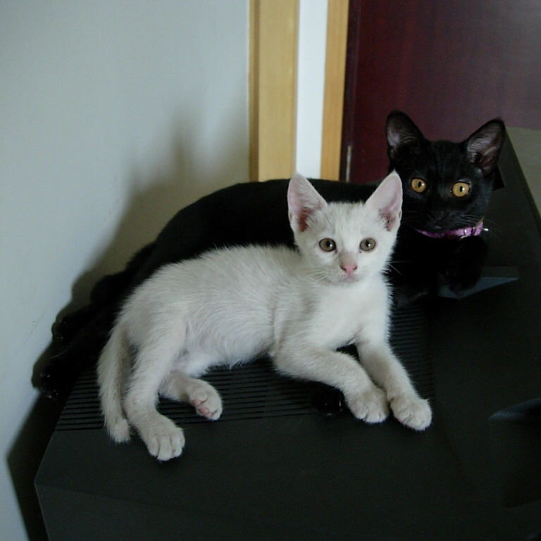

2009年春节后不久，搬家。  
搬家前夕，地雷走失，大概是由于绝育手术做得有些晚，当时它业已成年，终于没能忍住诱惑，消失在某个深夜。  
前车之鉴，赶在小老头儿即将一岁之前，给它完成绝育手术。  
讨喜儿的抚养权归还给那位北京籍男同事。  
小老头儿（之前忘记说了，它是只小母猫）跟随我去新居，开始一人一猫的生活。  

----

2009年4月至5月，一岁后的小老头儿，外表糙汉子，实际敏感心细的女青年。

当时某同事家生了一窝小猫，一只刚断奶不久，彪悍独立的全黑小母猫，coco加入。它俩不打不相识。

2009.05.10，第三位成员，小公猫chanel加入。占据我的双肩电脑背包加格子衬衫。

2009.05.16，奶牛猫主动承担起照顾 coco&chanel 的好阿姨角色。

2009.05.21，排排队，吃宵夜。

2009.05.26，一黑一白，两个小可爱。

半年之后，2009.10.18。

coco长成了“暗夜精灵”。

chanel长成了“傻大白”。

