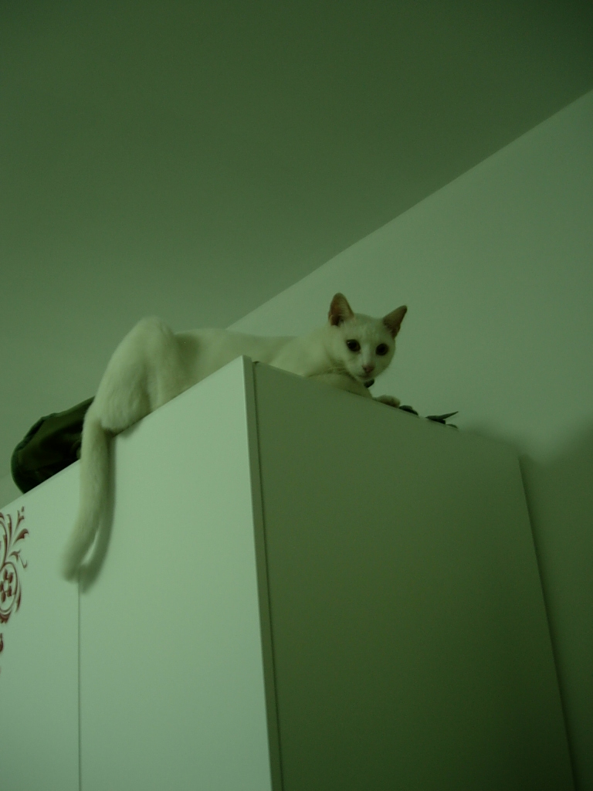
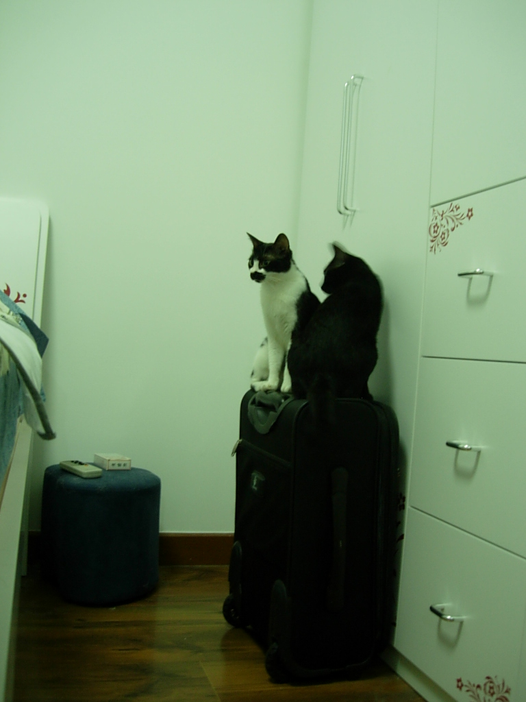
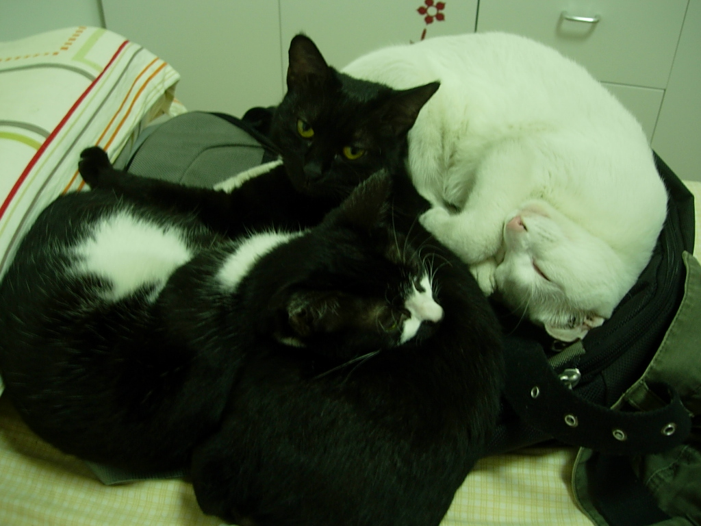
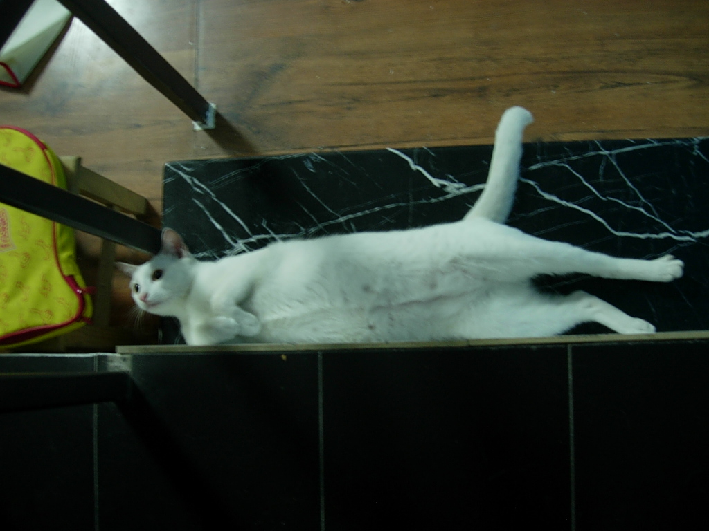
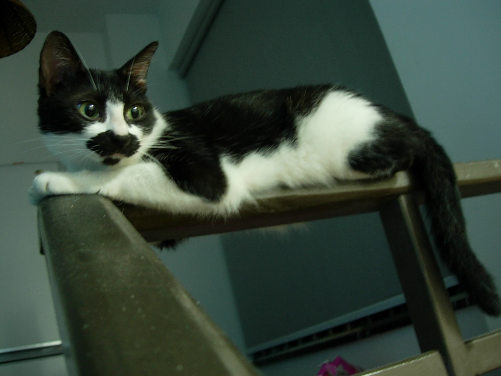
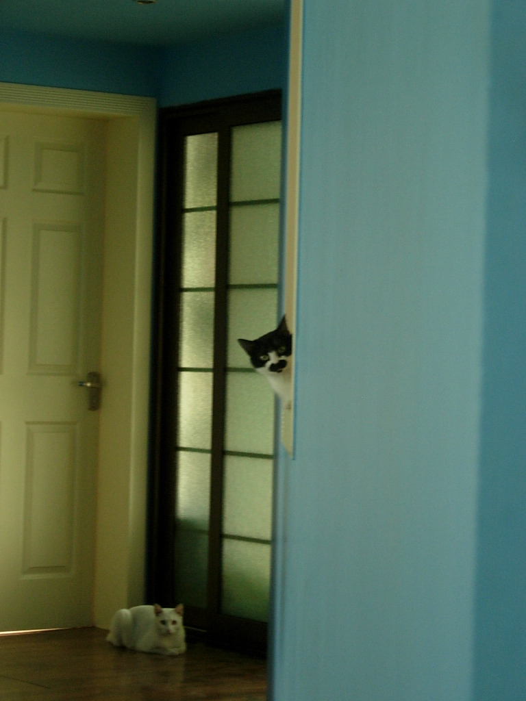
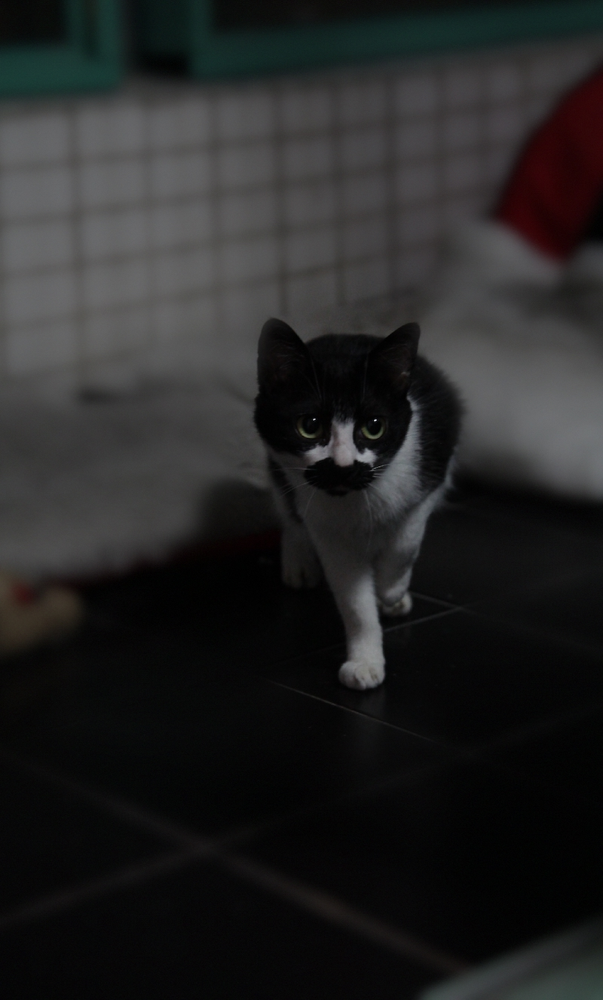
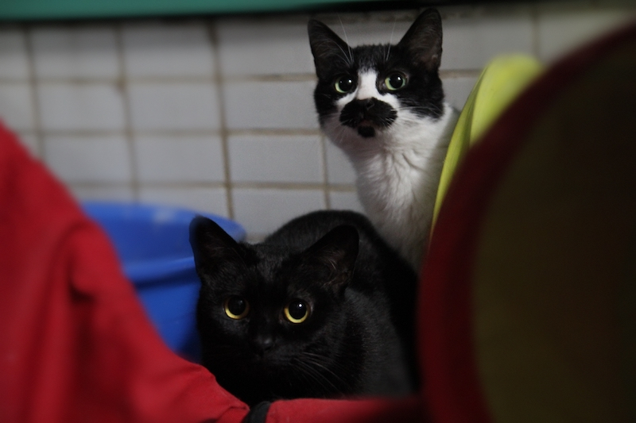
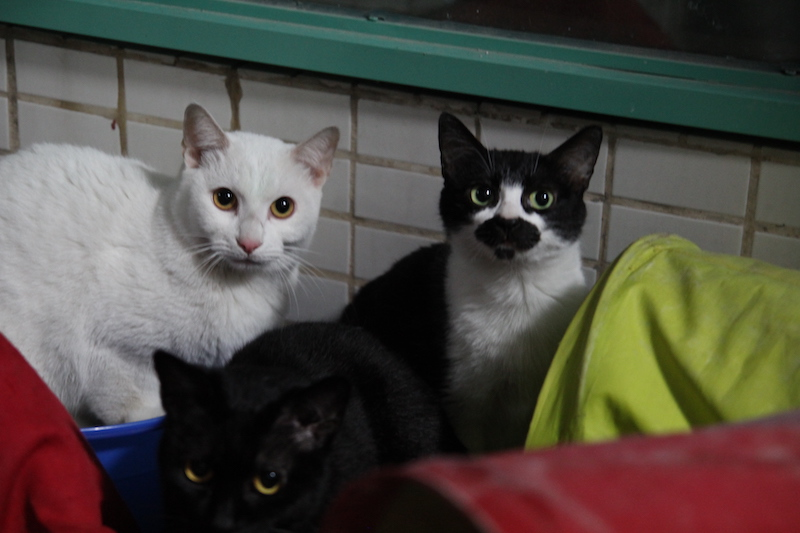

2010年，再次搬家，住在深圳福田新洲片区。时间久远，已经想不起具体搬迁日期。2011年某天又搬家到一街之隔的石厦片区，依然想不起具体搬迁日期。

同样想不起的还有，为什么在新洲的一年多，只留下了30张照片？是当时工作太忙，抑或心境变化，还是拍了又删掉？

就像喝了一坛醉生梦死酒，那段时光只剩下模糊的记忆碎片。

2010.08.18

我在卧室的时候，chanel 这只成年公猫体型最大，弹跳力最好，总是占据衣柜顶。

oldman 和 coco 这两只成年母猫就只能找些中等位置盘踞。

晚上睡觉，床的一半归它们。这个笔记本电脑背包已经快不够用了。

2010.11.28

我在客厅的时候，chanel 喜欢横躺在台阶上，搞得我总是担心会发生互相伤害的踩踏事件。

oldman 喜欢在栏杆上躺成一条线，这个视角方便观察整个客厅和脚下的 chanel。

每天下午，太阳逐渐偏西，它们就会转移到客厅与卧室的中间地带，既方便继续享受日照，又能继续维持全局观察者视角。

两个深井冰。

2011.03.05

一人三猫住久了，它们逐渐变得不习惯遇见陌生人。偶尔朋友来访，三猫就会齐聚阳台，眼神警惕。

小柚子师姐第一次造访，摄影技术明显比我强太多了。

