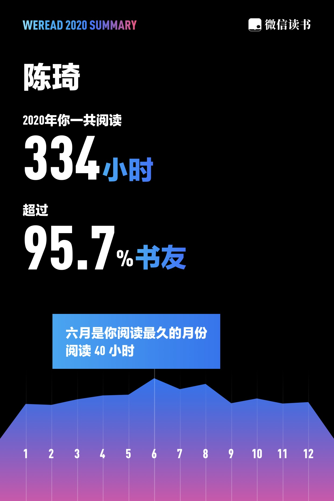
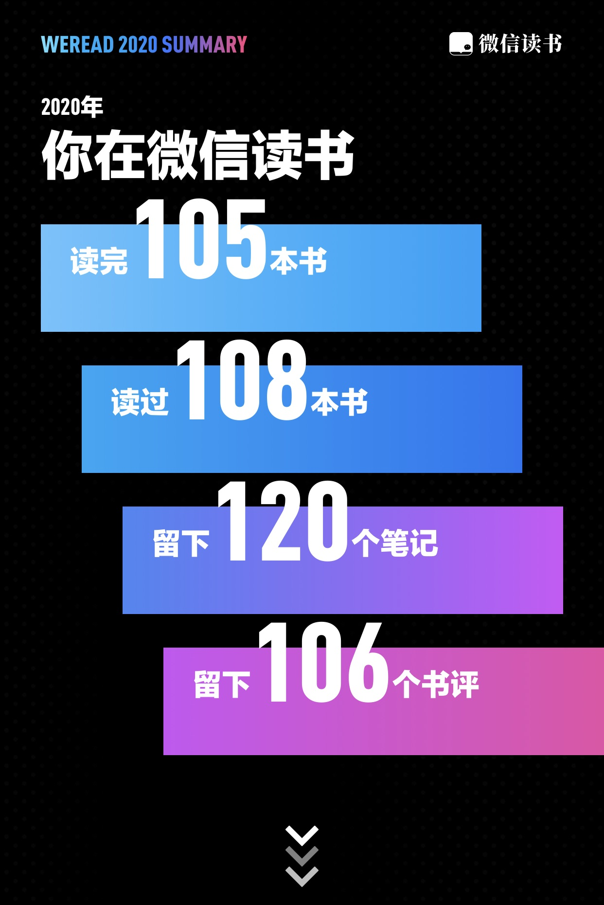
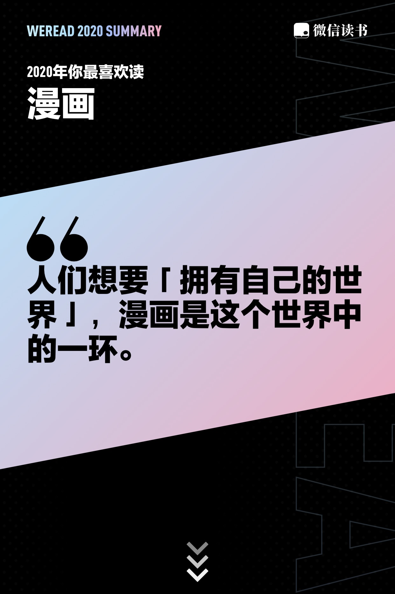
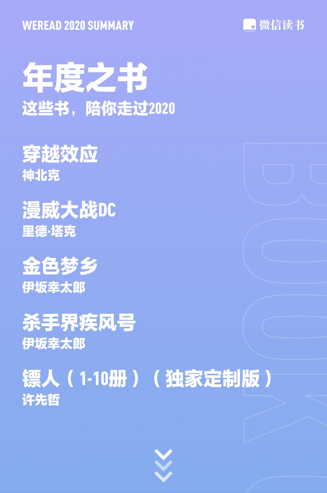

最近有点颓，从内到外的颓，懒得思考，懒得行动。元旦跨年前后，各种年度账单总结满天飞，内心毫无波澜。转眼已经断更公众号50天，不能一直这样下去，开始复健吧，先从简单的事情做起，整理回顾微信读书。

2020读书时间严重缩水，平均一天不到一小时。

仅读完105本，大部分是不足五万字的小册子，娱乐为主，缺乏深度思考，书架上的厚部头著作基本没碰。

看得最多的类型是漫画，官方这段诠释贴切，可能是想逃避2020这个魔幻的现实世界，潜意识想要“拥有自己的世界”。

官方年度书单Top5，仅仅是从单本阅读时长计算。整理一份可能值得一读的书单。

----

## 东野圭吾

惯例上架必读系列。

### 《魔力的胎动》

《拉普拉斯的魔女》的番外篇。魔女相关素材拼接的五个短篇故事。

### 《以眨眼干杯》

1988年，作者而立之年的旧作，标准的本格推理。

### 《布谷鸟的蛋》

梦想，亲情，守护，悬疑。

### 《挑战》

> 作者说：
>
> 单板滑雪很有趣，这是事实，但有趣不是全部，世界上比单板滑雪有趣的东西多了去了。我觉得让我入迷的，是"进步"。

### 《沉默的巡游》

2019新作，前半部分像进阶版的《检查方的罪人》（木村拓哉主演的电影），司法正义与结果正义的较量。后半部分不断逆转，结尾是另一个版本的《嫌疑人X的献身》。汤川学曾经使石神的献身失去意义，这次他把选择权留给了新仓夫妇自己。神探伽利略逐渐摆脱冷酷形象，开始温暖人心。

### 《科学？》

汇总了作者2003至2005年之间在报刊杂志上专栏连载的社评文章。不是推理故事，而是从一个理科作家个人视角出发，对生活，未来和创作的看法，对电话，相机和交通工具等时代变迁发展的点评。

内容趣味性普通，但是大叔的书，总归是要一读的。

----

## 伊坂幸太郎

另一位日本推理小说届的天才作家。最好按照出版顺序阅读，因为他时不时地在作品中引用一两句前作的典故，逐渐形成了“伊坂幸太郎宇宙”。乱序阅读容易错过很多小幽默。

+ 《奥杜邦的祈祷》
+ 《家鸭与野鸭的投币式寄物柜》
+ 《沙漠》
+ 《一首朋克救地球》
+ 《单挑》
+ 《杀手届》杀手系列三部曲之一
+ 《疾风号》杀手系列三部曲之二
+ 《恐妻家》杀手系列三部曲之三
+ 《夜之国的库帕》
+ 《金色梦乡》
+ 《哦！爸爸》

----

## 李诞

### 《笑场》

无，虚无，没头没尾的虚无。

时间线：

+ 《扯经》没有集结成册。
+ 《笑场》2016。
+ 《宇宙超度指南》2017。
+ 《冷场》2018。

## 南方周末

人物专访系列。

+ 《侯孝贤：我没有同类》
+ 《余华：我能够对现实发言了》
+ 《郭敬明：不为所动》
+ 《金宇澄：好作家的秘密》

## 医学

因为疫情，看了几本医学书。

+ 《病毒来袭》
+ 《荒诞医学史》

----

## 漫画

### 匡扶摇 后现代都市市井幽默

### 《回答不了》2018

11个故事，生活就是各有各的难，各有各的暖。屁民的生活，真实到绝望。

### 《纳闷集》 2020

6个故事，用直击人间真实的话语，纾解平凡生活的迷茫。为有时感到孤独的自我寻找同类。

面对乏味与压力，应对过去的烙印与未来的期许。再热爱生活的人，偶尔也会纳闷，我们正全情投入的这种生活，是否真的值得。

+ 私奔的外婆
+ 被折角的人生或书
+ 把月亮放左边
+ 织在一起的路
+ 和梦打交道的人
+ 自己的故事

### 《镖人》

第十册出版之后，作者似乎忙于动画版的事情，迟迟不见续作。

### 《穿越效应》 神北克

公元2116年的人，穿越回到清朝初期，蝴蝶效应让康熙时代科技大发展，最终统治了世界。为了修改时间线，多次穿越，故事结束时回到了明朝永乐年间。

民族性的一剂春药，嗨就行了，不需要思考这个故事有什么深刻意义。

----

## 时间线系列

### 《简单的谋杀：世界推理小说简史》

1841年至今，180年推理小说变迁历史。

### 《漫威大战DC》

1934，DC诞生。  
1939，漫威诞生。  
1960，正义联盟诞生。  
1961，神奇四侠诞生。  
八十年超级英雄漫画。  
六十年双巨头竞争。  
在任何一个行业里，有这样的对手陪伴，对双方都是幸运的。

### 《日本动画编年史》

1960年代至1990年代的日本动画历史。

----

## 其他

### 《山茶文具店》

明明是很简单枯燥的故事，可是在作者的笔下生花。初读像一碗正宗浓厚的疗愈系鸡汤，回味像一杯淡淡的清茶。

本书还有续集《闪闪发光的人生》，留给2021吧。
