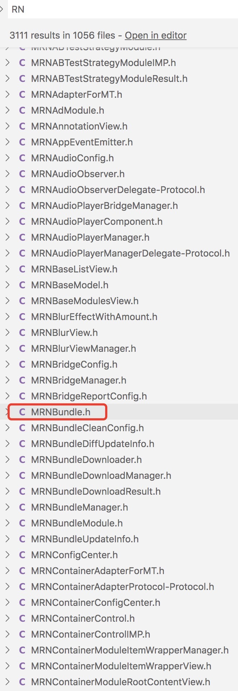
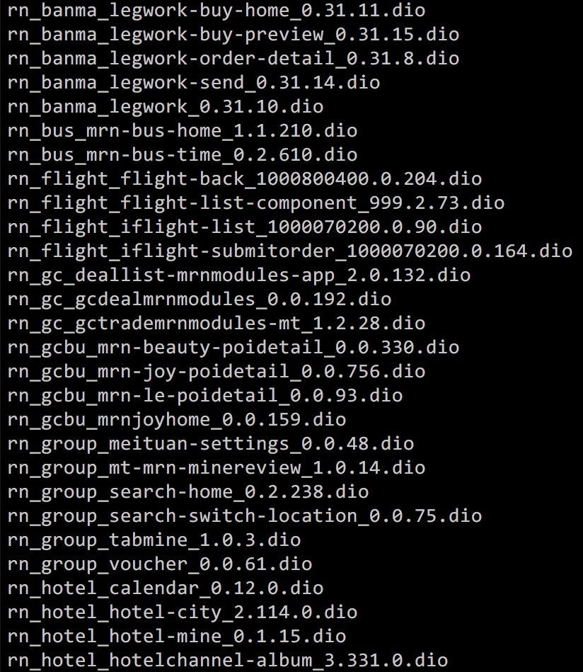
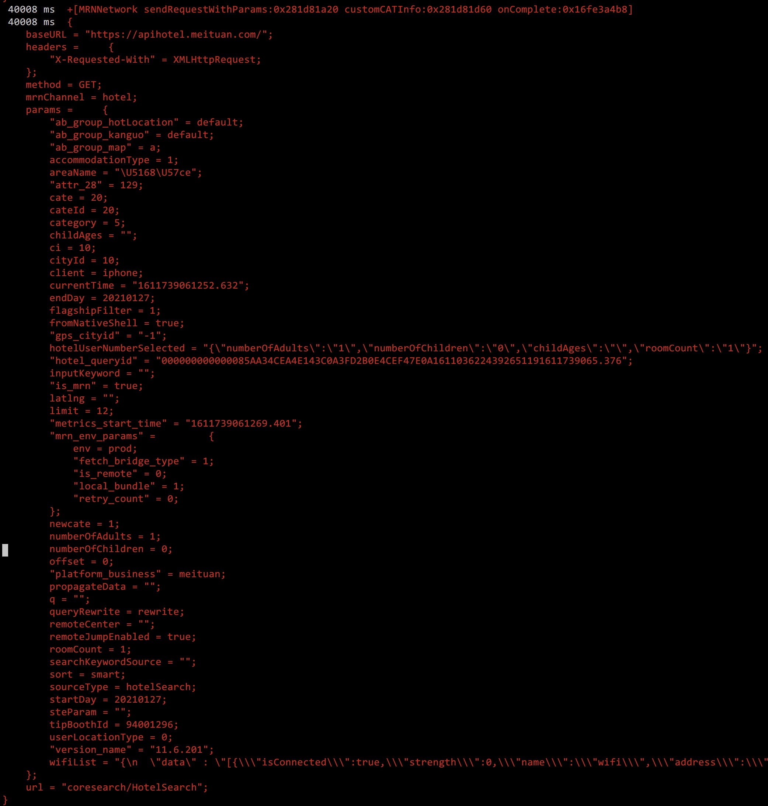
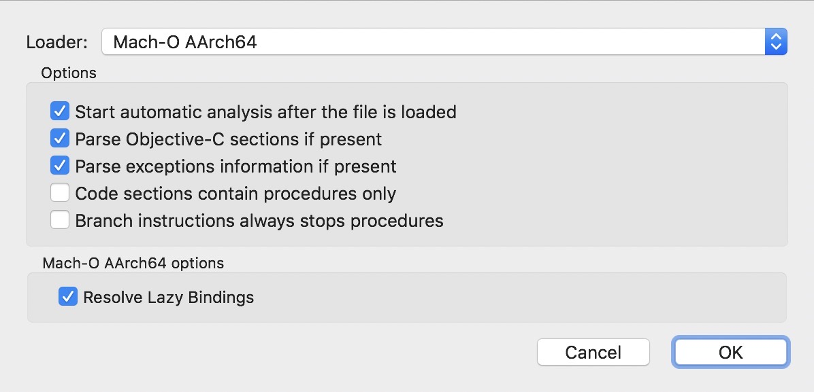
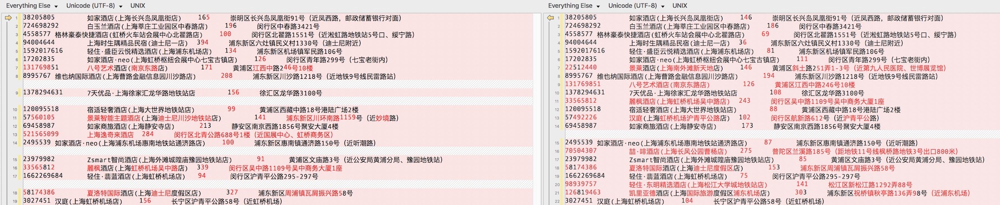
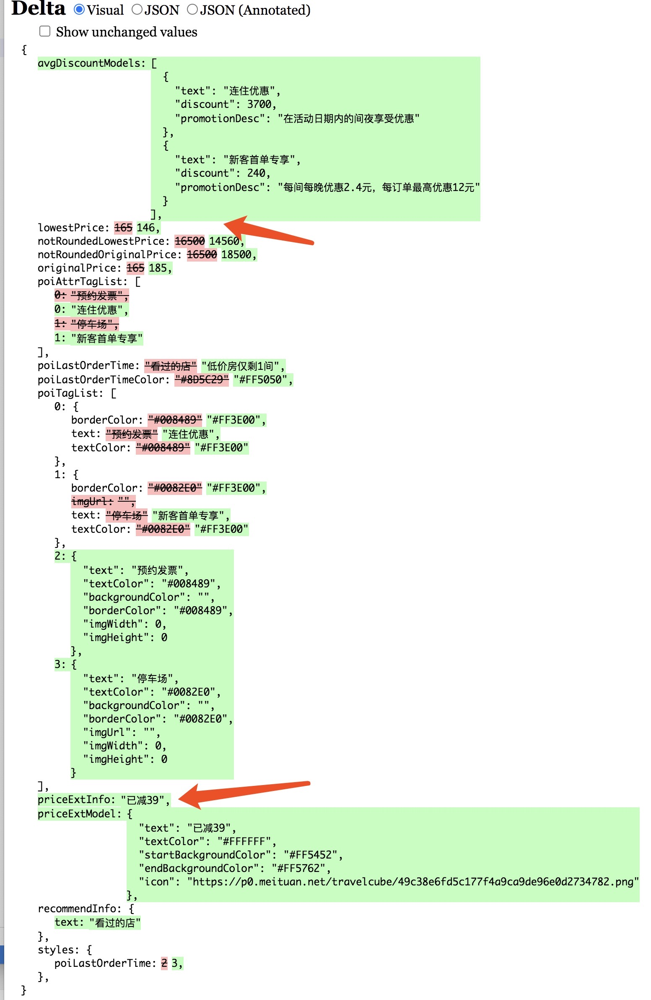

> [《Tech：美团Android逆向工程分析》](../MRN-Reverse-Engineering/)，九个月前曾经对美团Android App做过一次简单拆包分析，主要是了解美团MRN工程结构的实现，以及观察各业务线的模块设计划分和代码量占比情况。并未具体分析源码逻辑实现。
>
> 最近QIN对美团iOS App做了一次更加详细的逆向分析。

静态分析
--------

美团App iOS 安装包  
版本号 11.6.201  
发布时间 2021.01.18  

### [Fiddler](https://www.telerik.com/fiddler)

常规操作，首先使用Fiddler进行HTTP(S)网络代理抓包，没有获得任何明显的线索。猜测美团App使用了Native层实现网络通讯功能，负责加解密，压缩解压缩等常见处理，属于常见技术方案，携程CRN亦是如此。后续分析印证了该猜测。

### [Cydia](http://cydia.saurik.com/)

iPhone越狱，并在Cydia App中安装 Frida Cyrun Cycript 这几个包，后续会用到。

### [frida-ios-dump](https://github.com/AloneMonkey/frida-ios-dump)

Pull a decrypted IPA from a jailbroken device

#### Usage

+ Install [frida](http://www.frida.re/) on device
+ `sudo pip install -r requirements.txt --upgrade`
+ Run usbmuxd/iproxy SSH forwarding over USB (Default 2222 -> 22). e.g. `iproxy 2222 22`
+ Run ./dump.py `Display name` or `Bundle identifier`

For SSH/SCP make sure you have your public key added to the target device's `~/.ssh/authorized_keys` file.

App提交至App Store后，经Apple官方加密，生成供用户下载的IPA文件。该文件直接解压缩是密文，难以分析。所以需要通过越狱手机环境，使用frida砸壳，获得解密后的原始IPA文件（IPA = ZIP）。

```bash
iproxy 2222 22 # 开启USB端口转发，保持进程存在，勿关闭。
./dump.py com.meituan.imeituan # 开砸，将原始IPA文件导出至电脑本地。
unzip ./美团.ipa # 解压至 ./Payload/imeituan.app/
```

### [class-dump](http://stevenygard.com/projects/class-dump/)

class-dump is a command-line utility for examining the Objective-C segment of Mach-O files. It generates declarations for the classes, categories and protocols.

从原始IPA解压后的 Mach-O 二进制文件，还原出 Objective-C 类声明头文件。

```bash
class-dump -s -S -a -A --arch arm64 -H -o ./headers/imeituan/ ./Payload/imeituan.app/imeituan
```

### MRNBundle.h

使用VSCode打开上述使用 class-dump 生成的头文件工程。已知美团机票酒店等业务使用 MRN(Meituan React Native) 技术实现，所以直接搜索 RN 关键字。



先从 `MRNBundle.h` 下手。

```objc
//
//     Generated by class-dump 3.5 (64 bit).
//
//     class-dump is Copyright (C) 1997-1998, 2000-2001, 2004-2013 by Steve Nygard.
//
 
#import "SAKDomainObject.h"
 
@class METDIOBundle, NSArray, NSDictionary, NSMutableArray, NSString;
 
@interface MRNBundle : SAKDomainObject
{
    _Bool _manualStopLoading;   // 8 = 0x8
    _Bool _confused;    // 9 = 0x9
    _Bool _isRAMBundle; // 10 = 0xa
    NSString *_installPath; // 16 = 0x10
    NSString *_bizName; // 24 = 0x18
    NSString *_moduleName;  // 32 = 0x20
    NSString *_version; // 40 = 0x28
    NSArray *_dependencies; // 48 = 0x30
    NSString *_name;    // 56 = 0x38
    NSString *_timestamp;   // 64 = 0x40
    unsigned long long _bundleType; // 72 = 0x48
    NSMutableArray *_lazyLoadJavaScriptPaths;   // 80 = 0x50
    NSDictionary *_fonts;   // 88 = 0x58
    NSDictionary *_hashSum; // 96 = 0x60
    NSDictionary *_metaInfo;    // 104 = 0x68
    NSString *_RNVersion;   // 112 = 0x70
    unsigned long long _format; // 120 = 0x78
    NSString *_status;  // 128 = 0x80
    long long _size;    // 136 = 0x88
    NSArray *_dependentBundles; // 144 = 0x90
    NSString *_indexPath;   // 152 = 0x98
    NSArray *_filePaths;    // 160 = 0xa0
    METDIOBundle *_dioInstance; // 168 = 0xa8
}
 
+ (id)JSONKeyPathsByPropertyKey;    // IMP=0x00000001000f3778
+ (id)bundleFromDIOBundle:(id)arg1; // IMP=0x00000001000f17d8
+ (id)bundleFromPath:(id)arg1;  // IMP=0x00000001000f1238
+ (id)bundleTypeJSONTransformer;    // IMP=0x00000001000f3bc0
+ (id)domainWithJSONDictionary:(id)arg1;    // IMP=0x00000001000f36d8
- (void).cxx_destruct;  // IMP=0x00000001000f6b74
@property(readonly, nonatomic) NSString *RNVersion; // @synthesize RNVersion=_RNVersion;
@property(retain, nonatomic) NSString *bizName; // @synthesize bizName=_bizName;
@property(nonatomic) unsigned long long bundleType; // @synthesize bundleType=_bundleType;
@property(nonatomic) _Bool confused; // @synthesize confused=_confused;
- (id)dataOfFileAtPath:(id)arg1;    // IMP=0x0000000101730518
@property(retain, nonatomic) NSArray *dependencies; // @synthesize dependencies=_dependencies;
@property(retain, nonatomic) NSArray *dependentBundles; // @synthesize dependentBundles=_dependentBundles;
@property(retain, nonatomic) METDIOBundle *dioInstance; // @synthesize dioInstance=_dioInstance;
- (id)fileName; // IMP=0x00000001000e53ac
@property(retain, nonatomic) NSArray *filePaths; // @synthesize filePaths=_filePaths;
- (void)fillModuleName; // IMP=0x00000001000f4cb8
@property(retain, nonatomic) NSDictionary *fonts; // @synthesize fonts=_fonts;
@property(nonatomic) unsigned long long format; // @synthesize format=_format;
- (_Bool)greaterThan:(id)arg1;  // IMP=0x0000000101730400
@property(retain, nonatomic) NSDictionary *hashSum; // @synthesize hashSum=_hashSum;
@property(retain, nonatomic) NSString *indexPath; // @synthesize indexPath=_indexPath;
@property(retain, nonatomic) NSString *installPath; // @synthesize installPath=_installPath;
- (_Bool)isEntry;   // IMP=0x00000001000fcc9c
- (_Bool)isEqual:(id)arg1;  // IMP=0x00000001017302a8
@property(nonatomic) _Bool isRAMBundle; // @synthesize isRAMBundle=_isRAMBundle;
@property(retain, nonatomic) NSMutableArray *lazyLoadJavaScriptPaths; // @synthesize lazyLoadJavaScriptPaths=_lazyLoadJavaScriptPaths;
@property(nonatomic) _Bool manualStopLoading; // @synthesize manualStopLoading=_manualStopLoading;
@property(retain, nonatomic) NSDictionary *metaInfo; // @synthesize metaInfo=_metaInfo;
@property(retain, nonatomic) NSString *moduleName; // @synthesize moduleName=_moduleName;
@property(retain, nonatomic) NSString *name; // @synthesize name=_name;
@property(nonatomic) long long size; // @synthesize size=_size;
@property(retain, nonatomic) NSString *status; // @synthesize status=_status;
@property(retain, nonatomic) NSString *timestamp; // @synthesize timestamp=_timestamp;
@property(retain, nonatomic) NSString *version; // @synthesize version=_version;
- (id)sm_requestConfigPathWithComponent:(id)arg1;   // IMP=0x0000000104664680
- (id)sm_requestConfigWithComponent:(id)arg1;   // IMP=0x0000000104664770
- (_Bool)verifyDependencyIntegral;  // IMP=0x0000000101730218
 
@end
```

动态分析
--------

接下来是最辛苦烧脑的部分。

### [frida-trace](https://frida.re/docs/javascript-api/)

祭出 frida-trace 跟踪 MRNBundle 的运行过程。

```bash
frida-trace -U -f com.meituan.imeituan -m '*[MRNBundle bundle*]'
# -U USB连接
# -f 应用进程 BundleID
# -m ObjC 类方法，支持模糊匹配
```

frida-trace JavaScript Hook 功能介绍省略。

编辑文件：` __handlers__/MRNBundle/bundleFromPath_.js`

修改方法：`onEnter()`

替换

```js
log(`+[MRNBundle bundleFromPath:${args[2]}]`);
```

变成

```js
log(`+[MRNBundle bundleFromPath:${new ObjC.Object(args[2])}]`);
```

关于 new ObjC.Object 的用法，详见官网文档。

重新执行上述frida-trace命令，观察日志输出，找到App运行时Bundle文件夹路径。

使用scp命令，将手机文件夹导出至电脑文件夹。

```bash
scp -P 2222 root@127.0.0.1:/var/mobile/Containers/Data/Application/8F33CFCF-0B24-4D9F-96B5-10BC0C8809D3/Documents/com.cipstorage.archiver/public/MRN/MRNBundlesV2Dio/* ./
```

### DIO文件格式

如图所示，很明显每个DIO文件就是一个MRN Bundle。但是其格式并非ZIP，直接解压缩无效。看来美团App进行了安全加固相关措施，因此需要继续分析与其相关的ObjC代码线索。



### MTDIOBundle.h

回看上述 `MRNBundle.h` 声明文件，找到嫌疑点。

```objc
METDIOBundle *_dioInstance; // 168 = 0xa8
```

顺藤摸瓜 `MTDIOBundle.h`，盯住 `_filePaths` 和 `fileData` 这两个属性和方法。

```objc
//
//     Generated by class-dump 3.5 (64 bit).
//
//     class-dump is Copyright (C) 1997-1998, 2000-2001, 2004-2013 by Steve Nygard.
//
 
#import "NSObject.h"
 
@class NSArray, NSString;
 
@interface METDIOBundle : NSObject
{
    NSArray *_filePaths;    // 8 = 0x8
    struct _Dio_Reader_context *_context;   // 16 = 0x10
    NSString *_bundlePath;  // 24 = 0x18
    unsigned long long _loganType;  // 32 = 0x20
}
 
- (void).cxx_destruct;  // IMP=0x00000001000f6df0
- (void)_fetchFilePaths;    // IMP=0x00000001000f26e8
@property(copy, nonatomic) NSString *bundlePath; // @synthesize bundlePath=_bundlePath;
- (id)contentsOfDirectory:(id)arg1; // IMP=0x00000001013e89d0
@property(nonatomic) struct _Dio_Reader_context *context; // @synthesize context=_context;
- (void)dealloc;    // IMP=0x00000001000f6ce0
- (void)extracFile:(id)arg1 to:(id)arg2 withCompletionHandler:(CDUnknownBlockType)arg3; // IMP=0x00000001013e8668
- (id)fileData:(id)arg1 error:(id *)arg2;   // IMP=0x00000001000f28a8
- (_Bool)fileExists:(id)arg1;   // IMP=0x00000001013e82c0
- (unsigned long long)fileLength:(id)arg1;  // IMP=0x00000001013e849c
@property(readonly, nonatomic) NSArray *filePaths; // @synthesize filePaths=_filePaths;
- (id)initWithPath:(id)arg1;    // IMP=0x00000001013e8234
- (id)initWithPath:(id)arg1 loganType:(id)arg2; // IMP=0x00000001000f1acc
- (_Bool)isDirectory:(id)arg1;  // IMP=0x00000001013e8784
@property(nonatomic) unsigned long long loganType; // @synthesize loganType=_loganType;
 
@end
```

使用 cyrun 附加到App运行时进程，定位内存 METDIOBundle 类实例，查看这两个元素的相关信息，终于水落石出。

+ `_filePaths` 描述包中文件列表信息，包括文件名，偏移值。
+ `fileData` 持有文件数据。

接下来使用 `writeToFile()` 将解密数据写入手机本地存储，再使用 `scp` 命令将文件传回电脑。

### rn-hotel-mainlist

经过一番枯燥繁琐的检索，找到酒店列表页，取出其中 index.js ，继续耐心查看大量编译混淆后的代码，找到一行代码。

```js
return (u = t.NativeModules.MRNNetwork).request.apply(u, arguments)
```

原生模块托管了网络协议请求，验证了文章开头使用Fiddler分析无果的猜测。

只好继续分析 `MRNNetwork.h` 。

### MRNNetwork.h

```objc
//
//     Generated by class-dump 3.5 (64 bit).
//
//     class-dump is Copyright (C) 1997-1998, 2000-2001, 2004-2013 by Steve Nygard.
//
 
#import "NSObject.h"
 
@interface MRNNetwork : NSObject
{
}
 
+ (id)bin2URL:(id)arg1; // IMP=0x0000000101762e7c
+ (void)invokeRequestFinishedCallback:(CDUnknownBlockType)arg1 config:(id)arg2 data:(id)arg3 response:(id)arg4 error:(id)arg5;  // IMP=0x0000000101760f68
+ (void)sendMapiRequestWithParams:(id)arg1 client:(id)arg2 onComplete:(CDUnknownBlockType)arg3; // IMP=0x0000000101761f6c
+ (void)sendRequestWithParams:(id)arg1 customCATInfo:(id)arg2 onComplete:(CDUnknownBlockType)arg3;  // IMP=0x00000001017614f4
 
@end
```

与上述分析 `MRNBundle.h` 流程类似，继续祭出 `frida-trace` 。

```bash
frida-trace -U -f com.meituan.imeituan -m '*[MRNNetwork *]'
```

运行命令，并触发酒店搜索至列表页功能, 查看方法调用。

编辑文件：
> __handlers__/MRNNetwork/sendRequestWithParams_customCATI_19c1af7a.js

修改方法：`onEnter()`

增加代码，打印输出，RN发送给Native的请求参数：

```js
var request = new ObjC.Object(args[2])
log(request)
```



### [Hopper](https://www.hopperapp.com/download.html) 反汇编

> The macOS and Linux Disassembler
>
> Hopper Disassembler, the reverse engineering tool that lets you disassemble, decompile and debug your applications.

与Fiddler授权方式类似，可以免费使用，但每隔30分钟自动关闭一次。

启动后，将 `imeituan.app/imeituan` 文件拖入, 弹出配置提示框，按默认配置，点 OK 开始反编译。



等待运行完成，重点分析 `MRNNetwork sendRequestWithParams` 方法，定位到 `NVTask shouldRequestInTunnel` 方法。再次祭出 frida-trace 动态跟踪运行时数据。

终于看懂了酒店列表页网络请求的完整契约。

### Request Header 关键字段

这里省略使用Hopper和IDA反复进行反汇编分析过程，以及一目了然的请求字段部分，仅罗列关键复杂的字段含义。

#### pragma-unionid

举例：

```
85aa34cea4e143c0a3fd2b0e4cef47e0a161103622439265119
```

源于：`[[NVNetworkConfigurator configurator] unionId]`

#### M-SHARK-TRACEID

举例：

```
10285aa34cea4e143c0a3fd2b0e4cef47e0a161103622439265119182OfP1611745980663.913086PSoc6U
```

拆分各段数据含义：

+ 10 源于 `[[NVNetworkConfigurator configurator] appId]`
+ 2 固定值
+ 85aa34cea4e143c0a3fd2b0e4cef47e0a161103622439265119 `pragma-unionid`
+ 182OfP 随机六位字符串，源于：`[choose(NVTask)[0] randomStringWithLength: 6]]`
+ 1611745980663.913086 时间戳，源于：`[[NSDate date] timeIntervalSince1970 ] * 1000`
+ PSoc6U 随机六位字符串，源于：`[choose(NVTask)[0] randomStringWithLength: 6]]`

生成随机字符的取值范围：

```
abcdefghijklmnopqrstuvwxyzABCDEFGHIJKLMNOPQRSTUVWXYZ0123456789
```

#### pragma-os

举例：
```
"MApi 1.1 (mtscope 11.6.201 appstore; iPhone 12.4.5 iPhone7,2; a0d1)"
```

App版本和手机系统相关信息（实测可以向服务端传入固定内容）。

#### siua

举例：

```base64
i2.0GkeXEeqXpKCVy7ROAkB5ZWtw2Q1caL1Q2GR1Y1dU5lTYlGGoHZEKEUHfX7vRU5SlGthNwvbaDtSg71rhKMHR07j8qQBh/s3W4r+N4os8t9HIfx8lY1xoCF2j2QTnYM0v8XKyVH/MEvzv9i87QE8lLANNworNB/VH0kCmQSk3of9CEea+LsSGR+JwIpJoosBcD8XUAIhRUIuhq8jLBzN7tIbxLhYsVyfpAY8IQjnQWh07e2VS3NdGz2v69wRU9AWqs+rsImhYfjOAhuYy5CB81YB+PQUNfc9wGuFdqEptqk7cQhyb6a0XmTypeWKLw0stkS99cF4XmbyBvAGKlAXDE5FKzCvFGb397oFRjxjTz/ys8v9rBEnvk0kM7mEt+BKauZ0AliMcK2j5pWGeXo0Ocu8KgDSgG8Uy5C+1lthHbrQwu4rUla5y1M1kAUjctkRVva7z7E02N3cROWt1BCeXW7AwcSfla/9jdVcPD1vOVrxmUQS9ain+2WCoUHHrh9BwxzZPDNahloMGp7oqlwoNDN3C9gIXMIMgYm3ExGqzOaCZOvIY7qrWmebovLNJqFJNgBZX45vNTkVen+xZZfch+E2BgsXW4modtafUEuBi+5rUP+88B69Iuzt/8Cmhvckm/oYvbPON57dDT8bts9fj79SsKp1VY/Su2zPvMVFblyY=
```

实测该字段可选，可以不传。其生成算法是，使用手机系统和设备相关信息，构造设备指纹，生成字符串，再通过两层加密，base64编码形式。

完整的生成算法位于：

```objc
-[SAKGuardDataProcessor collectFingerprintData]
```

#### mtgsig

举例：

```json
{
  "a0": "1.5",
  "a1": "6f50fb51-23ee-4173-ab33-6ee69ed0ef29",
  "a2": "ecf6a150692c92eec8ff25f3e2c1c10e6d39efc0",
  "a3": 2,
  "a4": 1611745980,
  "a5": "AGjHF6YqMr1g4dT4Hm9AvW0wE6eB8KhybiTSAylXNvMZHUlxKbMZVJWtGrf0Nz+sSNDTtnKCFhiRRIy7igvGcdrLCVhtt1x0SB2vNe3DOY2SnuIrHyUkDEdkT44VYuzOMrVAGwLdTNAstTXtuSafhGI9pDP3wTNyH14GMwOznMOtP+12qxkfC4hmmR1inIdWvQ+IrGzlg/KbwWKbS34N2z15ppwt7s+IJeUdYA==",
  "a6": 0,
  "d1": "150bddee5b271abe814c8fa42fe33bfe117f58f1"
}
```

实测该字段必传，否则会被服务端拦截。以及生成内容必须正确，否则也会被拦截。

其生成逻辑位于以下方法：

```objc
-[libCoreExtension signatureRequestForRequest:]
```

最终调用以下方法进行加密：

```objc
-[libCoreExtension yFkjiQTANujkdkct:]  
```

该方法名显然是随机生成，因此不确定未来是否变化。所以记住要从入口方法进行分析。即：`signatureRequestForRequest`

#### `yFkjiQTANujkdkct` 入参分析

```
请求方法名 + 空格 + 请求URL + 空格 + 请求URL参数
(参数按key进行排序)
```

举例：

```http
GET /coresearch/v1/selectList/fast __reqTraceID=351BE837-69C0-43B5-9CB0-9CFFFE3873EC&cate=20&cateId=20&childAges=&ci=10&cityId=10&client=iphone&cn_pt=RN&endDay=20210126&gps_cityid=-1&isPrefetch=1&keyword=&language=en&msid=BC6CC6CF-6680-4694-B0FA-17A2F889B61F1611640848323419&numberOfAdults=1&numberOfChildren=0&osversion=12.4.5&platform_business=meituan&roomCount=1&sort=smart&source=mt&sourceType=hotel&startDay=20210126&token=RBquN9MXBHXbsmM1twAwnl2O9QEAAAAAhgwAADGp1bzWy18zLs9BlW1vN4ll-P9cm36JAHLiHzqEBpvt7u9J5SWqV8ujseh3bfzWUQ&userid=3141011433&utm_campaign=AgroupBgroupD200Ghomepage_category3_20__a1__c__e123148H0&utm_content=000000000000085AA34CEA4E143C0A3FD2B0E4CEF47E0A161103622439265119&utm_medium=iphone&utm_source=AppStore&utm_term=11.6.201&uuid=000000000000085AA34CEA4E143C0A3FD2B0E4CEF47E0A161103622439265119&version_name=11.6.201
```

酒店列表查询请求似乎只用到了GET方式。当请求方式为POST时，还需添加其他参数，未深入分析，省略。

#### `yFkjiQTANujkdkct` 返回值分析

即上述 `mtgsig` JSON格式，可直接置于 Request Header 中发送。

由于其数据基于URL参数生成，因此当URL参数不同，`mtgsig` 值不同。所以该字段不能模拟固定，需要调用上述算法动态计算得出。

### URL 关键字段

完整URL举例：

```http
https://apihotel.meituan.com/coresearch/HotelSearch?utm_campaign=AgroupBgroupD200Ghomepage_category3_20__a1__c__e123148H0&utm_content=000000000000085AA34CEA4E143C0A3FD2B0E4CEF47E0A161103622439265119&version_name=11.6.201&__reqTraceID=955C9000-9F1D-4366-A6E2-EF8CF5C875BE&utm_source=AppStore&flagshipFilter=1&newcate=1&category=5&remoteCenter=&utm_term=11.6.201&roomCount=1&startDay=20210127&uuid=000000000000085AA34CEA4E143C0A3FD2B0E4CEF47E0A161103622439265119&sort=smart&limit=30&cate=20&client=iphone&wifiList=%255B%257B%2522isConnected%2522%253Atrue%252C%2522strength%2522%253A0%252C%2522name%2522%253A%2522wifi%2522%252C%2522address%2522%253A%252292%253A74%253A87%253Aa8%253A4d%253A01%2522%257D%255D&platform_business=meituan&numberOfChildren=0&childAges=&attr_28=129&osversion=12.4.5&propagateData=&tipBoothId=94001296&queryRewrite=rewrite&q=&gps_cityid=-1&cityId=10&utm_medium=iphone&cn_pt=RN&offset=0&numberOfAdults=1&accommodationType=1&remoteJumpEnabled=true&inputKeyword=&sourceType=hotelSearch&steParam=&ci=10&cateId=20&msid=D210226D-D207-483A-A4C8-01699E25EDD81611745886186903&token=RBquN9MXBHXbsmM1twAwnl2O9QEAAAAAhgwAADGp1bzWy18zLs9BlW1vN4ll-P9cm36JAHLiHzqEBpvt7u9J5SWqV8ujseh3bfzWUQ&areaName=%E5%85%A8%E5%9F%8E&searchKeywordSource=&language=en&hotel_queryid=000000000000085AA34CEA4E143C0A3FD2B0E4CEF47E0A1611036224392651191611745914.847&userLocationType=0&endDay=20210127&latlng=&userid=3141011433
```

转为JSON格式，方便阅读：

```json
{
  "utm_campaign": "AgroupBgroupD200Ghomepage_category3_20__a1__c__e123148H0",
  "utm_content": "000000000000085AA34CEA4E143C0A3FD2B0E4CEF47E0A161103622439265119",
  "version_name": "11.6.201",
  "__reqTraceID": "955C9000-9F1D-4366-A6E2-EF8CF5C875BE",
  "utm_source": "AppStore",
  "flagshipFilter": "1",
  "newcate": "1",
  "category": "5",
  "remoteCenter": "",
  "utm_term": "11.6.201",
  "roomCount": "1",
  "startDay": "20210127",
  "uuid": "000000000000085AA34CEA4E143C0A3FD2B0E4CEF47E0A161103622439265119",
  "sort": "smart",
  "limit": "30",
  "cate": "20",
  "client": "iphone",
  "wifiList": "%5B%7B%22isConnected%22%3Atrue%2C%22strength%22%3A0%2C%22name%22%3A%22wifi%22%2C%22address%22%3A%2292%3A74%3A87%3Aa8%3A4d%3A01%22%7D%5D",
  "platform_business": "meituan",
  "numberOfChildren": "0",
  "childAges": "",
  "attr_28": "129",
  "osversion": "12.4.5",
  "propagateData": "",
  "tipBoothId": "94001296",
  "queryRewrite": "rewrite",
  "q": "",
  "gps_cityid": "-1",
  "cityId": "10",
  "utm_medium": "iphone",
  "cn_pt": "RN",
  "offset": "0",
  "numberOfAdults": "1",
  "accommodationType": "1",
  "remoteJumpEnabled": "true",
  "inputKeyword": "",
  "sourceType": "hotelSearch",
  "steParam": "",
  "ci": "10",
  "cateId": "20",
  "msid": "D210226D-D207-483A-A4C8-01699E25EDD81611745886186903",
  "token": "RBquN9MXBHXbsmM1twAwnl2O9QEAAAAAhgwAADGp1bzWy18zLs9BlW1vN4ll-P9cm36JAHLiHzqEBpvt7u9J5SWqV8ujseh3bfzWUQ",
  "areaName": "全城",
  "searchKeywordSource": "",
  "language": "en",
  "hotel_queryid": "000000000000085AA34CEA4E143C0A3FD2B0E4CEF47E0A1611036224392651191611745914.847",
  "userLocationType": "0",
  "endDay": "20210127",
  "latlng": "",
  "userid": "3141011433"
}
```

#### `[[SAKEnvironment environment] commonParameter]`

该方法计算得出以下参数：

```json
{
    "__reqTraceID" = "70184915-D47F-4F1C-8597-14FC276C3ADB"; //每次均变化，是一个uuid。
    ci = 10;//固化，无须解释
    language = en;//固化，无须解释
    msid = "BC6CC6CF-6680-4694-B0FA-17A2F889B61F1611566966630356";  //前半部分是SessionId，推测是APP启动时生成，或服务端下发，之后固化不变。后半部分是时间戳 1611566966630356
    userid = 3141011433; // userid 无须解释
    "utm_campaign" = AgroupBgroupD200H0;//固化，无须解释
    "utm_content" = 000000000000085AA34CEA4E143C0A3FD2B0E4CEF47E0A161103622439265119; //同下面的 uuid
    "utm_medium" = iphone; //固化，无须解释
    "utm_source" = AppStore; //固化，无须解释
    "utm_term" = "11.6.201"; //固化，无须解释
    uuid = 000000000000085AA34CEA4E143C0A3FD2B0E4CEF47E0A161103622439265119; //0000000000000 + 上面提及的unionId  
    "version_name" = "11.6.201"; //固化，无须解释
}
```

#### `[MRNBaseModel addUserParams:]`

该方法计算得出以下参数：

token 和 userID，推测应为用户凭证。

```bash
cy# [[choose(SAKBaseModel)[0] user] token]
@"RBquN9MXBHXbsmM1twAwnl2O9QEAAAAAhgwAADGp1bzWy18zLs9BlW1vN4ll-P9cm36JAHLiHzqEBpvt7u9J5SWqV8ujseh3bfzWUQ"
 
cy# [[choose(SAKBaseModel)[0] user] userID]
@3141011433
```

#### wifiList

实测可选字段，可以不传，代表用户手机当前连接的Wi-Fi信息。

举例：

```json
[
  {
    "isConnected":true,
    "strength":0,
    "name":"wifi",
    "address":"92:74:87:a8:4d:01"
  }
]
```

#### hotel_queryid

举例：

```
000000000000085AA34CEA4E143C0A3FD2B0E4CEF47E0A1611036224392651191611745914.847
```

格式：

```
0000000000000 + unionId + 时间戳
```

其他非关键参数省略，大致分为两种：

+ 酒店查询条件参数
+ 可以固化填充的非关键字段

### 制作爬虫脚本

上述分析可见，`mtgsig` 和 `siua` 的生成方式极其复杂，因此采用一种新方式实现。继续借助 frida 这一强大的工具，实现从外部直接调用 App 中相应的加密函数进行计算。

1. 新建文件夹，执行 `npm init -y` 初始化一个空项目。
2. 执行 `npm install --save  frida` ，安装依赖项。
3. 实现以下代码，保持至单独文件。此处以 `test.js` 为例。

```js
module.exports = (async (frida) => {
  const probeRealm = async (device, target, realm) => {
    return device.attach({ target, realm })
    .then(function (session) {
      console.log('attached:', session)
      return session.createScript(`
        var core = ObjC.classes.libCoreExtension.alloc()
        var SAKGuardCore = ObjC.classes.SAKGuardCore
 
        rpc.exports = {
          //-[libCoreExtension yFkjiQTANujkdkct:]
          mtgsig: function (data) {
            data = ObjC.classes.NSString.stringWithString_(data); // 转换成 NSString 对象
 
            return core.yFkjiQTANujkdkct_(data.dataUsingEncoding_(4)).toString() // 转换为 NSData 对象,并传入 加密方法, 将返回值 转换为字符串后返回
          },
          siua: function (data) {
            // send(data)
 
            var a = ObjC.classes.NSData.alloc().initWithBase64EncodedString_options_(data, 0) // 解 Base64 得到原生内容
 
            var b = ObjC.classes.NSString.alloc()
 
            var c = b.initWithData_encoding_(a, 4) // 按 utf8, 解码, 得到 NSString
 
            var p = Memory.allocUtf8String(c.toString())
 
            return SAKGuardCore.packSiuaData_len_(p, a.length()).toString()
          }
        };
      `)
    })
    .then(async function (script) {
      console.log('script created:', script)
 
      script.message.connect(message => {
        console.log('[*] Message:', message);
      });
 
      await script.load()
 
      console.log('script loaded:', script)
 
      return script.exports
    })
  }
 
  const findMeiTuanApp = async (device) => {
    const applications = await device.enumerateApplications();
 
    const app = applications.find((app) => app.identifier === 'com.meituan.imeituan')
 
    if (!app) {
      throw new Error("Can not find 美团 ...")
    }
 
    return probeRealm(device, app.pid, 'native') // 附加到 指定 appid
  }
 
  return await frida
    .getUsbDevice()       // 查找连接到本机的 USB 设备
    .then(findMeiTuanApp) // 查找 美团 的App
})(require('frida'))
```

4. 创建调用入口文件

```js
require('./test.js').then(async ({mtgsig, siua}) => {
    // 1. 生成要请求的URL
    // 2. 将URL中的参数, 按key进行排序
    // 3. 生成 `${METHOD} ${URL_PATH} ${SORTED_QUERY}`   这样的字符串
    // var sig = await mtgsig(something)  //获得请求URL签名后的数据, 并将该数据做为Request Header mtgsig 字段。
    // 最后发送请求, 应该就能拿到服务端返回的数据。
}, (e) => {
    console.error('Init Fail!', e)
})
```

5. 运行该文件，查看效果。Done！

### The End

不同身份的用户（未登录，已登录，新用户，老用户，等级不同），服务端（或后台接口）返回的酒店价格均有所不同。

因此从前端入手制作酒店列表页爬虫的思路受阻。

美团先从登录账号这一环节控制安全防范策略。与之类似的还有航旅纵横。

下图为“未登录用户(左)”和“已登录用户(右)”获取到的酒店列表数据和价格，可以明显看出两者的差别。



下图为具体到某一酒店的房型政策数据和价格，也存在差异。


