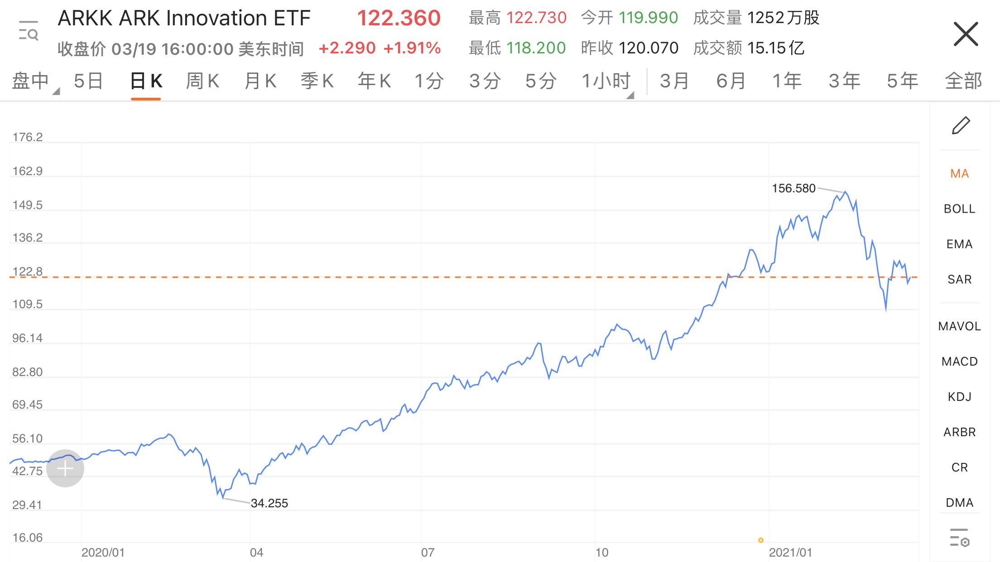
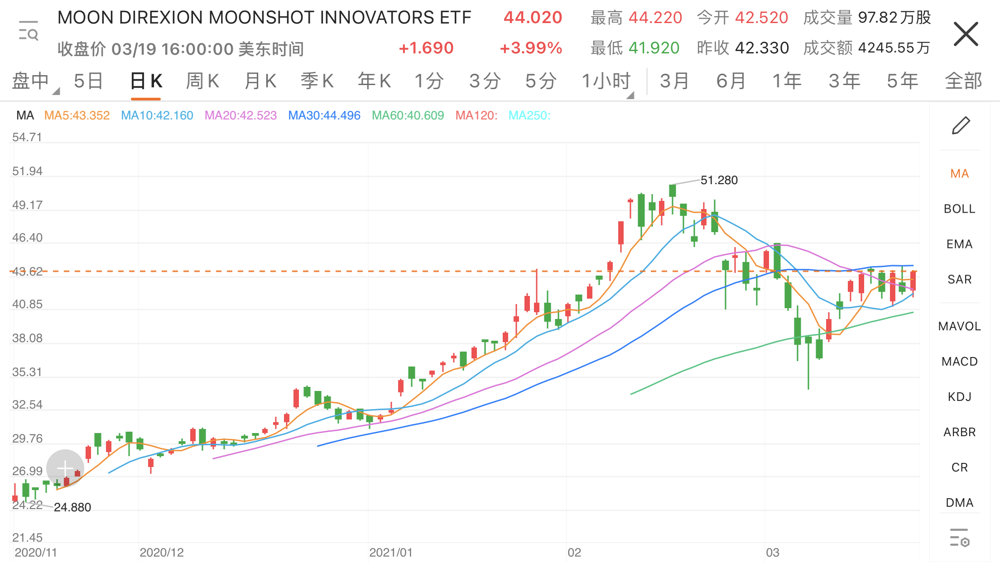

两个月前，2021.01.22，[《STOCK SUMMARY 2020》](../stock-summary-2020/)结尾说到，泡沫渐渐吹大，有点危险。后来私下也跟一些朋友说，三个月内必有大跌。但是2月初春节前的最后一个交易日，犹豫再三，没有止盈清仓。等到想明白准备操作时已经收盘，遂作罢。没想到春节后急转直下一片哀嚎。小丑竟然是自己。幸好最初买入点足够低，账面依然是盈利的，所以倒也不慌，躺倒围观。

看了两个月，还没看懂，所以只能叫做观察，没有任何结论，纯吃瓜笔记。

### 中国互联网公司走势（山字形为主）

时间范围：2020.12.28 ～ 2021.03.20  
价格：美股港股双上市的公司，按港股价格统计（港股交易费用低）。  
快手：2021.02.05 新上市，将上市开盘价归入起点一列（纯属方便）。  
小米：剔除，因为我认为它不是互联网公司，也不是硬件制造商（台积电，英伟达之类），算是C端硬件品牌组装吧（戴尔之类？）。  
左侧低点：山字形左侧，以2020.12.28计算。  
最高点：山字形价格顶点。具体日期省略。  
右侧低点：山字形右侧，即最大回撤价格，具体日期省略。

### 按今日市值排序 Top10

| 公司   | 左侧低点 | 最高点 | 右侧低点 | 最大涨幅   | 最大回撤   |
|------|------------|-----------|-----------|--------|--------|
| 腾讯   | 519        | 776       | 613       | 49.52% | 21.01% |
| 阿里   | 207        | 270       | 219       | 30.43% | 18.89% |
| 美团   | 258        | 460       | 289       | 78.29% | 37.17% |
| 拼多多  | 143        | 213       | 136       | 48.95% | 36.15% |
| 快手   | 300        | 418       | 250       | 39.33% | 40.19% |
| 京东   | 315        | 423       | 318       | 34.29% | 24.82% |
| 百度   | 189        | 355       | 227       | 87.83% | 36.06% |
| 贝壳   | 62         | 78        | 46        | 25.81% | 41.03% |
| 网易   | 141        | 208       | 154       | 47.52% | 25.96% |
| 腾讯音乐 | 18         | 31        | 31        | 72.22% | 0.00%  |

{:.table-scrollable}

### 按最大涨幅排序 Top10

| 公司 | 最大涨幅 |
|:--|--:|
| 富途 | 436.84% |
| 跟谁学 | 192.16% |
| 哔哩哔哩 | 100.00% |
| 金山 | 90.48%  |
| 百度 | 87.83%  |
| 唯品会 | 84.00%  |
| 美团 | 78.29%  |
| 微博 | 72.97%  |
| 腾讯音乐 | 72.22%  |
| 腾讯阅文 | 71.43%  |

{:.table-scrollable}

### 按最大回撤排序 Top10

| 公司 | 最大回撤   |
|:--|--:|
| 跟谁学 | 53.69% |
| 金山 | 43.75% |
| 京东健康 | 42.94% |
| 金蝶 | 42.50% |
| 富途 | 42.16% |
| 贝壳 | 41.03% |
| 快手 | 40.19% |
| 平安好医生 | 38.93% |
| 哔哩哔哩 | 38.61% |
| 汽车之家 | 37.41% |

{:.table-scrollable}

### 按左右低点涨幅排序 Top10

即相对于2020.12.28，大跌至今仍然保持住较好涨幅的公司。但是这也并不能得出什么结论。  
一方面可能暗示这些公司业绩够硬，扛得住股灾。另一方面可能暗示这些公司还没跌到位，将继续下行。  
只能说这些公司的买入持有者的当前账面盈亏情况相对较好吧。

| 公司 | 左侧低点 | 右侧低点 | 左右价差 |
|:--|--:|--:|--:|
| 富途   | 38 | 118 | 210.53% |
| 唯品会  | 25 | 46 | 84.00%  |
| 腾讯音乐| 18 | 31 | 72.22%  |
| 爱奇艺  | 17 | 28 | 64.71%  |
| 携程   | 31 | 42 | 35.48%  |
| 跟谁学 | 51 | 69 | 35.29%  |
| 微博   | 37 | 48 | 29.73%  |
| 哔哩哔哩 | 79 | 97 | 22.78%  |
| 百度   | 189 | 227 | 20.11%  |
| 腾讯   | 519 | 613 | 18.11%  |

{:.table-scrollable}

### 按左右低点跌幅排序 Top10

跟上面相反，是相对于2020.12.28，大跌至今最惨的公司。同样也得不出什么结论。

| 公司 | 左侧低点 | 右侧低点 | 左右价差 |
|:--|--:|--:|--:|
| 京东健康 | 138 | 101 | -26.81% |
| 贝壳   | 62   | 46 | -25.81% |
| 快手   | 300  | 250  | -16.67% |
| 金蝶   | 27   | 23   | -14.81% |
| 新东方  | 17   | 16   | -5.88%  |
| 拼多多  | 143  | 136  | -4.90%  |
| 好未来  | 68   | 65   | -4.41%  |
| 汽车之家 | 94   | 92   | -2.13%  |
| 陆金所  | 14   | 14   | 0.00%   |
| 京东   | 315  | 318  | 0.95%   |

{:.table-scrollable}

### 厂字型公司走势

厂字型就是价格没有受到股灾影响，一路上涨，然后持平，甚至最近到达历史高点走势的曲线。数据表现为回撤最小，左右价差最大。  

| 公司 | 左侧低点 | 最高点 | 右侧低点 | 最大涨幅 | 最大回撤 |
|:--|--:|--:|--:|--:|--:|
| 唯品会  | 25   | 46  | 46   | 84.00% | 0.00% |
| 腾讯音乐 | 18   | 31  | 31   | 72.22% | 0.00% |
| 爱奇艺  | 17   | 28  | 28   | 64.71% | 0.00% |
| 携程   | 31   | 45  | 42   | 45.16% | 6.67% |

{:.table-scrollable}

### 分岔路

+ 价值投资（价值股） vs 趋势投资（成长股）
+ 主动型基金 vs 被动性基金
+ 收益率 vs 回撤率
+ 蓝筹大盘股 vs 中小盘股

大资金基金公司抱团，势必建仓蓝筹头部大厂，推高“成长股”，“抱团股”公司。美债收益率上涨后集体砸盘，收割元旦后春节前进场的散户。

叶檀说，2020年收益率Top30的明星基金都是成长型赌博型风格，只有压对板块的赌博型基金经理才能获得最高收益率的成绩。因此股灾回撤亏损也最大，散户最好不要碰这类基金经理。

而优秀的稳健型基金经理，需要平衡收益控制风险，因此2020年业绩不会特别亮眼，但股灾回撤也就相对较小。业绩表现通常位于整体排名的中等偏上部分，值得散户仔细甄别选择。

渔叔说，优秀私募基金经理需要关注的核心指标，除了收益率，更重要的是控制回撤率，即稳健。

### ARKK ETF

2020年最红的华尔街明星基金经理，木头姐，Catherine Wood，“女版巴菲特”，美国散户心中的女神。管理主动型ETF基金 ARKK（ARK Innovation ETF）。因重仓 Tesla，Roku，Square，Shopify，Zillow，生物技术，比特币，等等，押注行业颠覆性科技公司而暴赚。2021股灾下暴跌30%，吐出今年所有盈利，获得新称号“华尔街最危险的女人”。

### MOON ETF

2020.11.12 Direxion 推出的 MOON （Direxion Moonshot Innovators） ETF 小型基金，更加偏激。它剔除了FAANG之类的大盘股科技公司。追求早期阶段，创新型，颠覆型，可能改变人类生活的，中小型科技公司。持仓都是小票股，今年至今收益率是木头姐 ARKK 的十倍以上，因此风险也更大。

