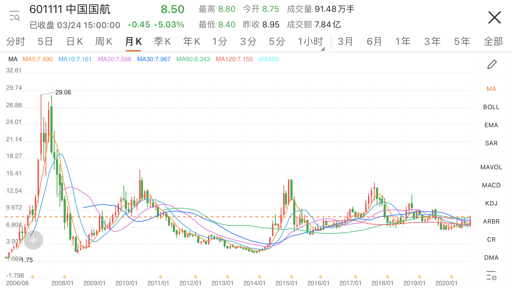
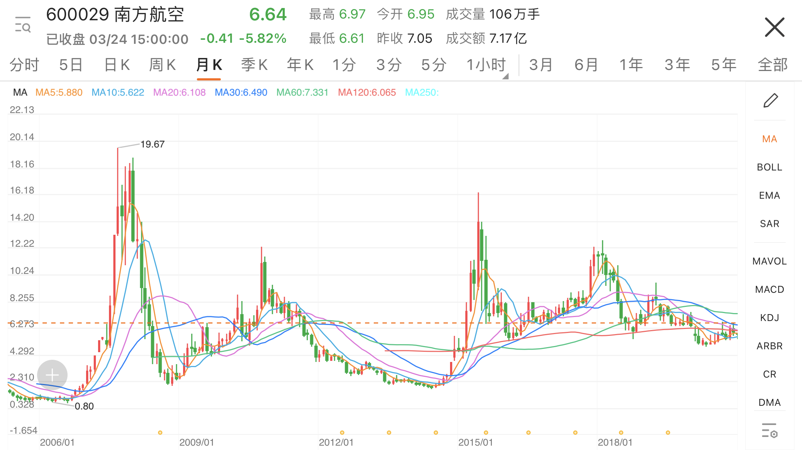
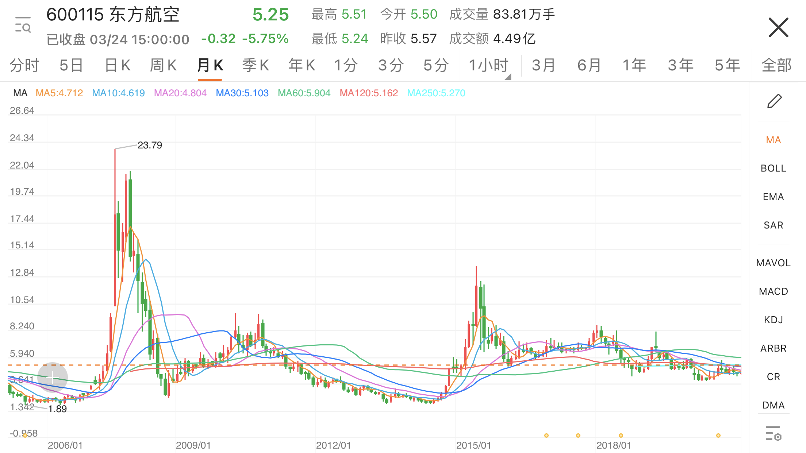
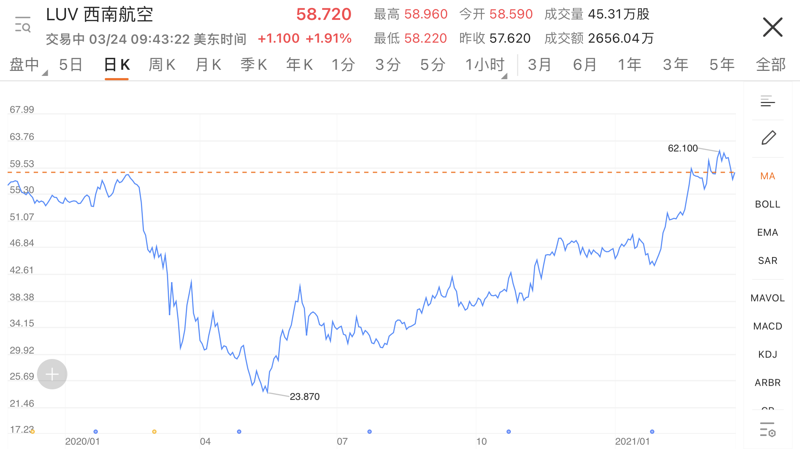

[方正证券](https://www.foundersc.com/)发布的一系列航空行业深度研究报告非常不错，值得一看。

## 平平无奇的全服务赛道

### 三大传统航司

> 传统航空公司，也称为全服务赛道，几乎集齐了一个低回报行业所该具备的所有特质，研究价值较大而投资价值较小，在有限的投资机会中，买危机和买格局是两种可验证、可复制的投资策略。

但是中国的传统航司实在勾不起我的任何投资欲望。重资产，高成本，低利润。看看历史K线图，牛短熊长，一窝蜂冲刺升顶，然后套牢几年，绝不错过任何一次股灾。三大航司的走势非常相似。

### 经营不善的海航

不争气的海航和海航集团，我都懒得说它。

### 奇葩分红的山航

诡异的K线图，可能跟这一条新闻有关[《山航连续9年大额现金分红回报广大股东》](https://news.futunn.com/post/3252649)。但是粗略估算，这些分红似乎也无法弥补小散户在股价上亏的钱。

> 山航从2009年开始连续9年大额现金分红，累积分红10.2亿元人民币，每股分派2.55元，分红处于国内上市公司较高水平，一直是深交所的信息披露优秀单位。

## 优质赛道的低成本航司

> 低成本赛道，是航空业中较优质的细分领域，长期需求红利和强者恒强属性为行业提供了培育周期性成长股的肥沃土壤，低成本龙头往往能够成为长期牛股带来丰厚回报，但对于长期投资者而言仍需关注其周期底色所带来的较大波动。

### 西南航空

低成本航司鼻祖，1973年-2019年连续47年盈利（被新冠疫情打破），绝对好公司。

详见方正研报《全球航空巨头启示录之北美篇(二) 西南航空集团: 垄断短途高频市场，“不低价”的低成本航空》。

### 春秋

### 华夏

### 吉祥

### 厦门

## 机场

上海
北京
白云山
深圳

note 3

OTA 印度 mmyt ...
