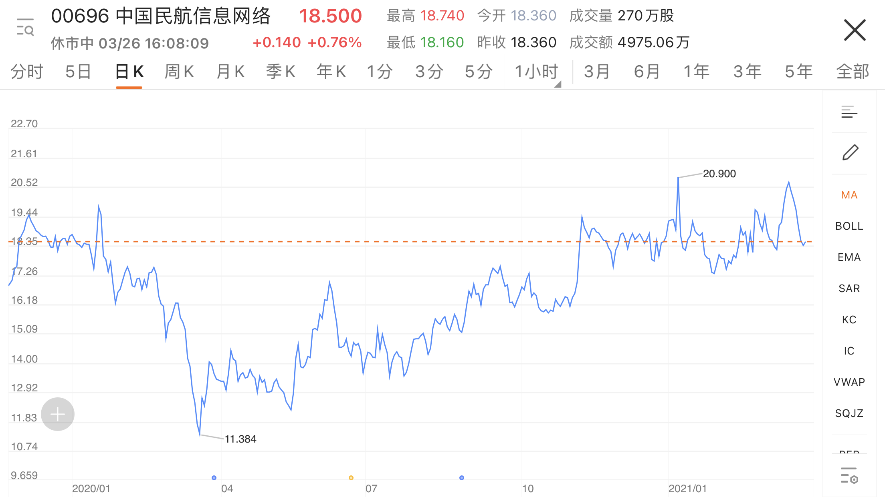

### 航空业风向标

前文《观察笔记2》遗漏了一家公司，[中国民航信息网络](https://news.futunn.com/wiki/hk00696)（中航信），中国航空服务业的“银联”，绝对的垄断地位，旗下包括“航旅纵横”这个垄断性产品。所以它的价格走势等同于航空版块ETF。不想看个股的话，盯它一家就够了。

### 哀鸿遍野的三月最后一周

本以为经过春节后的这场普遍连续大跌调整，Q1就将这样结束了。没想到三月最后一周的中概股版块愈发惨烈。3月20日（上周六）做的功课《观察笔记1》里面很多数据失效，就像妖精遇上了孙悟空，被一棒子打回原形。

中美会谈，《外国公司问责法案》，神秘机构爆仓出售大单。厂字型走势的公司消失不见。在线教育版块受监管政策趋严影响大幅调整。

按3月26日收盘价更新数据。

#### 按左右低点跌幅排序 十大最惨

| 公司   | 左侧低点 | 右侧低点 | 左右价差    |
|:--|--:|--:|--:|
| 跟谁学  | 51   | 29   | -43.14% |
| 新东方  | 17   | 12   | -29.41% |
| 京东健康 | 138  | 99   | -28.26% |
| 好未来  | 68   | 49   | -27.94% |
| 贝壳   | 62   | 46   | -25.81% |
| 快手   | 300  | 248  | -17.33% |
| 拼多多  | 143  | 121  | -15.38% |
| 金蝶   | 27   | 23   | -14.81% |
| 爱奇艺  | 17   | 15   | -11.76% |
| 腾讯音乐 | 18   | 16   | -11.11% |

{:.table-scrollable}

#### 按左右低点涨幅排序 十大坚挺

| 公司   | 左侧低点 | 右侧低点 | 左右价差    |
|:--|--:|--:|--:|
| 富途   | 38   | 100  | 163.16% |
| 微博   | 37   | 47   | 27.03%  |
| 携程   | 31   | 36   | 16.13%  |
| 哔哩哔哩 | 79   | 90   | 13.92%  |
| 腾讯   | 519  | 589  | 13.49%  |
| 网易   | 141  | 154  | 9.22%   |
| 腾讯阅文 | 56   | 61   | 8.93%   |
| 金山   | 42   | 45   | 7.14%   |
| 美团   | 258  | 275  | 6.59%   |
| 阿里健康 | 20   | 21   | 5.00%   |

{:.table-scrollable}

--------
春暖花开，还是出去踏青吧。
