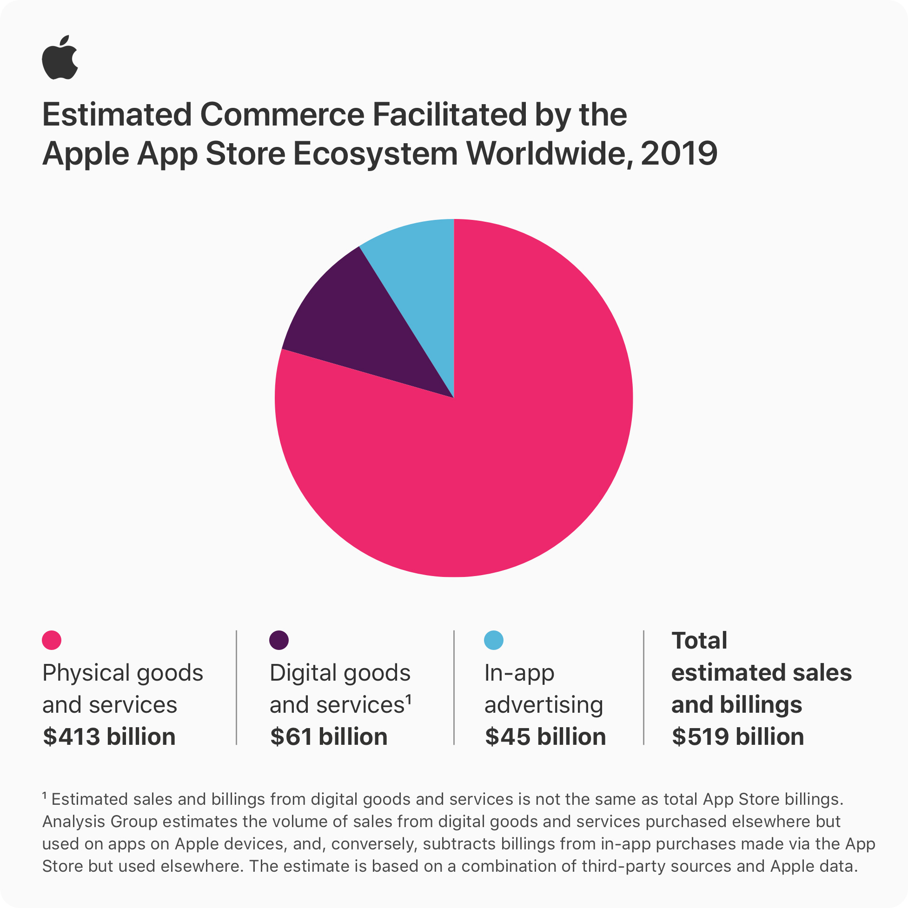

## 新人小朋友问

> 我的认知是，客户端开发人员招聘需求没有后端大。我之前的同事，做到技术主管的都是后端出身。加之35岁是互联网职业瓶颈，我就感觉这个方向的市场需求偏小加上升空间有限。你是过来人，有什么心得吗？或者说做客户端开发，有没有什么发展方向，要不要转前端，还是继续做深？

最近也有一位大佬说，未来都是Web，App会消亡。  
所以我想说点不同的故事和观点。

## 苹果和谷歌的生意经

2019年 Apple App Store GMV 5190 亿美元，其中实体商品和服务 4130 亿美元，数字化商品和服务 610 亿美元，App 内广告 450 亿美元。

详细数据见2020年6月15日，苹果官网新闻稿[《Apple 的 App Store 生态系统于 2019 年促成超 5000 亿美元的商业交易》](https://www.apple.com.cn/newsroom/2020/06/apples-app-store-ecosystem-facilitated-over-half-a-trillion-dollars-in-commerce-in-2019/)，其中还包含一份PDF文件《How Large is the Apple App Store Ecosystem - Analysis Group - June 15, 2020》。

第三方数据统计，2019年 App Store 总收入 500 亿美元。2020年 App Store 总收入 640 亿美元，同比增长 28%。对比谷歌，2019年 Google Play Store 总收入 293 亿美元。

苹果主要靠卖硬件赚钱，但应用商店已经成为收入增长的重要来源之一。谷歌安卓系统免费开源，但应用商店同样也是收入增长重心之一。所以 App 的形态存在是一门生意。

两家应用商店的各种上架审核政策变更，很大一部分都是围绕着如何让营收保持闭环流通。苹果对 H5 Web 套壳应用及动态更新技术的严厉封杀也是为了避免收入外流。苹果与 Epic Games 的神仙打架亦是如此。

所以只要两大设备和系统厂商还在，那么客户端技术就会继续存在。

## 乔布斯的失误

iPhone诞生之初，乔布斯放狠话：“Flash 是辣鸡，HTML5 是王道，开发人员只需要写网页就行了，iOS不需要提供 SDK，用户所有的需求在 Safari 浏览器中都能得到满足”。

然而苹果越狱风行一时，技术人员通过各种 hack 方式开发第三方 App。最终2008年苹果推出 App Store 和 iOS SDK，发展至今。

## Facebook的失误

Facebook former CTO Bret Taylor 一直是 HTML5 的推崇者，在他的主导下，Facebook Android iOS App 大量使用 HTML5，最终由于 HTML5 在那个年代的手机浏览器上的性能问题，被迫推翻重来，使用原生技术重写。据说他也因此失去威望，辞职创业。

于是有了扎克伯格的经典语录：

> The biggest mistake we made as a company was betting too much on Web HTML5 as opposed to native.

当然 Bret Taylor 还是非常优秀的，离开 Facebook 之后成功创办 Quip 和 Quora 两家公司，也算证明了他对 HTML5 的未来判断是正确的。

## 应用开发向左 系统开发向右

说到这里，还是避不开 React Native，Flutter 的话题。App 的形态会长期存在，但是不妨碍 App 的实现使用 Web 为代表的跨端动态技术栈。于是前端开发抢了客户端开发的饭碗。

其实是技术应用的场景变了。

就像，只掌握了JavaScript，也许可以写出 Angular，React，Vue，但是肯定写不出浏览器。只掌握了SQL，肯定写不出 Oracle，MySQL，SQLServer，甚至连简单的 SQLite 也写不出。这玩意是 C 实现的，而 React Native，Flutter 是 C++ 实现的。

跨端框架技术的普及，让前端开发人员吃上了应用上层开发这碗饭，而系统底层开发依然是 C C++ Rust 的主战场。客户端技术就站在中间层，担任应用与系统衔接的职责。

应用开发向左，系统开发向右，客户端开发站中间。

## JavaScript 与碳排放

前段时间看到一个数据，具体数字忘了。说是 JavaScript 语言在各种领域的盛行，显著提升了全球碳排放量，参与推动了全球变暖这件事，不环保。

这个逻辑仔细想想也很合理。技术栈从原生到动态，相同的功能实现所消耗的设备算力确实大幅增加。个人用户感知到 App 运行越来越卡，不如十年前的手机 App 那么小巧快速。全球气候汇总到的就是碳排放增加，气温升高。

所以做好客户端开发，提高性能，节省算力，也是做环保。

----
至于能不能做技术主管，上升空间，35岁瓶颈，这些都是认知偏狭与贩卖焦虑的扯淡。  
小朋友，你还没有看到这个世界的全貌。
