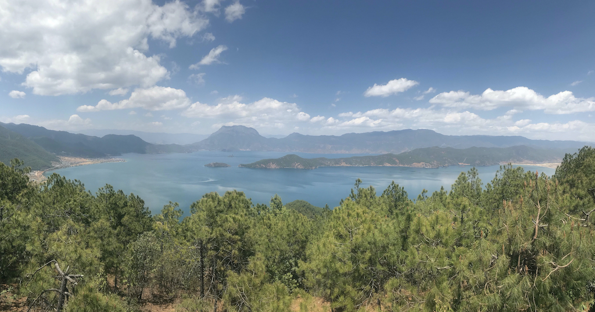

从丽江到泸沽湖，山路蜿蜒，开车需要4小时。住在摩梭小镇寻云度假酒店，清晨沿湖步行2-3公里到达里格村，天气稍凉，远处湖面水汽蒸腾。

从南至北，绕过半圆的湖湾，是里格村观景台。

继续由西向东十公里，泸沽湖正北面是水天一色的情人滩。

继续向东，走婚桥与草海。

泸沽湖的南面是大洛水村，码头对面约2公里处有一座小岛“大海堡”，岛上有一座喇嘛庙。

阳光极好，白云的影子洒在远处的山上。乘坐当地摩梭人的猪槽船游湖。

回望泸沽湖全景。

一切都很好，除了阳光紫外线略强，需要做好防晒保护。据当地纳西族导游说，每年最佳游玩时间是十一月中旬。此时天气最佳，风景最美，并且避开了旅游旺季。

七八月温度尚可，但雨季来临，阵雨较多。国庆前后是游客高峰期，尤其是喜欢享乐的川军入滇。

嗯，适合安逸度假住一周的好地方。
