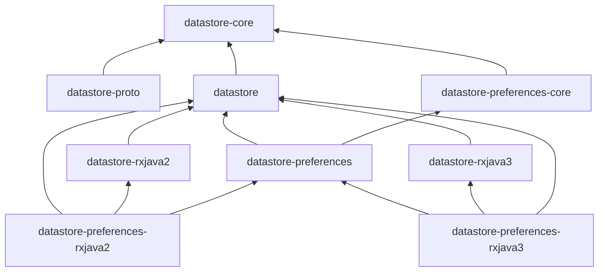

### 0. 什么是 DataStore？

> DataStore 是一个经过改进的新数据存储解决方案，旨在取代 SharedPreferences。DataStore 基于 Kotlin 协程和 Flow 构建而成，提供以下两种不同的实现：一种是 Proto DataStore，用于存储类型化对象（由 Protobuf 支持）；另一种是 Preferences DataStore，用于存储键值对。数据以异步、一致和事务性的方式存储，有助于避免 SharedPreferences 的一些缺点。

### 1. 相关文档

官网指南：[DataStore](https://developer.android.google.cn/topic/libraries/architecture/datastore?hl=zh_cn)

官方博客：

+ [Prefer Storing Data with Jetpack DataStore](https://android-developers.googleblog.com/2020/09/prefer-storing-data-with-jetpack.html)
+ [使用 Jetpack DataStore 进行数据存储](https://mp.weixin.qq.com/s/-RfIREyzA2O1Sioj9xxkww)

Codelabs：

+ [使用 Preferences DataStore](https://developer.android.google.cn/codelabs/android-preferences-datastore/index.lab?hl=zh_cn#0)
+ [使用 Proto DataStore](https://developer.android.google.cn/codelabs/android-proto-datastore/index.lab?hl=zh_cn#0)

源码仓库：

+ [AOSP](https://android.googlesource.com/platform/frameworks/support/+/refs/heads/androidx-main/datastore/)
+ [GitHub](https://github.com/androidx/androidx/tree/androidx-main/datastore)

### 2. 工程结构

项目模块：

```bash
.
├── datastore
├── datastore-core
├── datastore-preferences
├── datastore-preferences-core
├── datastore-preferences-rxjava2
├── datastore-preferences-rxjava3
├── datastore-proto
├── datastore-rxjava2
├── datastore-rxjava3
└── datastore-sampleapp
```

模块依赖：



### 3. datastore-core
