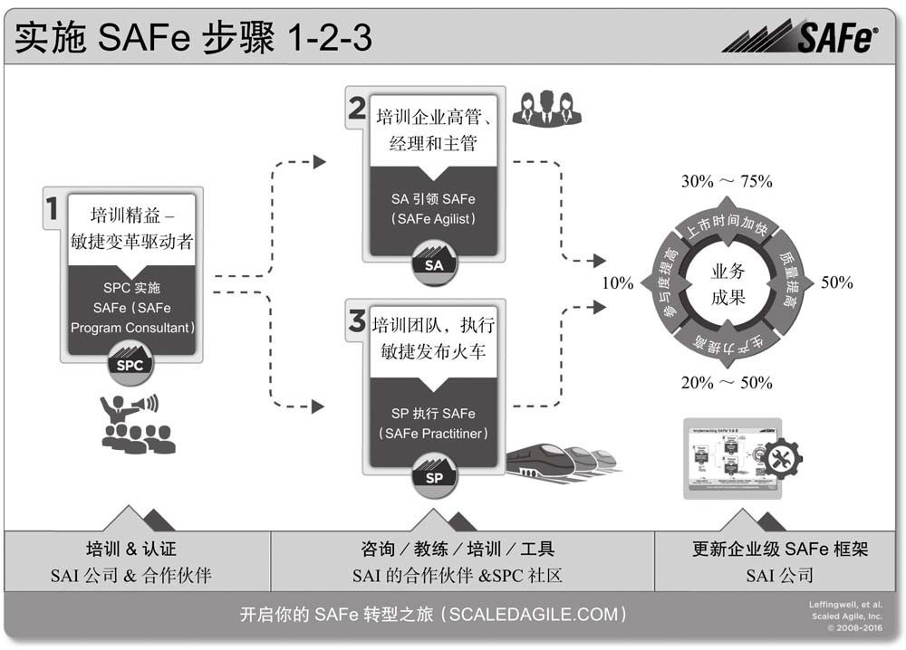
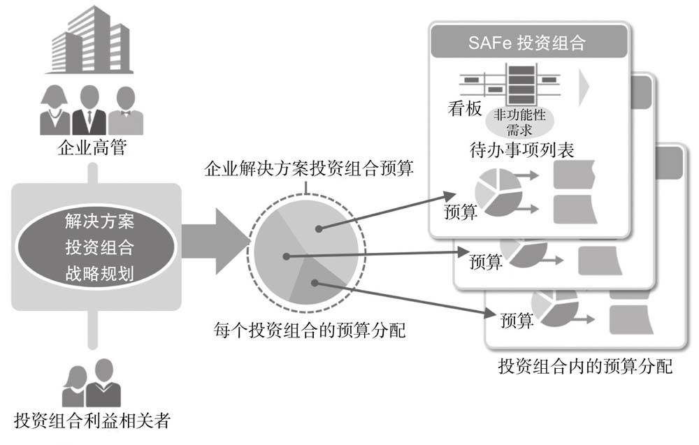
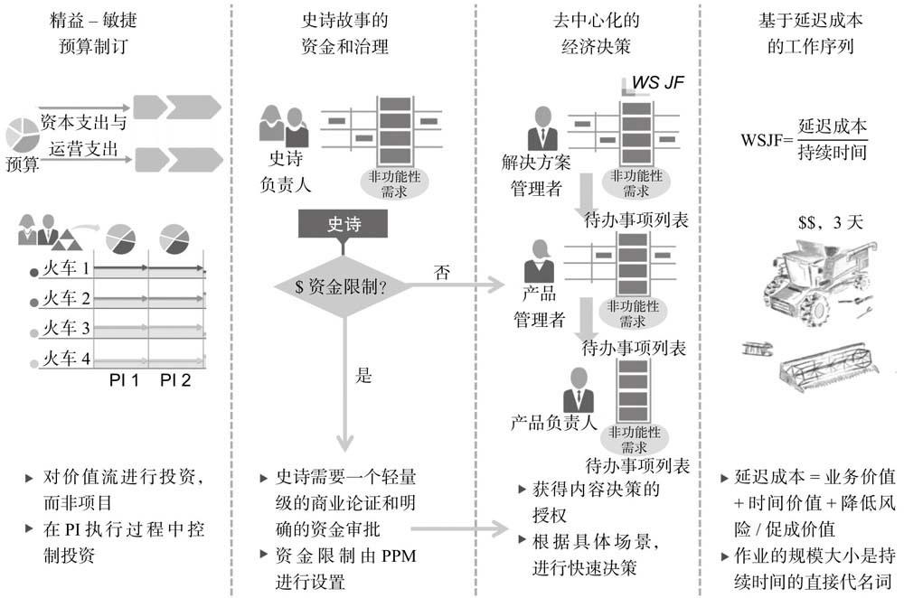

### 免责声明

SAFe是逻辑自洽的，经过大量生产实践检验过的，在某些团队（企业）充分验证过的，可以成功实施落地的模式。

我只是想简单谈谈它的起源和本质，撕开敏捷领域某些近乎宗教狂热式的布道洗脑话术，正如我经常说的“成功的项目管理首先需要跳出项目管理视角”。

## SAFe的本质就是变大变大再变大

SAFe不是从石头缝里蹦出来的，而是当敏捷思想变成软件研发共识模式之后，从小团队内聚向大团队协作的延伸过程中演化诞生。

需求的变大：故事<特性<能力<史诗。

团队的变大：从小型敏捷团队（5-9人 ScrumXP），到`团队层`（100-150人）。

项目的变大：为了完成更大的需求，多个研发团队和其他支持资源一起工作，形成了`项目群层`。

项目周期的变大：从1-2周Sprint迭代，到8-12周`PI（Product Increment 产品增量迭代）`周期。

项目进度同步范围的变大：从小型敏捷团队内部每日站会，到`SoS（Scrum of Scrums）`会议，各团队代表组成定期沟通会议。

发布的变大：围绕重大需求，多个团队协同发布节奏，从班车（BUS）发版到`敏捷发布火车（ART, Agile Release Train）`。

数据统计的变大：从小型民间团队内部看板，到整个大型组织的`跨层级面板`。

## SAFe的商业化模式

人都是要吃饭的，SAFe推广机构（公司）不是做公益，而是赚钱，一种互惠互利的商业合作。

SAFe推荐的实施步骤1-2-3清晰的阐述了这场合作模式。以下引用推广机构原文内容。

### 1. 培训实施人员和精益-敏捷变革驱动者

> 考虑到实施范围、挑战和影响等因素，要想成功地实施SAFe，需要大多数企业结合内部和外部的变革驱动者、领导者、导师及教练，这些人员需要具备教授和引导SAFe执行的技能。为了实现这个目标，SAI公司提供了“实施SAFe 4.0的SPC认证项目”。
>
> 如果参加了培训课程并通过了SPC认证考试，可以获得以下授权：
>
> 1. 教授“Leading SAFe课程”，培训经理和高层管理者，颁发SAFe敏捷领导者（SAFe Agilist, SA）认证。
> 2. 教授“SAFe团队级课程”，培训团队层级的实践者，颁发SAFe敏捷实践者（SAFe Practitioner, SP）认证。
>
> 认证的SPC培训师（SAFe Program Consultant Trainer, SPCT）可以通过在全球范围内的公开课和内训，开设SAFe培训课程，颁发SAFe咨询顾问（SAFe Program Consultant, SPC4）认证。

### 2. 培训企业高管、经理和主管

> 企业高管、经理和主管们需要理解精益-敏捷转型的条件，包括为什么采用SAFe，以及如何使用SAFe，这一点至关重要。  
> 为了实现这一目标，SAI公司提供了一个为期2天的培训课程——“Leading SAFe，引领精益-敏捷企业实施规模化敏捷框架”。
> 他们的职责是引领精益-敏捷变革，他们可以从培训中获取引领SAFe实施的必备知识。  
> 如果通过培训课程之后的认证考试，可以获得SAFe敏捷领导者（SA）认证，同时享有SAFe SA社区的会员（有效期1年）资格和相应的权利。

### 3. 培训团队，启动敏捷发布火车

### 4. 支持咨询活动

### 5. 培训各种专项人员

### 6. 持续改进

每一步都需要money，所以，实施SAFe的第一步是搞定企业高管决策者（拍板出钱的人）。  
那么有人要问了，为什么不自己看书学习，然后小范围试点，成功后再扩大呢？  

+ 拜托，这可是`规模化敏捷框架`！三五个人的小团队根本用不上，即使用了也无法证明什么。要搞就必须是100人大团队，或者至少打5折，圈50个人进来才行。就好比你拿2台PC机装了个k8s+docker，就敢宣传你家云原生了？
+ SAFe强调的是，首先企业高管决策者要支持和跟进。那么总得说服至少一个高管参与吧。  
想象一下，一位高管主导发起SAFe试点项目，并且按照SAFe指导思想定期跟进问询进度协调资源，你说这个项目最终能不能做好？  
敢做不好吗？项目成功是SAFe的功劳？还是高管亲自指挥的功劳？  
`狐假虎威的故事里，SAFe就是那只狐狸，而高管就是背后的老虎。`

## SAFe对敏捷的扩展

为了实现企业收益的最大化，SAFe不仅要求企业高管决策者亲自下场参与，还要求所有团队成员都能够从经济视角看问题（这可不是我瞎说，这是SAFe原则第一条：采取经济视角）。同时也将项目管理的外沿扩大至财务领域，提出了价值流和投资组合层。

价值流也是收益概念变大的结果，当一个或多个业务需求无法充分描述收益价值时，就扩大成了`价值流`。

投资组合层，这个概念更厉害了，包括了企业发展战略，财务预算与成本会计核算，资本支出和运营支出。  
`投资组合TODO LIST是SAFe框架中最高级别的TODO LIST。`  
拥有最高层级战略和受托决策权的组织是`项目群投资组合管理（PPM）`。  
企业需要围绕长期价值做`敏捷开发资本化策略`。

好嘛，叶老师可以当机票CFO了！

