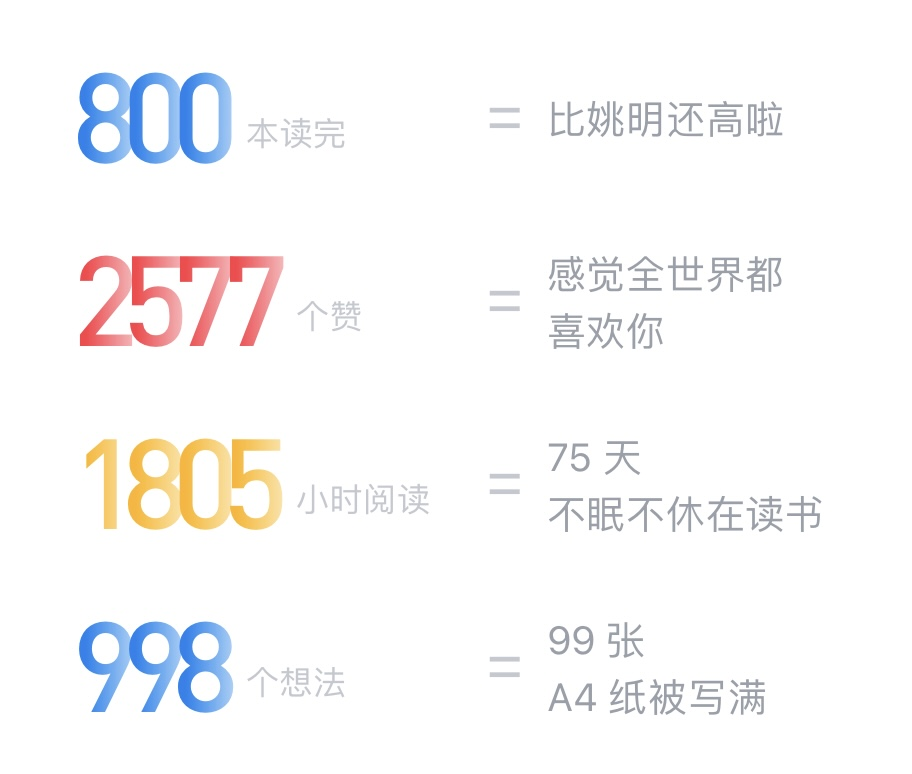
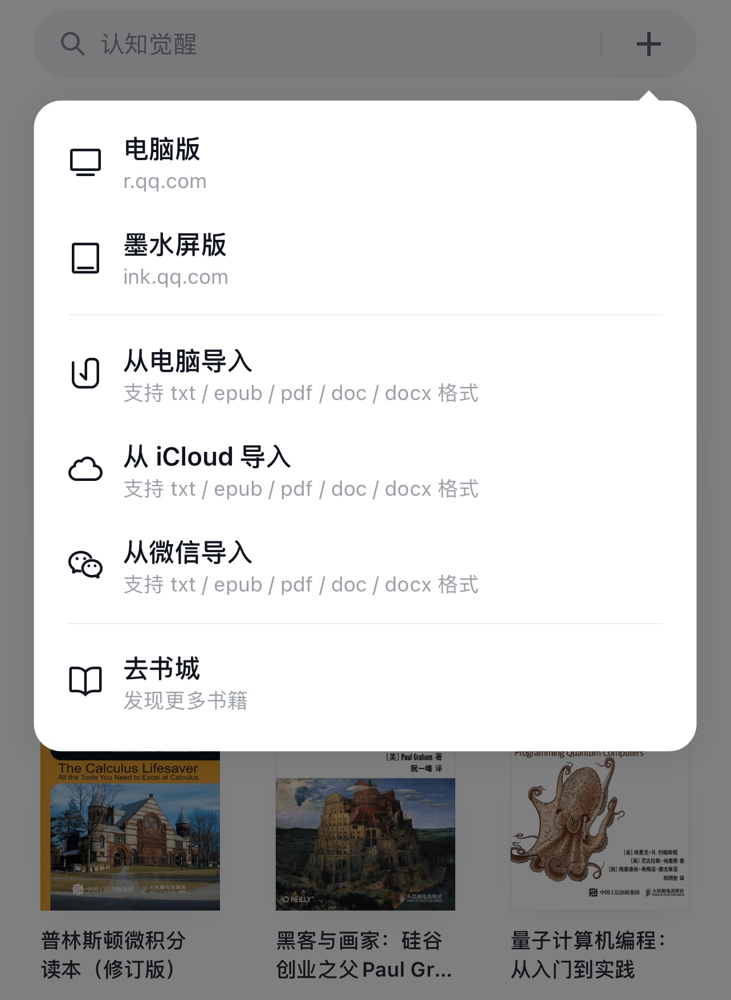
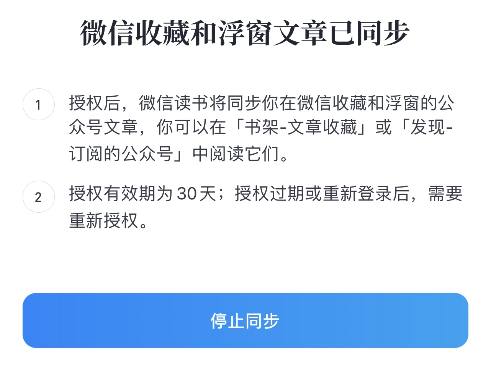
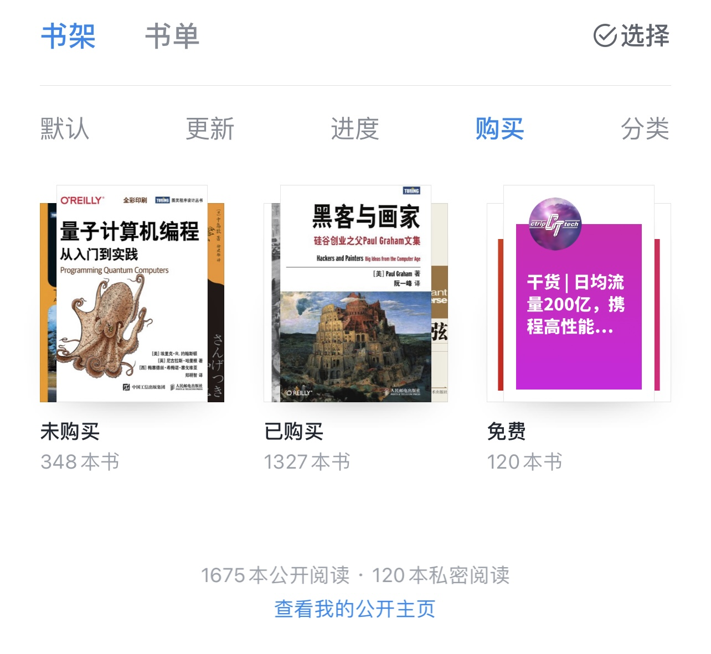
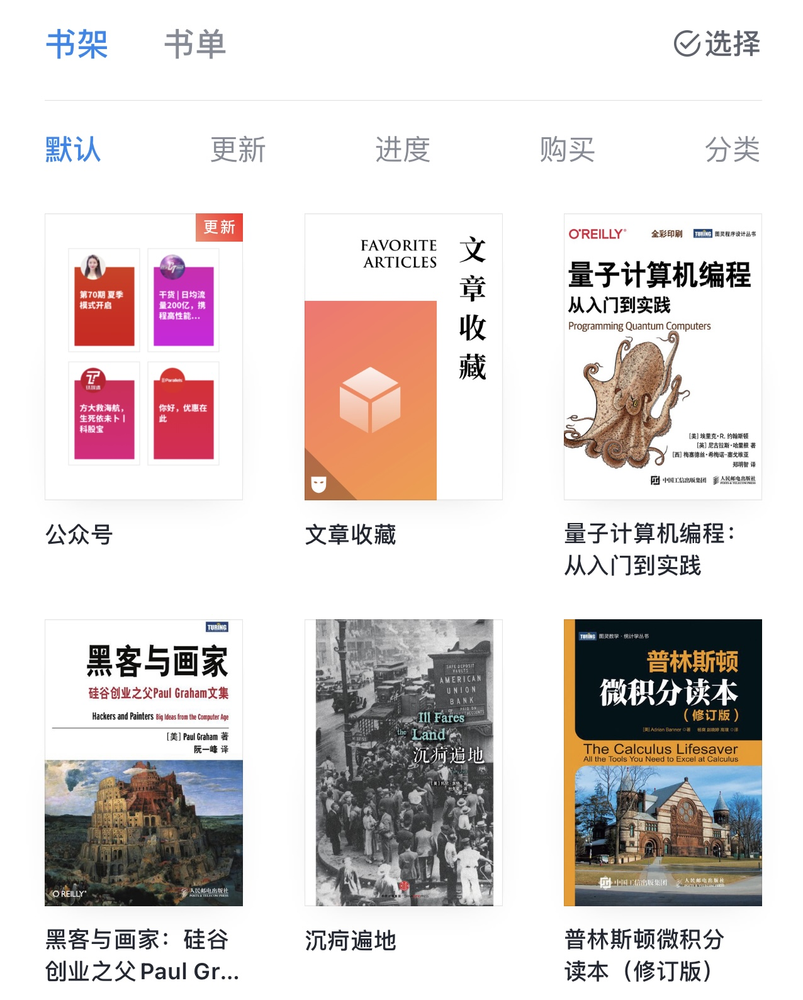
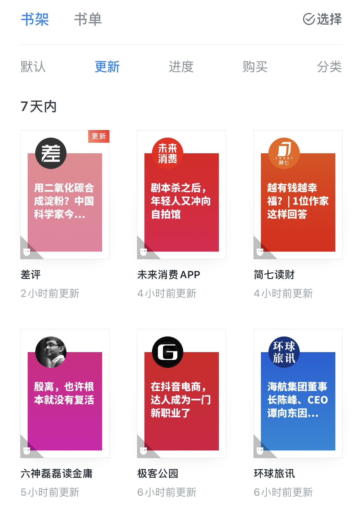
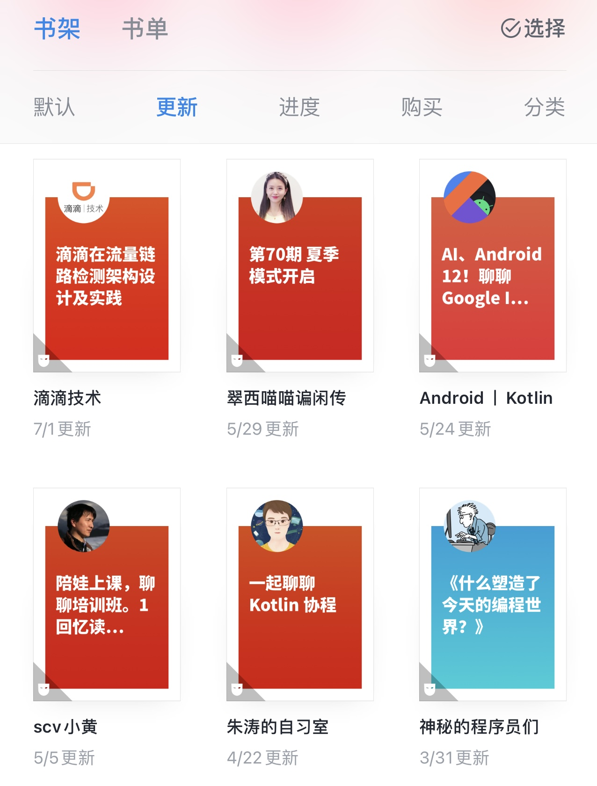
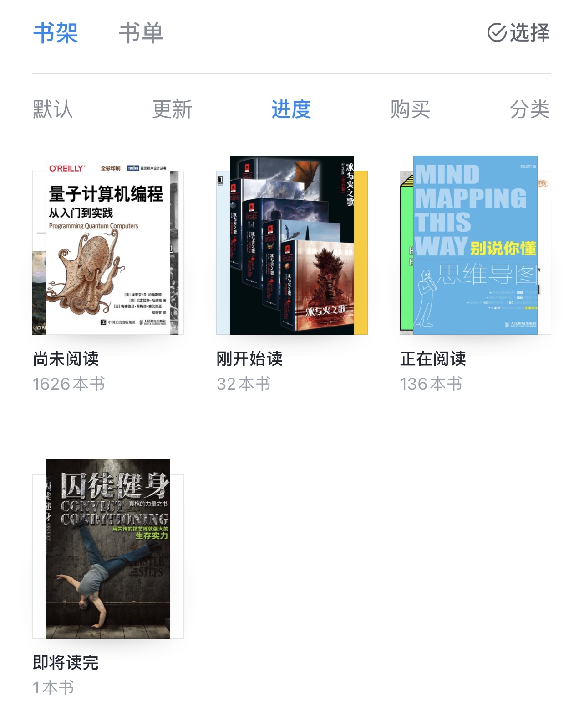
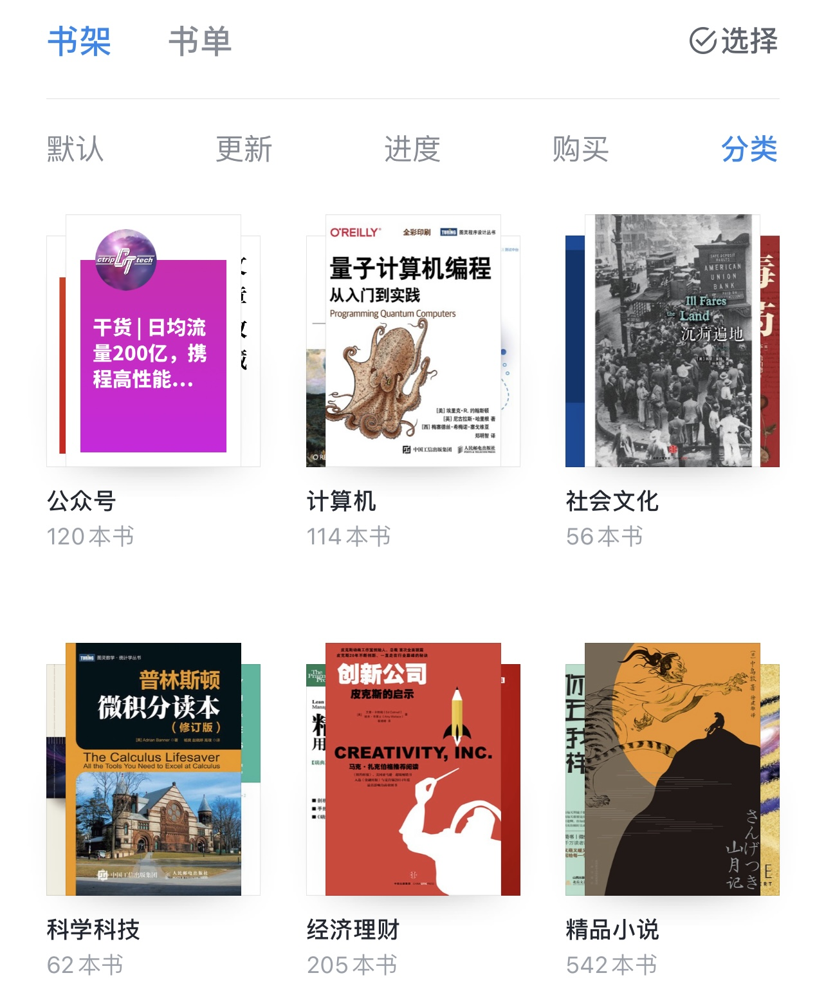

本周达成了微信读书App第800本已读完的小小里程碑，回想起五年前的某个冬夜，躺在床上举着手机开始阅读第一本东野圭吾的《疾风回旋曲》，从此入坑不可自拔。

五年时光，看着微信读书这个小而美的产品研发团队，完成了从0到100的跃迁，也实现了他们立下的slogan：“让阅读不再孤独”。池建强老师在[《微信读书，终结一场战争？》](https://mp.weixin.qq.com/s/AGPVa9ZK44NFkXWZ3rHnsQ)文章中写道：

> 微信读书的团队和我接触的其他微信团队一样，专注而可怕。他们小而专注，反应敏捷，产品迭代速度非常快。  
就电子书阅读这个领域，在国内，微信读书基本上终结了这场战争。  
也许，这款产品诞生之初，就想要终结这场战争吧。  
在阅读领域，这是个最好的时代。

## 推荐几个重度体验的好用功能

### 1. 大小屏跨端阅读

除了最高频使用的手机App，扩展阅读方式：

+ iPad mini 最适合外出长途和夜晚入眠前的大段时间沉浸式阅读。尺寸轻巧，排版佳，漫画图片清晰度更好。
+ r.qq.com 电脑网页版大屏浏览，适合专业资料书籍快速检索和详细研读。
+ ink.qq.com 墨水屏版，支持十多种墨水屏厂商设备。

### 2. 外部文档导入

如果某些书尚未上架，或者是未出版发行的文档资料，希望可以有更好的阅读体验，可以轻松的导入进来。（其实苹果系统自带的 [Apple Books](https://www.apple.com/apple-books/) 阅读体验也不错，只是略显孤独）

### 3. 微信公众号文章收藏和浮窗同步

### 4. 订阅和通知推送

支持订阅书籍（书名）和订阅作者（出版社）。当关注的书籍上架，或关注的作者（出版社）有新作品上架时，会有系统消息推送，最快时间知晓。

### 5. 免费普通用户书架超限后的对策

自从微信读书推进商业化，区分免费普通用户和付费订阅会员的权益，免费用户书架上限500本，超限后只能升级付费用户。

而我的书架现有1795本待阅读，（不包含已读完的800本，读完就移除，转至“个人主页-已读完”分类。）其中1675本公开阅读是常规书籍，120本私密阅读是微信公众号（为了不影响书架显示排序，设置私密+分组管理）。

书架超限后怎么办？

1. 将书籍添加至系统或自定义书单，快速查找定位，不影响阅读体验。但缺点是失去整本书完整离线缓存功能，以及微信公众号无法感知文章更新。
2. 找一个安卓手机，从豌豆荚电子市场的应用历史版本归档，下载安装4.6.5版本APK。这是支持无限书架的最高版本，从4.7版本开始就改商业化模式啦。  
App Native 技术栈带来的福利，低版本没有动态化更新覆盖。（搞不好哪天就强制升级封禁了）

### 6. 贴心的书架多种分类排序功能

默认分类是按照最近访问排序 LRU Cache。

更新分类是按照最近发布排序。书籍右上角红标显著区分已读和未读文章。特别适合速读刷掉大量公众号文章的每日更新。同时布局标题区分最近七天内更新和更久之前更新。

按更新时间倒序查看，很明显能发现一些“懒惰”的作者（大都是同事朋友个人号），例如黄老师已经将近5个月没有写产品经理随笔了，想必是国际化事业繁忙工作劳累吧。

进度分类适合我这种阅读强迫症患者，一本书一旦开始阅读，哪怕内容再艰涩，也一定要完整读完。

购买分类前面贴过图了，没什么好说的。  
自动分类就是按书籍上架时的出版分类进行分组。方便在不知道该读哪本书的时候，先按题材翻一翻。

### 7. 微信公众号聚合

2020.07.20 写过的[《生活：从微信公众号到微信读书》](../from-wechat-to-weread/)

### 8. 反爬虫反骚扰

自从微信读书壮大后，各路神仙也来了，自动化机器人僵尸号爬虫一直不消停。非常有必要仔细看看“个人主页-设置-隐私”的各种权限控制。
