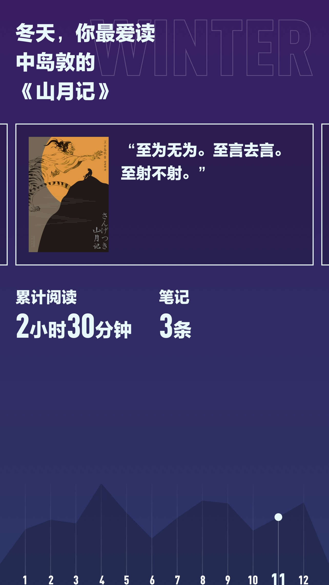

2020年阅读334小时，读完105本书。2021年阅读279小时，读完106本书。读书时长同比下降16.5%，这个锅暂且甩给万恶的短视频平台吧，但是很显然今年的深度阅读和深度思考变弱了，肤浅的灵魂啊！

### 《SAFe 4.0参考指南》

我不喜欢这个框架方案，但是为了有理有据得反对，避免由于自己认知的浅薄造成错误的偏见，仍然花了一些时间仔细阅读。结论是继续维持原判，还是不喜欢。

### 伊坂幸太郎

继东野圭吾之后，刷完伊坂幸太郎的作品，伊式宇宙的怪诞与温情，一次又一次的打动人心。

### 熊节 《敏捷中国史话》

熊节是一位敢说真话的勇者，我在知乎上也关注了他。敏捷诞生二十周年，布道师们集中发文反思其中的对错成败，然而依旧有许多无知的信徒埋头跪拜当年的圣经和语录。

### 三浦紫苑 《真幌站前三部曲》

《多田便利屋》，《番外地》，《狂骚曲》，三本书以及由此改编的两部同名电影，松田龙平和瑛太演绎出了一种从骨子里渗透出来的丧帅。但这种丧并不是颓，是有温度的无可奈何，这部剧不仅能教你修炼一身丧帅气质，更能给予你一些治愈的能量，教会你在面对失去这件事情时，能温柔一点，再温柔一点。

### 中岛敦 《山月记》

大君同学推荐的这本书，读起来很慢，慢不是因为字数多，而是处处直击人心，打中软肋，让人不由得弯下腰抚着心思索些什么。

## 2021，就这样吧。
