> 公司工作相关的小文字，按惯例归档到TLDP分类，实际无关，不要在意这些细节。

2021Q4，受Lara姐邀请，又参加了一个内部培训活动，为期2个月，于2022元旦后结业。

上一次跟Lara姐合作的2020Q2[《TLDP 022：结业典礼（欢乐版）》](https://mp.weixin.qq.com/s/IqsTHdulMThCUmXtjXs3zA)的欢声笑语依然历历在目，这次也趁周末时间记录一些相似且又不同的感悟吧。

我在尝试思考，到底是什么因素支撑一群不同年龄不同性格不同背景不同岗位的人，每周线上线下凝聚在一起，从开始走到现在？

+ 直奔主题而来，但又因为创意讨论不够嗨，直接退赛的一代目小组长静静。
+ 成熟稳重，对组员们照顾有加的二代目小组长二素。
+ 心直口快，口无遮拦的莹莹。
+ 凡事力争第一，团队中坚力量的丽珠。
+ 口拙手快，笑容可掬，明明是91年生人，却总被当作81年的海成。

这是一群真心真诚认真坦率的人。  
我想要什么，我不想要什么。  
我喜欢什么，我厌恶什么。  
我愿力所能及贡献什么，我不愿或无力实现什么。  
每个人都坦诚相待，知无不言，无论讨论过程多么激烈，最终总是能够充分理解对方的善意。  
我喜欢真心换真心的人。  
我讨厌心里想着A，嘴上说着B，行动做着C的人。

----
2个月转瞬即逝，过程辛苦且快乐。结业不是结局终点，而是下一段过程的开端起点。  
临近年底，愈发忙到飞起，我在过程中也有过抱怨，这类项目放在Q4年终之际，大家精力时间有限，难免产生诸多遗憾，最初的精彩创意恐怕无法完美的实践落地。  
但是，想起一位朋友的话：“有些事情，不要问值不值得，而要问愿不愿意。”  
如果仅仅是想争得一个名次，一份奖金，一项产出汇报，计较投入产出利益得失，那也许并非特别值得。  
但是这趟真心且开心的过程，我愿意。  
就像小朋友，小猫咪，空手道，读书，写公众号，心向往之，行必能至。  
愿2022心所念皆如愿。

----
晒图时刻

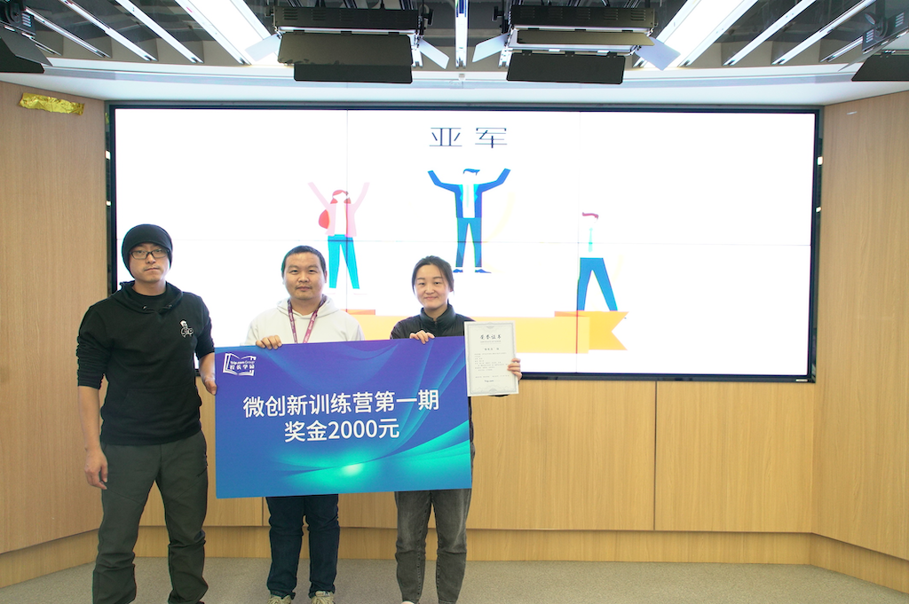
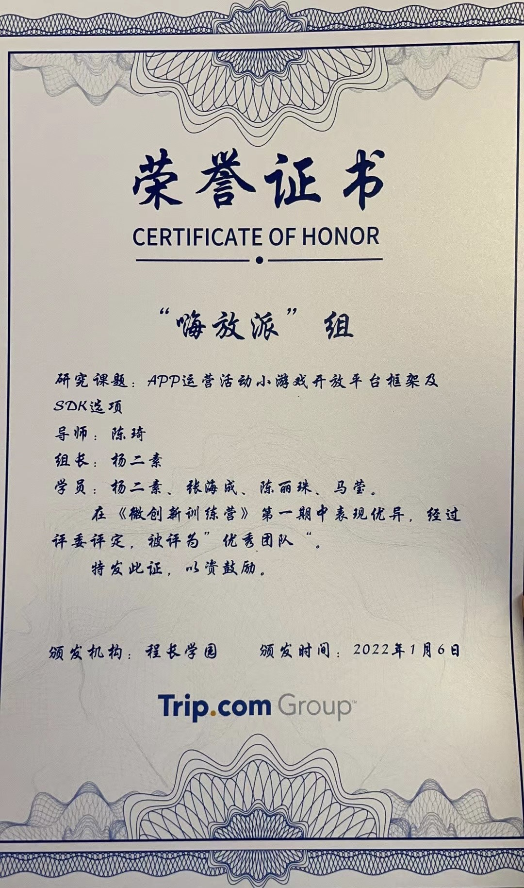
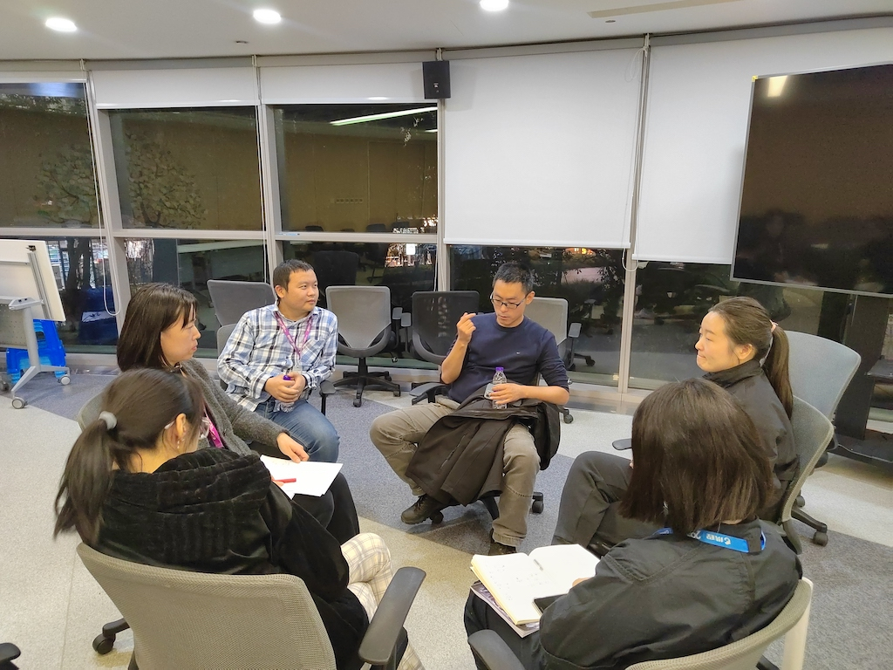
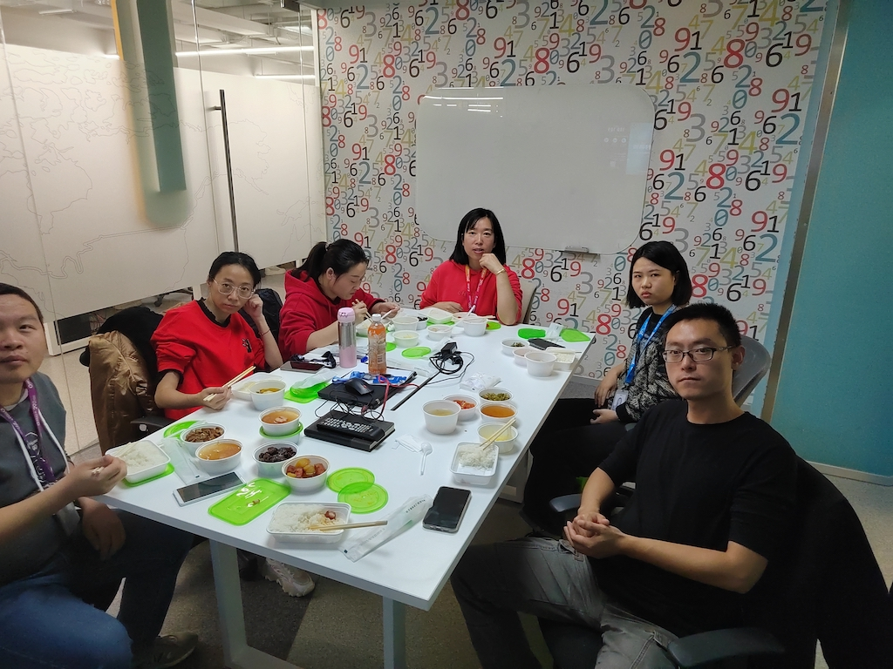
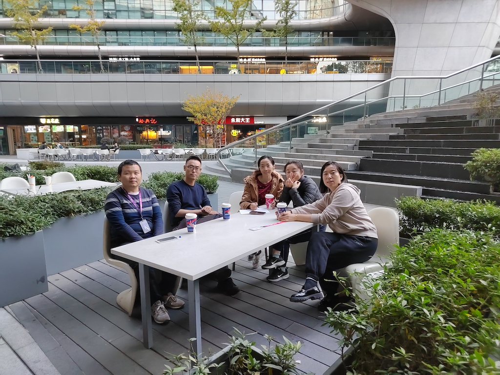
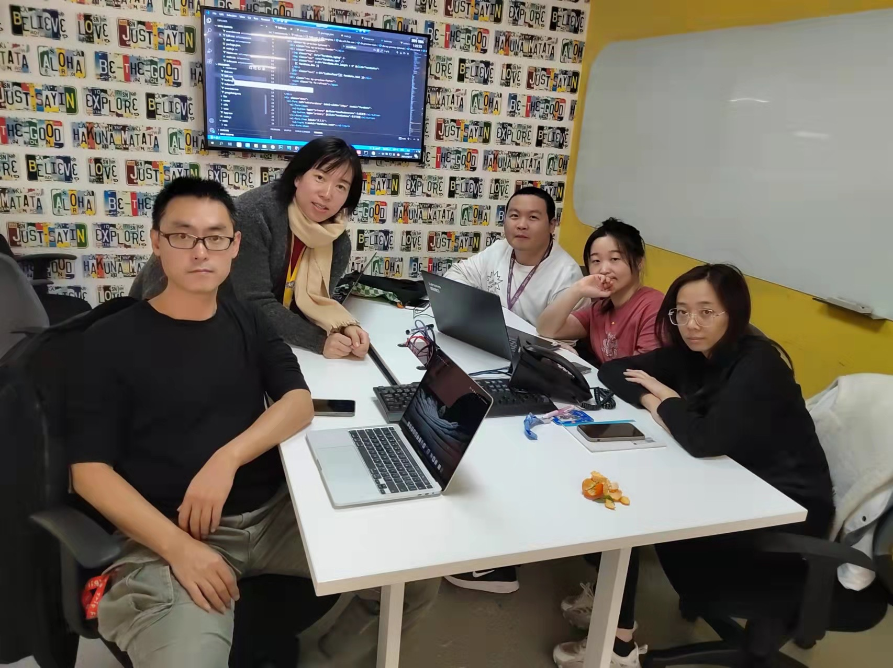
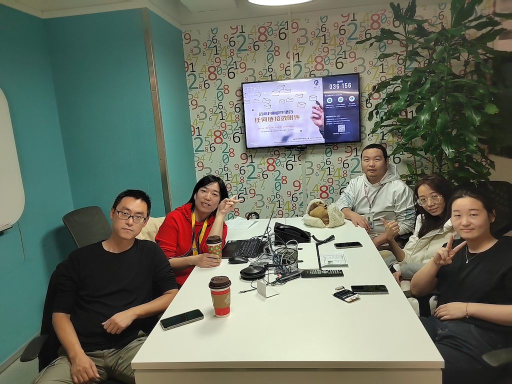
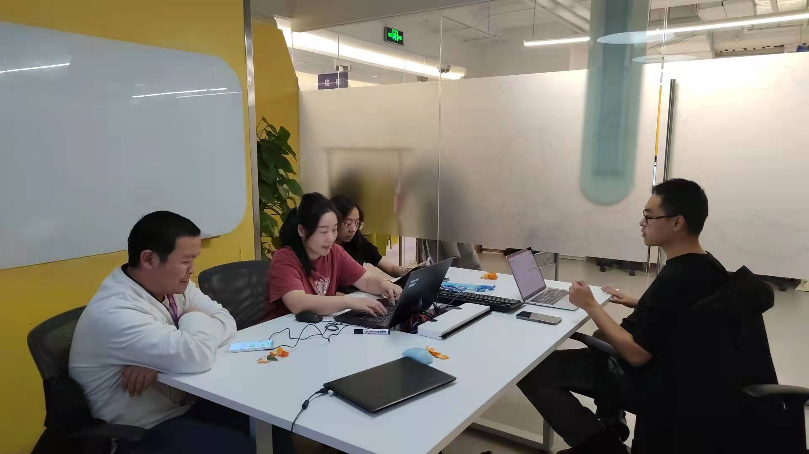
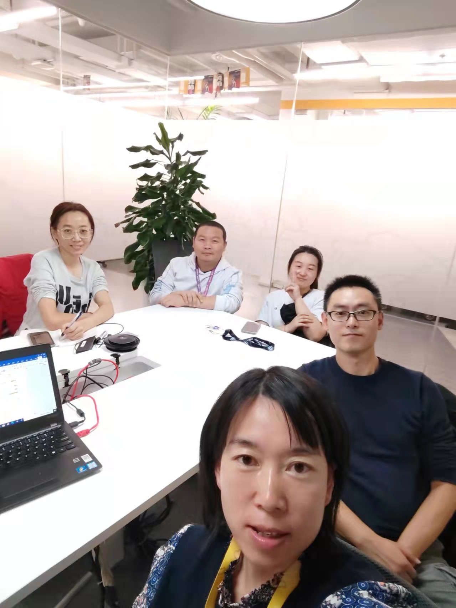
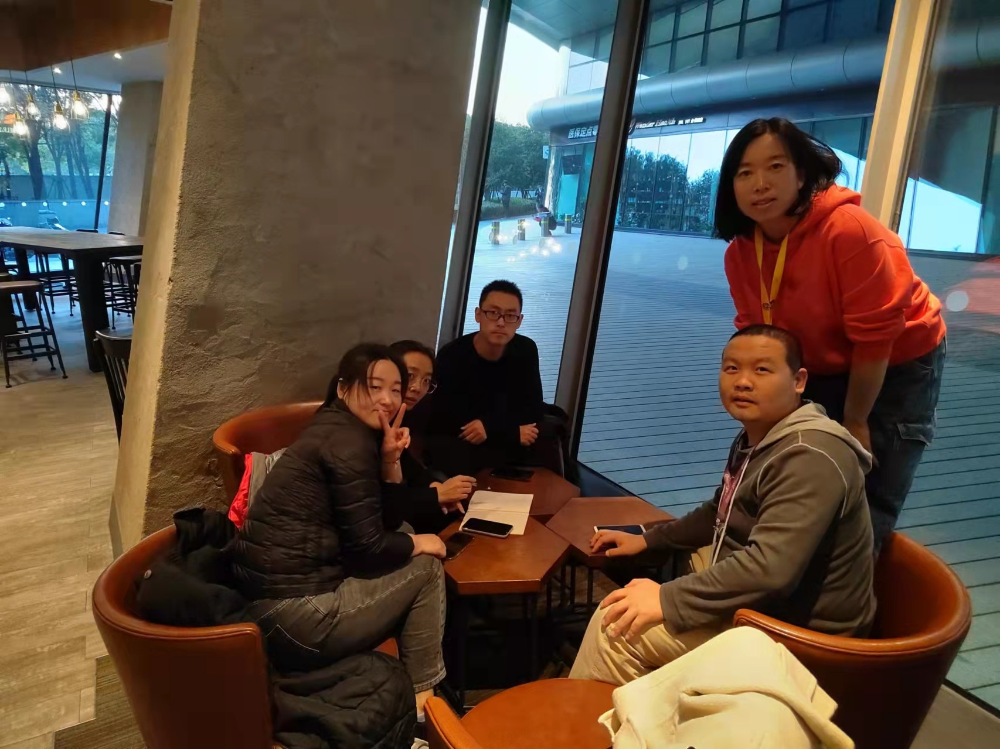
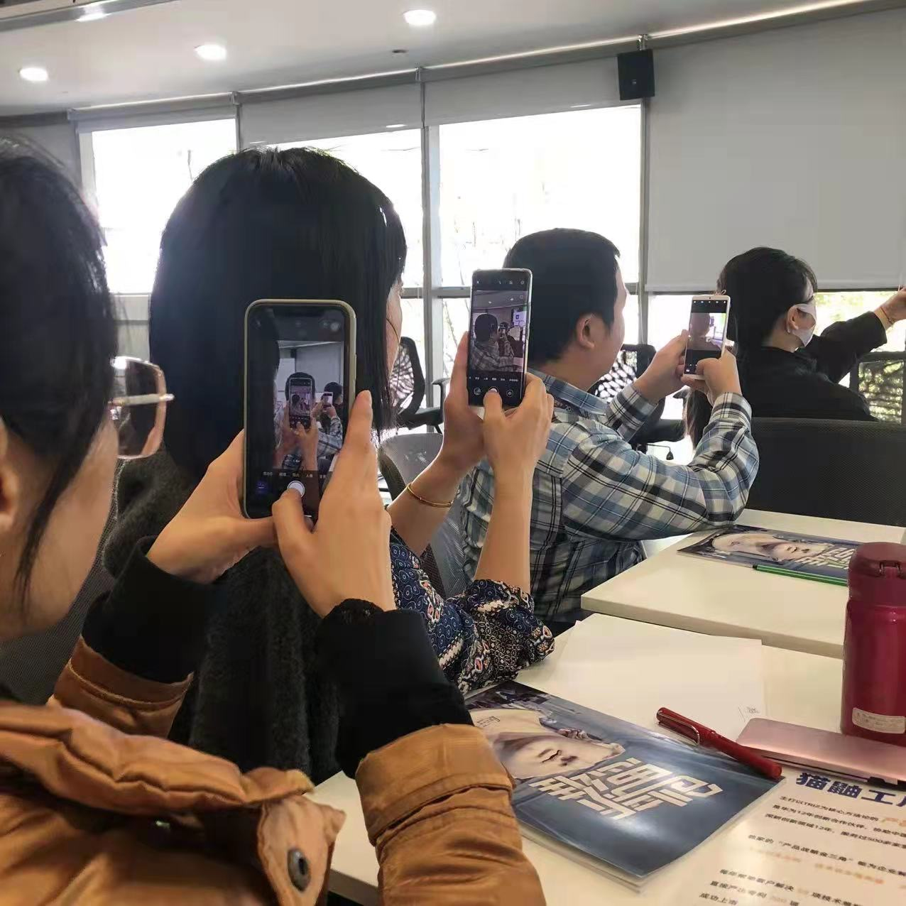
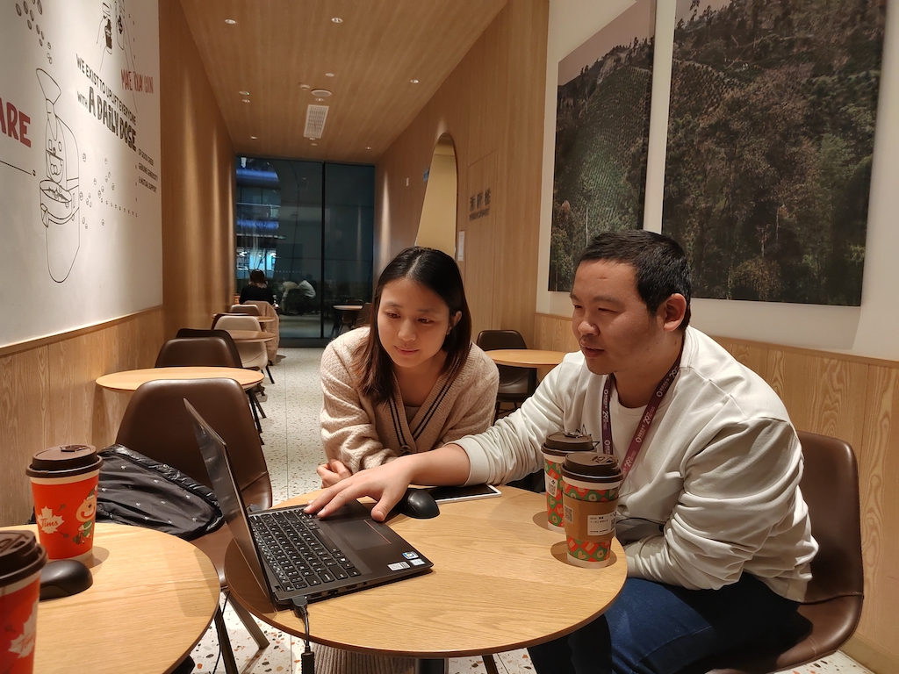
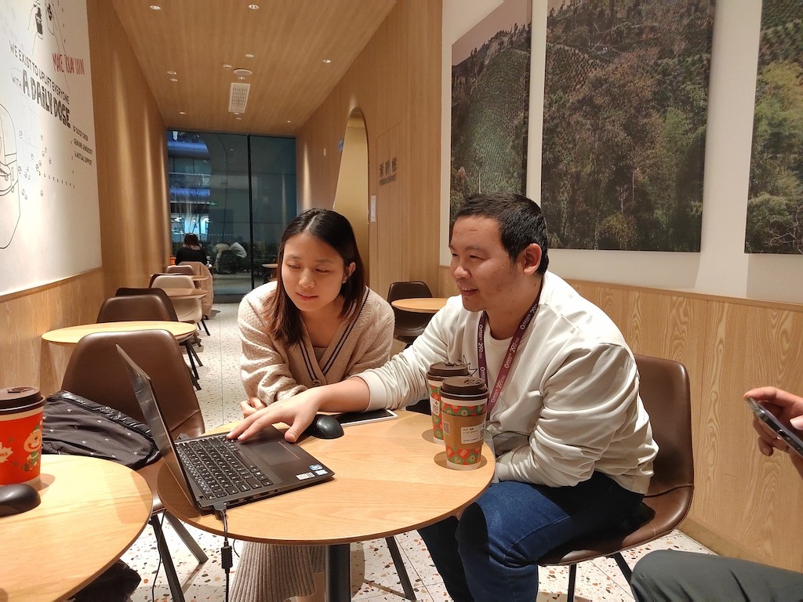

最后感谢班主任Gloria小姐姐的全程辛勤付出。
