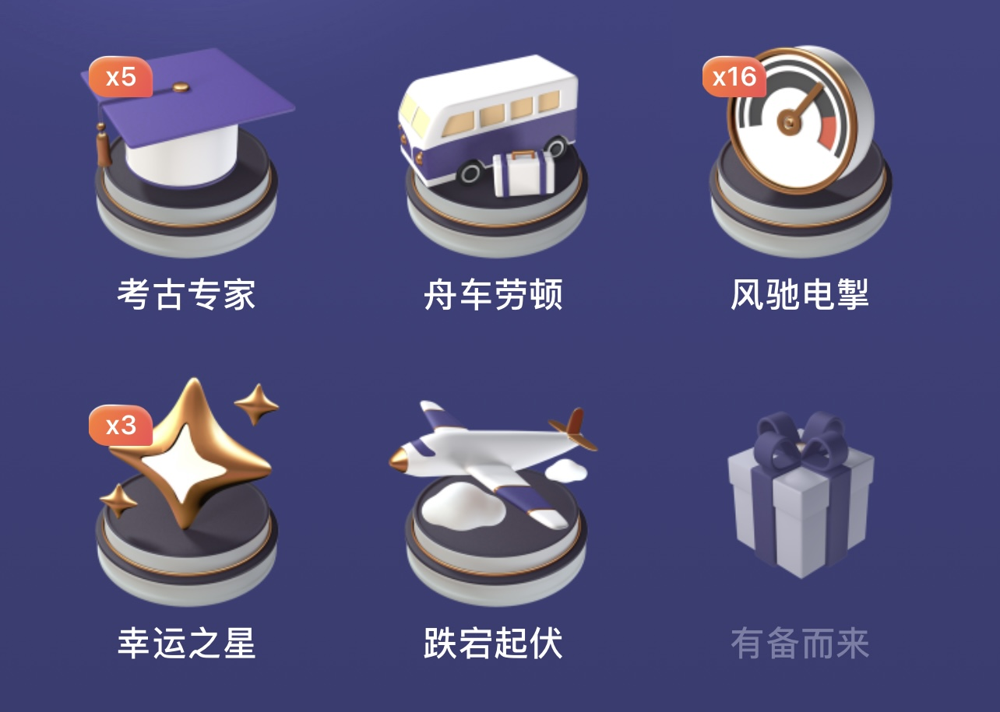
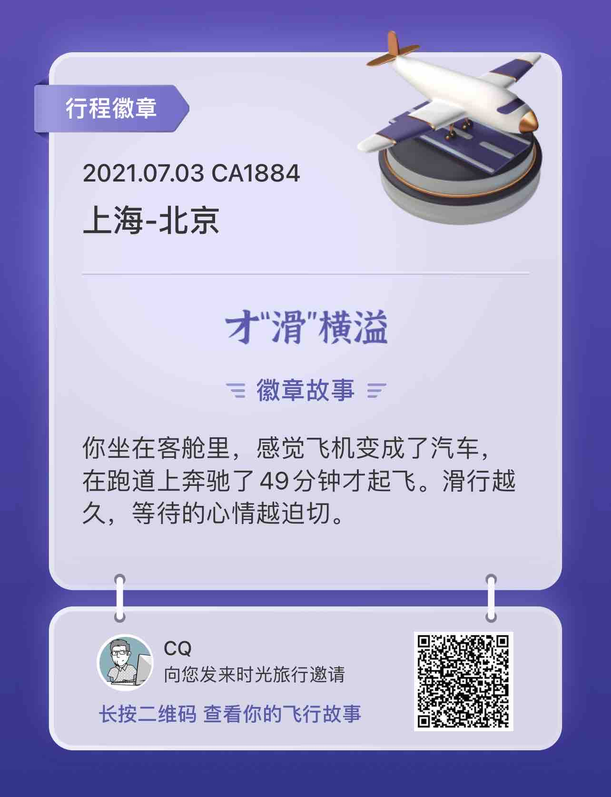

> 一半互联网产品研发角度，一半生活回忆，不管了，随便写写字吧。

中航信下属的航旅纵横是一个很有趣的互联网产品（团队）。产品功能迭代速度给人感觉并不快，不像典型互联网公司侵掠如火的风格，更偏向豆瓣网的节奏。但是总是能够匀速的不断上新，并且每个新功能的体验水准及格，虽然未必惊艳，但是恰到好处。隐约感觉到其背后稳步前进的业务供应链体系，以及基于业务推进速率下的产研团队的不急不躁。

航旅纵横以App为核心，始终没有建设 PC Online 官网，但是却紧跟微信小程序的步伐，以高效触达用户为目标。

大部分用户最初使用航旅纵横的理由无非是订阅关注航班动态，以及后来的在线值机选座。围绕这两大核心功能，之后逐渐延伸出机票，酒店，接送机，保险，火车票，休息室，畅行卡，航旅优选等等产品。最近又紧跟潮流推出了NFT数字藏品。反观身边的人群，知晓和了解NFT的仍然极少，能够准确描述出NFT技术原理的更是凤毛麟角。

不过呢，受限于赛道属性，OTA出行业务本身的低频，DAU必定不会高。然而某个产品小功能却意外的让我每天想起登录一次进去看看。

## 航旅行程徽章

### 1.航旅行程徽章是什么？

航旅行程徽章是航旅时光机基于用户历史行程发放给用户的收藏纪念，它可以帮助用户收集和记录有趣的历史行程信息。

### 2.如何获取行程徽章？

用户每日可获得一次时光旅行机会，通过点击“首页时光机卡片”或“更多-出行工具-时光机”你可以搭载时光机，开启时光旅行，随机穿越至某一历史行程。  
当你穿越到的行程命中徽章定义时，就有机会获得相应徽章。行程越多，你可开启的时光旅行次数越多，获得徽章的概率也会越大~  
不同行程可能命中同一徽章，同一徽章的不同行程信息可以在“我的航旅徽章”页点击徽章左右滑动杳看哦。

### 3.如何查看已获得的行程徽章？

己获得的行程徽章可以在“我的徽章”页面查看，所有已获得的行程徽章都会展示在这里。

## 时光机启动

  
  

目前总量33种，我已收集16种。翻开每一枚，背后的那段旅程回忆，或浓或淡。

### 才“滑”横溢

2021.07.03 上海-北京，一个人工作出差，参加 GMTC 全球大前端技术大会。  
提前预订了一个名字非常响亮，但是实际非常破旧不堪的烂酒店。用同事们的玩笑话说就是：”你穿越去了二十年前的北韩吧？“  
半夜饿了独自外出觅食，一个人走进喧嚣的烧烤店，肉串加啤酒独酌。

### 千年等一回

### 好事多磨

### 新心相印

### 说走就走

### 高瞻远瞩

### 跋山涉水

### 披星戴月

### 行色匆匆

### 长途跋涉

### 百里挑一

### 考古专家

### 舟车劳顿

### 风驰电掣

### 幸运之星

### 跌宕起伏
