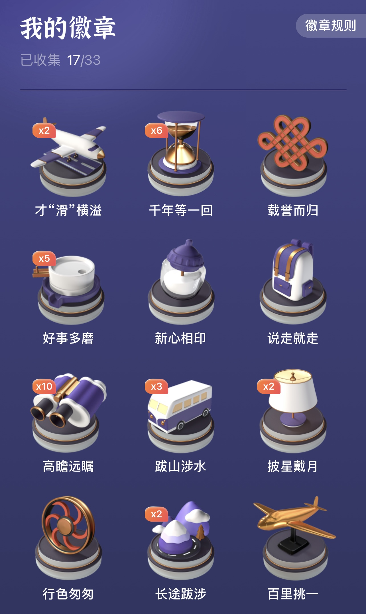
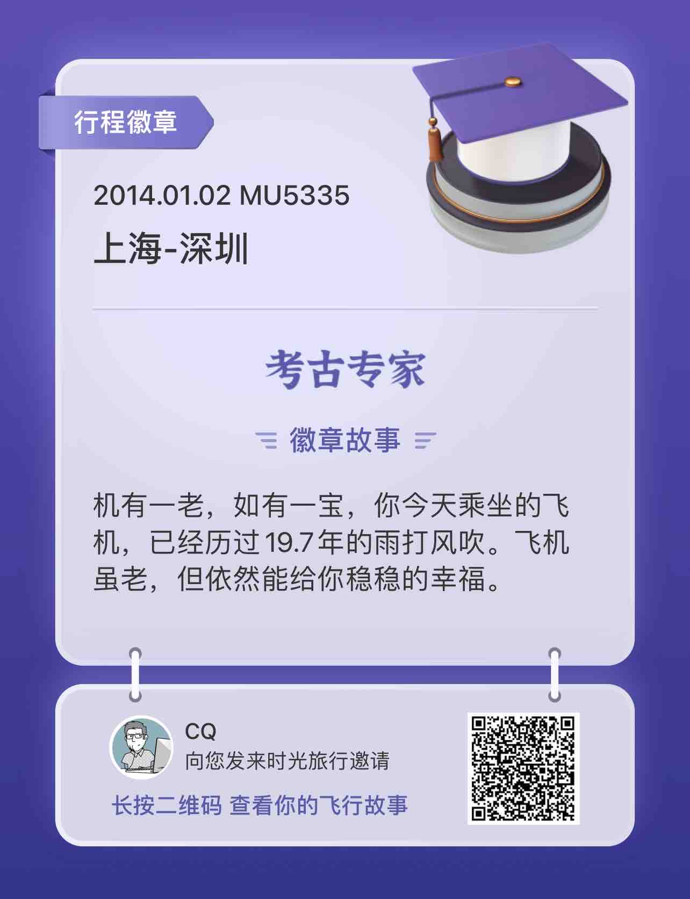

> 一半互联网产品研发角度，一半生活回忆，不管了，随便写写字吧。

中航信下属的航旅纵横是一个很有趣的互联网产品（团队）。产品功能迭代速度给人感觉并不快，不像典型互联网公司侵掠如火的风格，更偏向豆瓣网的节奏。但是总是能够匀速的不断上新，并且每个新功能的体验水准及格，虽然未必惊艳，但是恰到好处。隐约感觉到其背后稳步前进的业务供应链体系，以及基于业务推进速率下的产研团队的不急不躁。

航旅纵横以App为核心，始终没有建设 PC Online 官网，但是却紧跟微信小程序的步伐，以高效触达用户为目标。

大部分用户最初使用航旅纵横的理由无非是订阅关注航班动态，以及后来的在线值机选座。围绕这两大核心功能，之后逐渐延伸出机票，酒店，接送机，保险，火车票，休息室，畅行卡，航旅优选等等产品。最近又紧跟潮流推出了NFT数字藏品。反观身边的人群，知晓和了解NFT的仍然极少，能够准确描述出NFT技术原理的更是凤毛麟角。

不过呢，受限于赛道属性，OTA出行业务本身的低频，DAU必定不会高。然而某个产品小功能却意外的让我每天想起登录一次进去看看。

## 航旅行程徽章

### 1.航旅行程徽章是什么？

航旅行程徽章是航旅时光机基于用户历史行程发放给用户的收藏纪念，它可以帮助用户收集和记录有趣的历史行程信息。

### 2.如何获取行程徽章？

用户每日可获得一次时光旅行机会，通过点击“首页时光机卡片”或“更多-出行工具-时光机”你可以搭载时光机，开启时光旅行，随机穿越至某一历史行程。  
当你穿越到的行程命中徽章定义时，就有机会获得相应徽章。行程越多，你可开启的时光旅行次数越多，获得徽章的概率也会越大~  
不同行程可能命中同一徽章，同一徽章的不同行程信息可以在“我的航旅徽章”页点击徽章左右滑动查看哦。

### 3.如何查看已获得的行程徽章？

已获得的行程徽章可以在“我的徽章”页面查看，所有已获得的行程徽章都会展示在这里。

## 时光机启动

  
  

目前总量33种，我已收集17种。翻开每一枚，背后的那段旅程回忆，或浓或淡。

### 才“滑”横溢

2枚。起飞滑行49分钟。  
2021.07.03 上海-北京，一个人工作出差，参加 GMTC 全球大前端技术大会。  
提前预订了一个名字非常响亮，但是实际非常破旧不堪的烂酒店。用同事们的玩笑话说就是：”你穿越去了二十年前的北韩吧？“  
半夜饿了独自外出觅食，一个人走进喧嚣的烧烤店，肉串加啤酒独酌。

### 千年等一回

6枚。非常凸显我的延误体质。  
61分钟。  
76分钟。  
84分钟。  
88分钟。  
92分钟。  
96分钟。  

### 载誉而归

这个有点看不懂，似乎只要是从国外飞国内的航线，就容易出这枚。  
家庭旅游，记不清去了哪里，看了什么。  

### 好事多磨

5枚。继续延误体质。  
61分钟。  
70分钟。  
76分钟。  
109分钟。  
121分钟。  
2020.09.09，上海-深圳。一个人工作出差，为了去见深圳研发团队的同学们一面，早晨出发，晚上到达。好吧，好吧，有时候，等待是为了更好地前行。

### 新心相印

坐了一回新飞机，可以。这个时间这个航班，应该是春节全家回山西老家过年了。

### 说走就走

2018.04.22，北京-上海。参加QCon技术大会。  
这应该是第一次跟振华两人一起出差。差旅预算有限，两人挤在全季酒店20平米左右的房间里，开着窗户透气，借着四月的春风，你一根我一根，一晚上烧掉至少四五包烟。  
早已记不清那天晚上到底聊了什么漫长深奥的技术问题，但是这一场之后，双方似乎就不约而同的再也不敢如此拼烟了，到底还是命要紧。

返程从购票到起飞41分钟，其实是会议结束后去机场较早，提前了太多时间，于是临时改签早一些的航班飞回上海。

### 高瞻远瞩

10枚。这个逻辑最简单，飞行高度超过10000米即可。  
2021.07.25，喀什-北京。团体出差返程，原计划应是喀什回上海，但是上海台风来袭，转道北京。这大概应该是国内段距离最远的航线吧？坐了足足四个小时。11368米，这是我飞过的最高海拔了。

### 跋山涉水

3枚。坐飞机送摆渡车半日游。  
2021.04.07，上海-丽江。团体出差。  
时隔12年，自2009年第一次丽江之行后，第二次去丽江。特意寻找12年前拍照留影的旧址，对比着旧照，让磊哥帮忙再拍一张。  
树长更高了，墙壁砖石斑驳了，大水车依然转动着，少年变中年了。

### 披星戴月

2016.09.27，武汉-上海。公司组团去武汉开校园招聘会，出差返程。  
不记得为什么这么晚降落，难道又延误了？但是我记得振华，哈哈。  
虽然这次出行过程中没有太多交集（面试官一人一个房间），但是返程机场通过安检之后，不约而同一起寻找并奔赴吸烟室的举动，交叉相视的目光一瞬间确认了友军盟友。

### 行色匆匆

行色匆匆等于一天飞多个航段？好吧。其实是从银川去喀什，经由乌鲁木齐中转。前序航班延误，临时改签后序航班，最终零点三十分降落在喀什黑暗的机场。

### 长途跋涉

2枚。  
最长距离其实是“高瞻远瞩”的2021.07.25，喀什-北京，3752公里。  
次长距离是2017.12.17，哈尔滨-上海。雪乡你好，雪乡再见。

### 百里挑一

百里挑一？功夫熊猫？特别涂装飞机？还真没留意到。这个世界的你更特别？特别就特别吧，开心就好。  

### 考古专家

5枚。老飞机专属。  
8.5年，10年，13.4年，14年，19.7年，可以的。

### 舟车劳顿

舟车劳顿的摆渡车跟跋山涉水的摆渡车有什么区别？难道一个是去程一个是返程？  
这一趟行程，也就是开头才“滑”横溢的那一趟。

### 风驰电掣

16枚。飞行速度够快就行，超过700km/h即可。最快995km/h，差一点点过千。

### 幸运之星

3枚。延误常有，而提前到达不常有。太罕见了。  
2014.03.15，上海-旧金山。托黎叔的福，公费参加GDC。十几个小时的航班，昏昏欲睡度过。第一次踏上加州的土地，只记得阳光热烈刺眼。

### 跌宕起伏

颠簸？不记得了。反正呢，以后上海-北京这段路，还是尽量高铁吧。

### 历史上的今天

有时候，时光机并不会获得徽章，而是显示一段历史。

