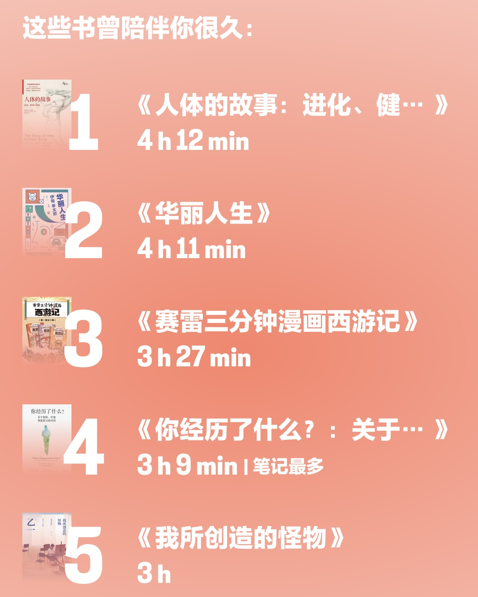
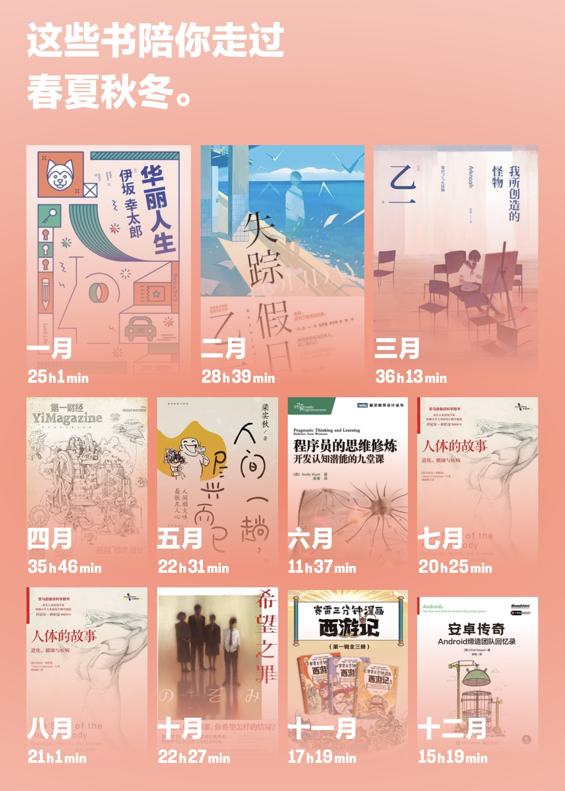
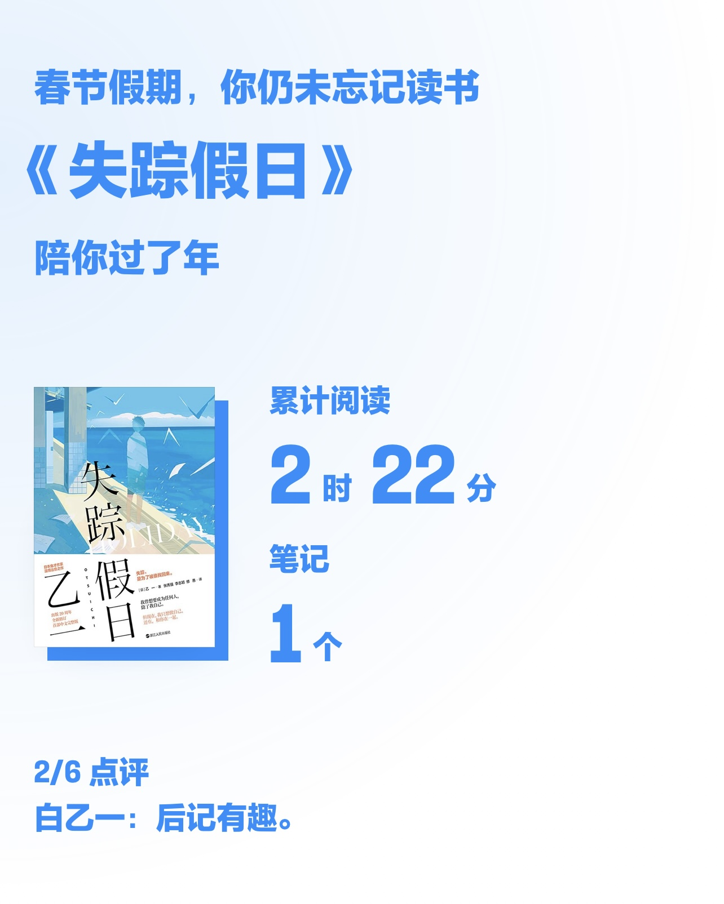
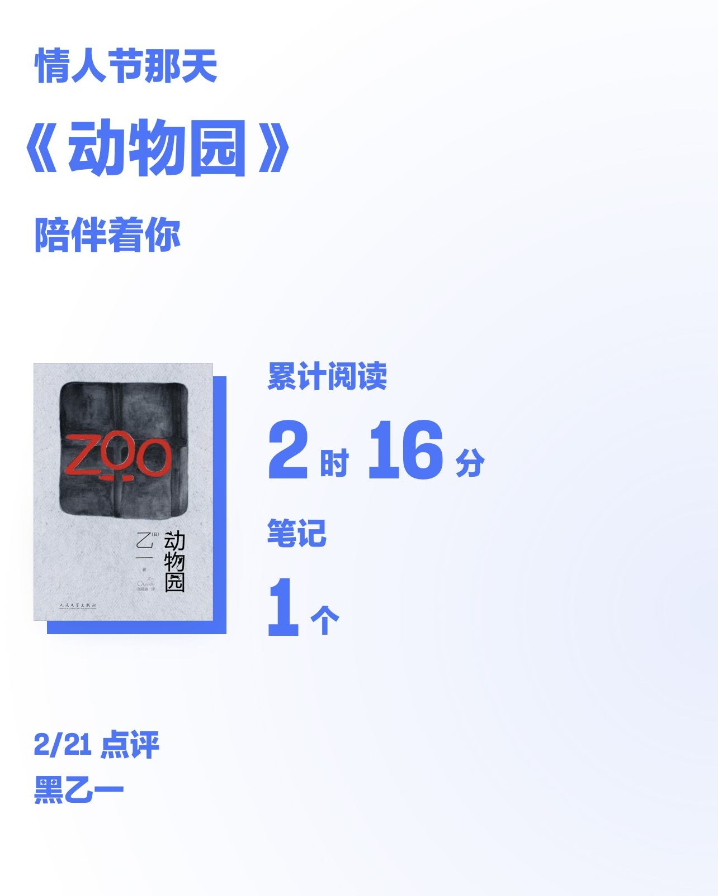
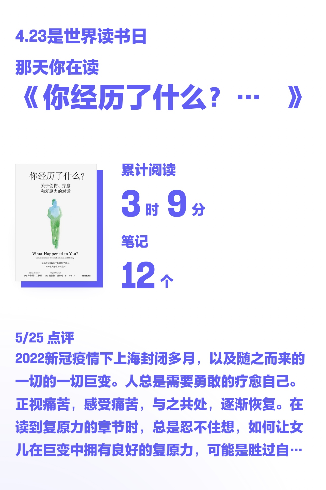
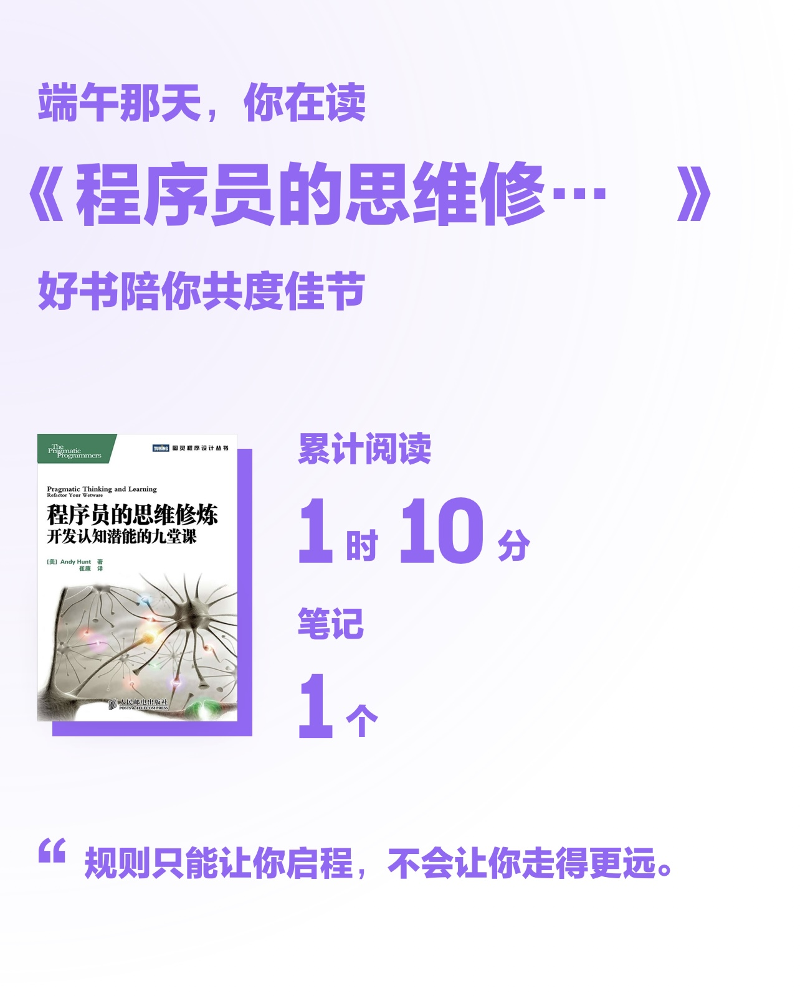
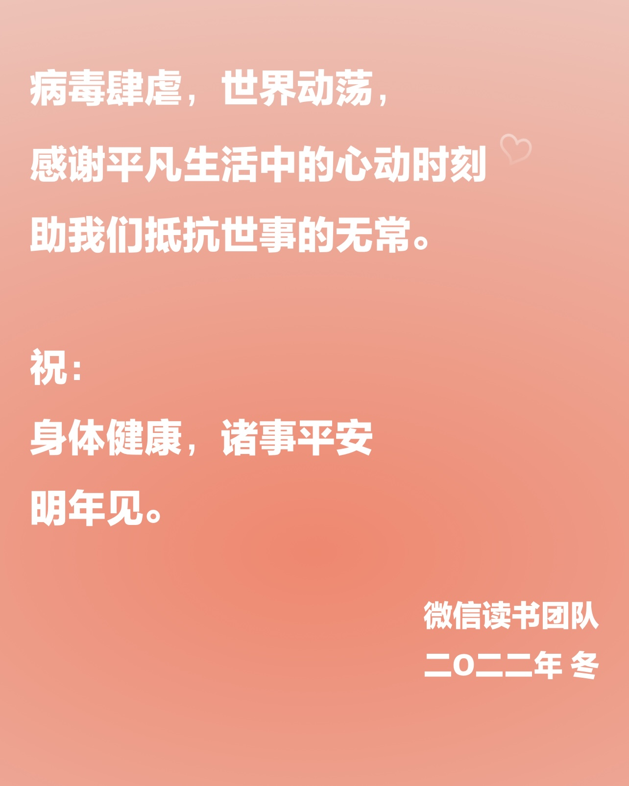

旧文整理，我这无可救药的跨年度的拖延症。

关于2022，引用ifanr的总结：

> 该怎么形容过去的2022年？层出不穷的变故被塞入到一代人短暂的时光，平凡生活的秩序被打破，那种不知所措或许更像是加缪在《鼠疫》中描绘的「流放感」。时刻压在我们心头的这种空患、真真切切的这种冲动，即非理性地渴望回到过去，或者相反，加快时间的步伐，还有记忆的这些火辣辣的利箭，这些正是「流放感」。

2022年阅读267小时，读完79本。微信读书平台的书源版权和商业化策略调整很大，东野圭吾和伊坂幸太郎的作品几无更新，幸好认识了乙一这位变态作家，使得日式推理小说阅读之旅得以延续。

## 乙一 13本

本名安达宽高，一位变态精分天才作家，作品风格多变。以残酷而凄惨为基调的“黑乙一”，以悲痛而纤细为基调的“白乙一”，写校园小清新爱情故事的中田永一，写怪力乱神悬疑怪谈的山白朝子，写恐怖惊悚的越前魔太郎，以及用本名作为编剧和导演参与影视作品。

### 黑乙一

+ 《夏天、烟火和我的尸体》 `乙一16岁成名作，一部书写天真与恶的暗黑杰作。九岁那年夏天，我看着我的尸体漫山遍野奔跑。`
+ 《动物园》 `2005翻拍电影《继续活下来的5个故事》`
+ 《天帝之狐》

### 白乙一

+ 《失踪假日》
+ 《只有你听到》
+ 《寂寞的频率》
+ 《杀死玛丽苏》
+ 《箱庭图书馆》
+ 《我所创造的怪物》 1，2

### 山白朝子

+ 《如果我的头脑正常》
+ 《我的赛克洛斯》

### 中田永一

+ 《我不会写小说》

## 其他日本作家 4本

+ 《华丽人生》 `伊坂幸太郎`
+ 《圣诞妈妈》 `东野圭吾`
+ 《山月记》 `中岛敦`
+ 《希望之罪》 `雫井脩介`

## 漫画 36本

+ 《胖虎下山》
+ 《如果名画都是猫2》
+ 《请吃红小豆吧》
+ 《人人都有妄想症》
+ 《镖人11》
+ 《嘘，夜晚才刚刚开始》
+ 《想呀想呀想不停》，《欢迎来到欲望商店》 `吉竹伸介`
+ 《人类是怎么霸气上天的：吾皇巴扎黑航天科学史》 `白茶`
+ 《蛹·食蝉手绘插画作品集》
+ 《白城血鳗》
+ 《人类关怀计划》
+ 《看你一眼就会笑》
+ 《100天后会死的鳄鱼君》
+ 《请和我谈一场这样的恋爱吧！》
+ 《可能和你有关》
+ 《虫子本》 `朱赢椿`
+ 《一个人泡澡》 `高木直子`

### 混知和赛雷系列

+ 《半小时漫画世界名著》
+ 《半小时漫画中国史0》
+ 《半小时漫画青春期：心理篇》
+ 《赛雷三分钟漫画中国共产党历史》
+ 《赛雷三分钟漫画中国史·明朝三百年》
+ 《赛雷三分钟漫画西游记 1-3册》
+ 《赛雷三分钟漫画三国演义》 7-15
+ 《赛雷三分钟漫画恐龙世界大冒险》
+ 《赛雷三分钟漫画汽车史·保时捷篇》
+ 《李老鼠说车》

## 其他 26本

+ 《你经历了什么？关于创伤、疗愈和复原力的对话》
+ 《西洋镜：一个英国风光摄影大师镜头下的中国》
+ 《人体的故事：进化、健康与疾病》
+ 《病毒星球》
+ 《谁动了我的奶酪》
+ 《孩子们的诗》 `果麦 儿童诗集`
+ 《人间一趟，尽兴而已》 `梁实秋`
+ 《架构师》 `2021年第10-12期，2022年第1-6期。`
+ 《第一财经 YiMagazine》 `2022年第1-5期`
+ 《无印良品的花样土锅料理》
+ 《食帖》 `03，04，05，08`

## 写在最后

之前删除了若干篇生活类小文。因为发现生活中的那点事，鸡毛蒜皮也好，刻骨铭心也罢，时过境迁之后再看，泛出了几分有病呻吟絮絮叨叨的渍色。并不想把公众号变成另一个朋友圈，何况朋友圈也是万年不更新。

