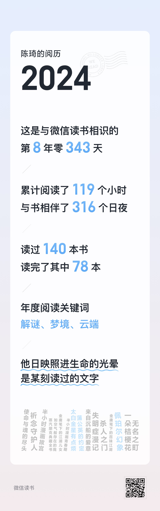
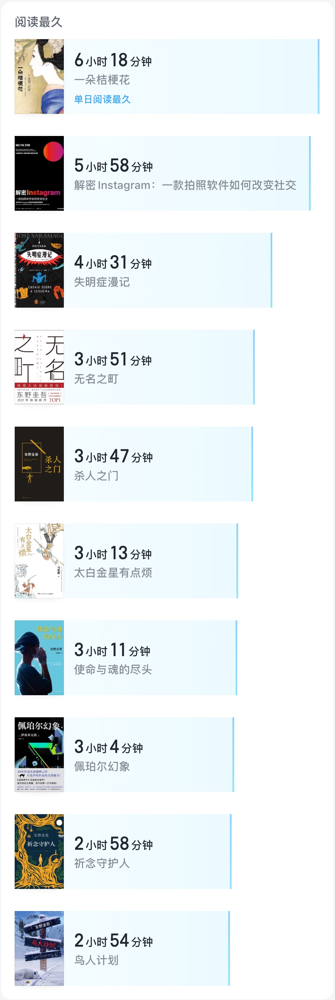
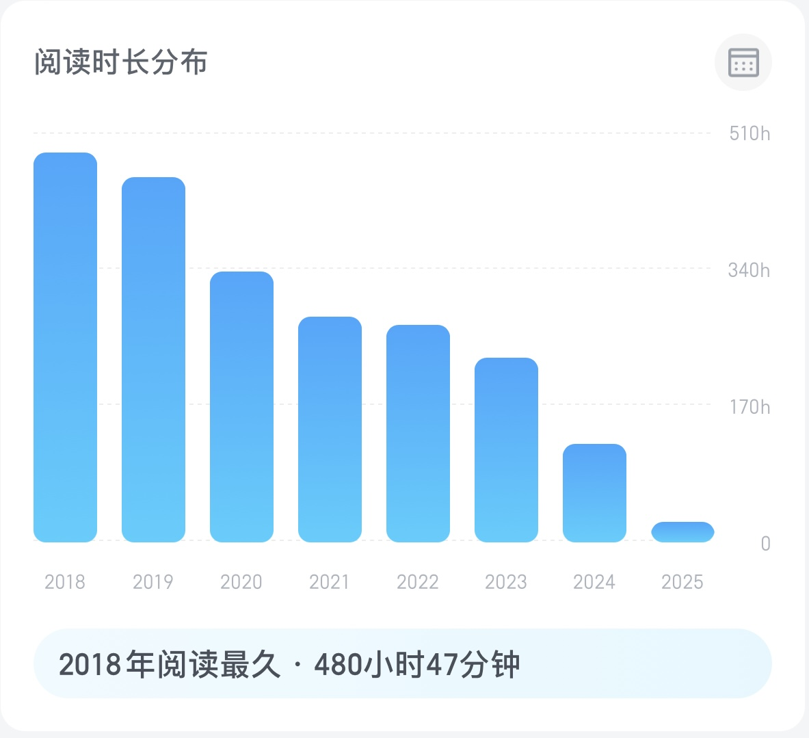
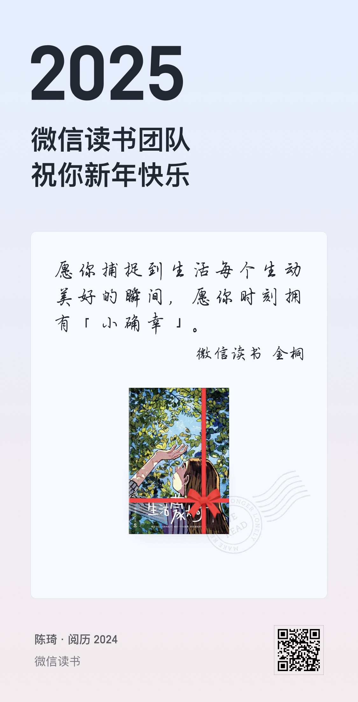

## 东野圭吾

+ 《祈念守护人》 `祈念是给人生的遗憾一次打补丁修复的机会`
+ 《希望之线》 `他说，就算无法与对自己很重要的人见面，只要一想到两人被无形的细线相连，就已经足够幸福。无论那条线有多长，都令人充满希望。因此他不会放开那条线，直到死去。`
+ 《长长的回廊》 `1991本格推理，中规中矩`
+ 《侦探俱乐部》 `1990本格推理短篇`
+ 《杀人之门》 `一个蠢人 + 一个坏人 = 两个混蛋`
+ 《假面游戏》 `平铺直叙毫无波澜的社会派小说，几乎算不上是推理小说`
+ 《无名之町》
+ 《使命与魂的尽头》
+ 《鸟人计划》

## 乙一

+ 《女佣异闻：乙一出道25周年纪念短片集》
+ 《平面犬》
+ 《枪与巧克力》 `天真且残酷`
+ 《SOS之猿》
+ 《来自沉船的爱意》
+ 《如空气般存在的我》 `瞬移，隐身，隧穿，缩小，控火，念力。白乙一的超能力青春校园故事`
+ 《蒲公英的约定》

## 伊坂幸太郎

+ 《佩帕尔幻象》 `依然是伊坂幸太郎一贯的多线叙事和絮絮叨叨说话风格，始终温柔的强调社会责任感，尽量不要给他人添麻烦。作者重读了尼采就大量引用尼采，虚拟和现实的交错有点《苏菲的世界》的影子。拥有预演未来的超能力但却并不能拯救所有人，这种痛苦需要持续自我和解。`
+ 《这一切纯属偶然》 `又一次被暖到了`

## 马伯庸

+ 《太白金星有点烦》
+ 《长安的荔枝》
+ 《风起陇西》 `漫画版`
+ 《白帝城之夜》 `漫画版`
+ 《官渡杀人事件》 `漫画版`

## 其他长篇

+ 《失明症漫记》 `萨拉马戈 诺奖神作 作者说：“如果我们亵渎生活的尊严，我们也就扭曲了理智；而人的尊严每天都会受到我们世界中权势者的侮辱；普遍的谎言已经替代了多元的真理；人一旦失去来自其他成员的尊重，他也就不再尊重自己。”`
+ 《蒸汽朋克典藏全书》
+ 《海底军舰》 `押川春浪 《蒸汽朋克典藏全书》将这本1900年发表的小说称为受儒勒·凡尔纳《海底两万里》影响下的日本蒸汽朋克科幻第一书。
但是放在现在这个时代来看，故事的起伏转折和吸引力显然不足。`
+ 《一朵桔梗花》 `连城三纪彦`
+ 《解密Instagram: 一款拍照软件如何改变社交》

## 漫画

+ 《银河护卫队2》
+ 《蝙蝠侠手记：超人类绝密档案》
+ 《邪恶力量：超自然生物图鉴》
+ 《流浪犬伊奇》 `荒木飞吕彦 乙一`
+ 《伞学院 天启组曲》 `看完美剧五季去刷原著`
+ 《我想成为不错的人，但这并不容易》
+ 《一切都好好起来的》
+ 《镖人 12》
+ 《快乐宅急便：手冢治虫漫画佛陀指南》
+ 《单人房的天使》
+ 《愿你温柔且有力量》 `读书博主小嘉`
+ 《请画一下爱》 1 2
+ 《罗小黑战记》 1 2
+ 《蓝溪镇》1 2 3 4
+ 《格里格外》
+ 《卡皮巴拉的自我修养》
+ 《怪老头》
+ 《你是我的全世界》
+ 《好好照顾你自己》

H.P.Lovecraft

+ 《疯狂山脉》
+ 《梦寻秘境卡达斯》
+ 《超越时间之影》

田边刚

+ 《克苏鲁的呼唤》
+ 《魔犬》

### 混知和赛雷系列

+ 《半小时漫画西游记2》
+ 《半小时漫画中国地理》2 3 4
+ 《半小时漫画青春期 全2册》
+ 《半小时漫画青春期：社交篇》
+ 《半小时漫画中共一大》
+ 《半小时漫画故宫：皇家生活篇》
+ 《半小时漫画中国航天：航天奠基篇》
+ 《半小时漫画中国航天：探索宇宙篇》
+ 《半小时漫画水浒传》 1 2
+ 《超级大脑在想啥？漫画医学大突破》 `钟南山`

+ 《赛雷三分钟漫画中国史 明朝三百年 3》
+ 《赛雷三分钟漫画三十六计》
+ 《赛雷三分钟漫画恐龙世界大冒险 2》
+ 《赛雷三分钟漫画西游记 7》

### 其他

+ 《在金庸武侠里当NPC》
+ 《金庸笔下的江湖儿女》
+ 《金庸笔下的百味江湖》
+ 《公开水域游泳运动》
+ 《爬泳技术图解》

读书时长逐年递减，2025加油！

